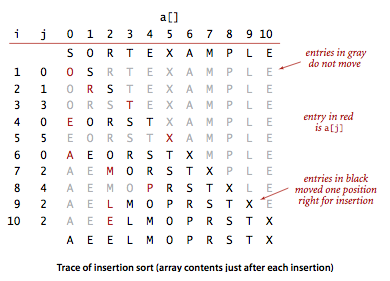
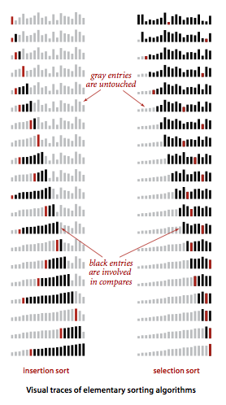
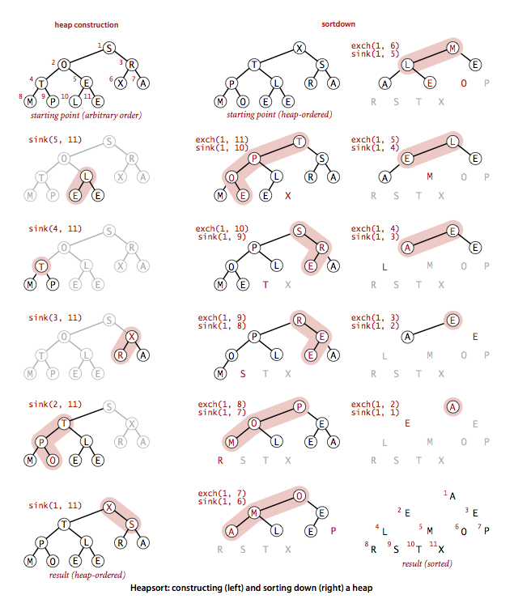

# 排序 #

[选择排序](#选择最排序)

[插入排序](#插入排序牌排序)

[冒泡排序](#冒泡排序)

[希尔排序](#希尔排序)

[归并排序](#归并排序)

[快速排序](#快速排序)

[堆排序](#堆排序)

[基数排序](#)

[应用](#应用)

---

[排序算法模板](AbstractSorting.java)

**排序成本模型** 在研究排序算法，需要计算 **比较** 和 **交换** 的数量。对于不交换元素的算法，会计算**访问**数组的次数

### 选择（最）排序 ###

基本思想：首先，找到数组中最小的那个元素，其次，将它和数组的第一个元素交换位置（如果第一个元素就是最小元素那么它就和自己交换）。再次，在剩下的元素中找到最小的元素，将它与数组的第二个元素交换。周而复始，直到整个数组排序。**选择排序，不断地选择剩余元素之中的最小者。**

[选择排序](Selection.java)

	对于长度为N的数组，选择排序需要大约 N^2/2 次比较和N次交换。

### 插入排序（牌排序） ###

为了给要插入的元素腾出空间，我们需要将其余所有元素在插入之前都向右移动一位。

[插入排序](Insertion.java)

另一个写法

[插入排序2](Insertion2.java)

选择排序 与 插入排序的轨迹

### 希尔排序 ###

**插入排序的进阶版**

希尔排序的基本思想使数组中的任意间隔为h的元素都是有序的。

[希尔排序](Shell.java)

### 冒泡排序 ###

[冒泡排序](Bubble.java)

### 归并排序 ###

归并，将两个有序的数组归并成为一个更大的有序数组。

[自顶向下的归并算法](Merge.java)

**对小规模子数组使用插入排序，可以缩短一些（10%~15%）运行时间。**

[混入插入排序的归并排序](MergeX.java)

**自底向上的归并排序**

基本思想：首先进行的是两两归并（将每个元素想象成一个大小为1的数组）,然后是四四合并（将两个数组归并成一个有4个元素的数组）,然后是八八的归并，一直下去。

[自底向上的归并排序](MergeBU.java)

### 快速排序 ###

来自 **C编程语言2nd 英文版** Page 87

[快速排序](Quick.java)

基本思想：将数组排序的方式则是当两个子数组都有序时，这个数组都有序。

快速排序是一种分治算法。

[快速排序2](Quick2.java)

**算法改进**

1.切换到插入排序

[混入插入排序的快速排序](Quick2X.java)

2.用数组的中间数作为切分元素

3.三向切分的快速排序

将数组切分三部分,分别对应小于、等于和大于切分元素的数组元素。

适合用于大量重复的元素的数组。

[三向切分的快速排序](Quick3way.java)

### 优先队列 ###

场景：许多应用程序都需要处理类有序的元素，但不一定要求它们全部有序，或是不一定要一次就将它们排序。优先队列应运而生。

优先队列支持两种基本操作：**删除最大元素和插入元素**

二叉堆能够很好地实现优先队列的基本操作。

#### 堆的定义 ####

**当一颗二叉树的每个结点都大于等于它的两个结点时，它被称为 堆有序。**

**根节点是堆有序的二叉树的最大结点**

**二叉堆是一组能够用堆有序的完全二叉树排序的元素，并在数组中按照层级储存（不使用数组的第一个位置）**

**一棵大小为N的完全二叉树的高度为 小于lgN的最大整数。**

二叉堆简称堆

在一个堆中，位置k的结点的父结点的位置为 (小于k/2的最大整数)，而它的两个子结点的位置分别为2k和2k+1

#### 由下至上的堆有序化（上浮） ####

	//上浮
	private void _float(int k) {
		while(k > 1 && less(k/2, k)) {
			exchange(k, k/2);
			k /= 2;
		}
	}

#### 由上至下的堆有序化（下沉） ####

	//下沉
	private void sink(int k) {
		while(2 * k <= N) {
			int j = 2*k;
			
			if(j < N && less(j, j + 1)) {//选它两个子结点中的较大者交换来恢复堆
				j++;
			}
			
			if(!less(k, j)) {
				break;
			}
			
			exchange(k, j);
			
			k = j;
			
		}
	}

**基于堆的优先队列**

[基于堆的优先队列](MaxPQ.java)

#### 索引优先队列 ####

用例：解决了**多向归并**问题：它将多个有序的输入流归并成一个有序的输出流。

1. 输入可能来自于多个科学仪器的输出（按时间排序）
2. 来自多个音乐或电影网站的信息列表（按名称或艺术家名字排序）
3. 商业交易（按账号或时间排序）

使用优先队列的多向归并

	% more m1.txt 
	A B C F G I I Z
	
	% more m2.txt 
	B D H P Q Q
	
	% more m3.txt 
	A B E F J N
	
	% java Multiway m1.txt m2.txt m3.txt 
	A A B B B C D E F F G H I I J N P Q Q Z 

---

[多向归并](Multiway.java)

[索引优先队列](IndexMinPQ.java)

### 堆排序 ###

1.构造堆

2.下沉排序

PS.这里可能跟前面的 数组 0 位置有没有 数据而搞混

[堆排序](Heap.java)

### 基数排序 ###

TODO:[基数排序](http://blog.csdn.net/lemon_tree12138/article/details/51695211)

### 应用 ###

复合Comparator的运用，来自Apache commons-io

	public class CompositeFileComparator extends AbstractFileComparator implements Serializable {
	
		private static final long serialVersionUID = -2224170307287243428L;
		private static final Comparator<?>[] NO_COMPARATORS = {};
		private final Comparator<File>[] delegates;
	
		/**
		 * Create a composite comparator for the set of delegate comparators.
		 *
		 * @param delegates
		 *            The delegate file comparators
		 */
		@SuppressWarnings("unchecked") // casts 1 & 2 must be OK because types are already correct
		public CompositeFileComparator(final Comparator<File>... delegates) {
			if (delegates == null) {
				this.delegates = (Comparator<File>[]) NO_COMPARATORS;// 1
			} else {
				this.delegates = (Comparator<File>[]) new Comparator<?>[delegates.length];// 2
				System.arraycopy(delegates, 0, this.delegates, 0, delegates.length);
			}
		}
	
		/**
		 * Create a composite comparator for the set of delegate comparators.
		 *
		 * @param delegates
		 *            The delegate file comparators
		 */
		@SuppressWarnings("unchecked") // casts 1 & 2 must be OK because types are already correct
		public CompositeFileComparator(final Iterable<Comparator<File>> delegates) {
			if (delegates == null) {
				this.delegates = (Comparator<File>[]) NO_COMPARATORS; // 1
			} else {
				final List<Comparator<File>> list = new ArrayList<>();
				for (final Comparator<File> comparator : delegates) {
					list.add(comparator);
				}
				this.delegates = (Comparator<File>[]) list.toArray(new Comparator<?>[list.size()]); // 2
			}
		}
	
		/**
		 * Compare the two files using delegate comparators.
		 * 
		 * @param file1
		 *            The first file to compare
		 * @param file2
		 *            The second file to compare
		 * @return the first non-zero result returned from the delegate comparators or
		 *         zero.
		 */
		public int compare(final File file1, final File file2) {
			int result = 0;
			for (final Comparator<File> delegate : delegates) {
				result = delegate.compare(file1, file2);
				if (result != 0) {
					break;
				}
			}
			return result;
		}
	
	}

#### 稳定 ####

若一个排序算法能够保留数组中重复元素的相对位置则可以被称为是**稳定的**。

#### 各种排序算法的性能特点 ####

<table>

<tr>
	<td rowspan=2>排序算法</td>
	<td rowspan=2>是否稳定</td>
	<td rowspan=2>是否为原地排序</td>
	<td colspan=2>将N个元素排序的复杂度</td>
	<td rowspan=2>备注</td>
</tr>

<tr>
	<td>时间复杂度</td>
	<td>空间复杂度</td>
</tr>

<tr>
	<td>选择</td>
	<td>F</td>
	<td>T</td>
	<td>N^2</td>
	<td>1</td>
	<td></td>
</tr>
<tr>
	<td>插入</td>
	<td>T</td>
	<td>T</td>
	<td>(N, N^2)</td>
	<td>1</td>
	<td>取决于输入元素的排列情况</td>
</tr>
<tr>
	<td>冒泡</td>
	<td>T</td>
	<td>T</td>
	<td>N^2</td>
	<td>1</td>
	<td></td>
</tr>
<tr>
	<td>希尔</td>
	<td>F</td>
	<td>T</td>
	<td>NlogN? N^(6/5)?</td>
	<td>1</td>
	<td></td>
</tr>
<tr>
	<td>快速</td>
	<td>F</td>
	<td>T</td>
	<td>NlogN</td>
	<td>lgN</td>
	<td>运行效率由概率提供保证</td>
</tr>
<tr>
	<td>三向快速</td>
	<td>F</td>
	<td>T</td>
	<td>(N, N^2)</td>
	<td>lgN</td>
	<td>运行效率由概率保证， 
		同时也取决于输入元素的分布情况</td>
</tr>
<tr>
	<td>归并</td>
	<td>T</td>
	<td>F</td>
	<td>NlogN</td>
	<td>N</td>
	<td></td>
</tr>
<tr>
	<td>堆</td>
	<td>F</td>
	<td>T</td>
	<td>NlogN</td>
	<td>1</td>
	<td></td>
</tr>
<tr>
	<td>基数</td>
	<td>T</td>
	<td></td>
	<td></td>
	<td></td>
	<td></td>
</tr>

</table>

**快速排序是最快的通用排序算法。**

#### 归约 ####

**归约指的是为解决某个问题而发明的算法正好可以用来解决另一个问题。**——使用解决问题B的方法来解决问题A时，都是将A归约为B.

很多排序的问题都以算法测验的形式出现，而解决它们的第一想法往往是平方级别的暴力破解。

但很多情况下如果先将数据排序，那么解决剩下的问题就只需线性级别时间，这样归约后的运行时间的增长数量级就由平方级别降到了线性对数级别。

1.找出重复元素

2.排名 ([Kendall tau距离](kendalltau))

3.优先队列

4.中位数和顺序统计

	/**
	 * Rearranges the array so that {@code a[k]} contains the kth smallest key;
	 */
	public static Comparable select(Comparable[] a, int k) {
		if (k < 0 || k >= a.length) {
			throw new IllegalArgumentException("index is not between 0 and " + a.length + ": " + k);
		}
		StdRandom.shuffle(a);
		int lo = 0, hi = a.length - 1;
		while (hi > lo) {
			int i = partition(a, lo, hi);
			if (i > k)
				hi = i - 1;
			else if (i < k)
				lo = i + 1;
			else
				return a[i];
		}
		return a[lo];
	}

**基于切分的选择算法的运行时间是线性级别的。**

#### 排序应用一览 ####

1.商业计算

2.信息搜索

3.运筹学（指的是研究数学模型并将其应用于问题解决和决策的领域，如：调度，负载均衡）

4.事件驱动模拟（很多科学上的应用都涉及模拟，用大量计算来将现实世界的某个方面建模以期更好地理解它）

5.数值计算（如，控制精确度）

6.组合搜索（人工智能领域一个解决“疑难杂症”的经典范式就是定义一组状态、由一组状态演化到另一组状态可能的步骤以及每个步骤的优先级，然后定义一个**起始**状态和**目标**状态）

7.其它算法

7.1.Prim算法和Dijkstra算法

7.2.Kruskal算法

7.3.霍夫曼压缩

7.4.字符串处理
