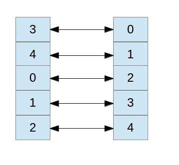
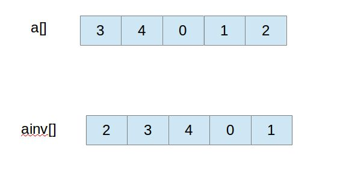
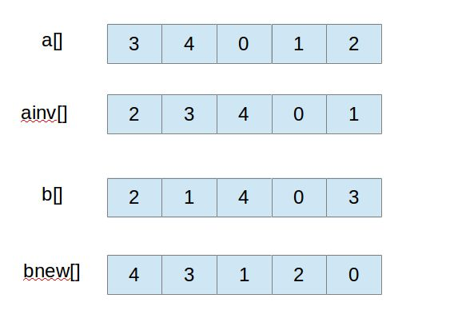

### Kendall tau距离：求两个排列之间的逆序数 ###

#### Kendall tau距离的定义 ####

以下定义取自wiki百科Kendall tau distance：

>The Kendall tau rank distance is a metric that counts the number of pairwise disagreements between two ranking lists. The larger the distance, the more dissimilar the two lists are.

也就是说，Kendall tau距离就是两个排列之间的逆序数，它反映了两个排列的相似程度。例如两个在区间[ 0 , 6 ]的排列：

	a = { 0, 3, 1, 6, 2, 5, 4 } 
	b = { 1, 0, 3, 6, 4, 2, 5 }

求a，b的Kendall tau距离，就是求两个排列之间的逆序{ 0，1 }，{ 3，1 }，{ 2，4 }，{ 5，4 }，一共为4对，故Kendall tau距离为4。

#### Kendall tau距离的求法 ####

从上面的例子可以看出，两个排列之间的逆序数可以看作是以a为排列的标准，b排列自身的逆序数。要以a为排列标准，首先需要将a排列的索引提取出来放到新排列aIndex中，即aIndex[ a[ i ] ] = i 。接着要以a排列的索引去确定b的索引，即bIndex[ i ] = aIndex[ b[ i ] ] 。从而bIndex中索引的逆序数就是a，b之间的逆序数了。 
一种特殊情况就是：a[ i ] = i 自然数序，则aIndex[ i ] = i ，bIndex[ i ] = b[ i ] ，则以a为排列的标准，b排列的逆序数就是b排列自身的逆序数。

#### 求一个排列的逆序数 ####

首先考虑简单的平方量级的算法。在插入排序或者冒泡排序中，元素交换的次数等于该排列的逆序数，因此在排序过程中统计交换次数即可。但是这种方法效率比较低。 
更高效的方法启发自高效的排序算法，比如归并排序，它可以使得算法变成线性对数量级。在将两个有序的排列归并在一起时，前子数组首元素如果小于后子数组首元素，则逆序数为0，反之，逆序数为前子数组当前的元素个数。

#### 求Kendall tau距离的实现 ####

<a href='KendallTau.java'>KendallTau</a>

---

### Kendall tau distance理解与分析 ###

#### 简介 ####

Kendall tau distance这个概念在平时如果不是专门接触到相关工作的话会显得比较陌生。它主要是一个用来比较两个向量之间相似度的概念。在一些数据分析和搜索引擎的结果相似度ranking里会有很多的应用。这里针对它的定义和计算做一个总结。
 
#### 概念分析 ####

Kendall tau distance这个概念似乎比较少见，在网上搜索也没找到太多详细的介绍。总的来说，它是用来量化的衡量几组向量之间的偏差的。这样粗看起来还是很难理解。怎么来定义一个偏差呢？我们总该有一个标准吧，比如说多少个元素不一样，以及它们不一样的位置如何等等。

举例来说，比如说我们有这样的一个数组[1, 2, 3, 4, 5]那么对于它来说，它就是一个标准顺序排列的一个序列。这个序列里元素不重复而且所有元素都是递增的。现在有另外一个数组，比如说[2, 3, 1, 5, 4]。对于它来说，它肯定和前面的数组不一样，也就是说有偏差。该怎么来量化这种偏差呢？

我们看，对于前面这个标准序列，它里面每个元素都比排它后面到元素小。而对于后面这个序列来说，它却不是这样，比如说第一个元素是2，它后面有元素1比它小，对于3， 5也是。这样，从数学的概念来说，它存在有3个逆序。所以说，逆序数量就相当于是它和基准序列的偏差。实际上Kendall tau distance虽然是描述两个序列之间的偏差。它也就是一个序列相当于一个基准序列的逆序数。
关于逆序计算和分析可以参照我前面的一篇文章。

#### 实现 ####

现在，我们再进一步细化前面讨论的过程。首先进行比较计算的两个序列可以通过定义两个数组来实现。为了使得问题简化，可以定义两个int数组。因为要计算它们的差异，所以它们每个元素都是唯一的而且两个数组长度一样。

在前面讨论的地方，计算Kendall tau distance是一个序列针对基准序列来计算逆序数。但是要进行比较的两个序列并不一定是我们前面提到的理想情况。它们可能没有一个是基准序列。这个时候该怎么办呢？

我们先来看这样一个数组a=[3, 4, 0, 1, 2]。由于这种序列的限制，它里面每个元素和下标都是唯一的。假设a[i]里有每个唯一的元素，那么对应的下标i就和这个元素形成一个唯一的映射。因此也可以说这是一种描述一个元素和它位置一一映射的关系：

如果我们对map数据结构比较熟悉的话，会发现这相当于是一个特殊的map。通过它们的关系，既可以从某个元素得到它的索引位置，也可以从它的索引位置得到该元素。在前面数组里，从某个索引得到某个元素的时间很快，就是一个常量，可是如果要从某个元素得到它的索引，则比较复杂，需要去查询整个数组。这样，可以利用该数组的特性，建立一个反向映射，用一个数组来保存它们的关系。概括起来就是

ainv[a[i]] = i 。对于数组a[i]来说，i相当于是key，通过它可以常量时间内得到a[i]的值，而对于ainv[]来说，a[i]是key，通过它也可以常量时间内得到对应的索引i。

这样，通过ainv[], a[]这两个数组可以建立起一个数组元素和索引的双向映射。

以上面数组为例，我们构造的ainv[]数组如下：

在回到前面的问题中。我们这里建立了一个数组元素和索引的关系。如果对于两个不同的数组，而且它们两个都不是基准数组的话，就需要将它们做一个转换才行。比如说，我们将一个数组转换成基准数组。当然，既然一个要转换的话，另外一个也需要对应的转换。这个转换该怎么做呢？

在上述的a[]和ainv[]数组中，如果我们从头开始以i = 0开始去遍历a[i]，然后返回ainv[a[i]]，得到的正好就是一个基准序列[0, 1, 2, 3, 4]，这个序列表示a[]数组里所有元素的索引。如果我们取对应另外一个数组的元素，比如b[]来作为映射的key，则它返回的结果相当于经过ainv[]的一个转换运算。我们的映射关系为

bnew[i] = ainv[b[i]]; 一个对应的示例如下图：

最终得出的数组bnew[]相当于数组b针对数组a 索引映射确定的索引顺序，求这个序列的逆序则就可以确定它们之间最终的Kendall tau distance。
于是，我们最终得到如下的代码：
 

	public static long distance(int[] a, int[] b) {  
	    if(a.length != b.length)  
	        throw new IllegalArgumentException("Array dimensions disagree");  
	    int n = a.length;  
	    int[] ainv = new int[n];  
	    for(int i = 0; i < n; i++)  
	        ainv[a[i]] = i;  
	  
	    int[] bnew = new int[n];  
	    for(int i = 0; i < n; i++)  
	        bnew[i] = ainv[b[i]];  
	    return Inversions.count(bnew);  
	}  
 
 
#### 总结 ####

Kendall tau distance的问题比较绕。首先一个问题就是要确定一个衡量两个数组差别的方式。这里是用一个数组相当于一个基准数组的逆序数来衡量它们的差别。逆序数越大说明差别越大。最麻烦的问题就是当两个数组都不是基准数组的时候要将一个转换成基准数组，而这个时候另外一个数组也要做对应的变化。该怎么来变化呢？通过一个数组的元素-->索引映射数组建立一个映射关系。这个关系如果应用到该数组上的时候相当于返回了一个基准数组。它相当于应用了一个数学函数。而将其应用到另外一个比较的数组时，相当于对应的数组也和该数组做了一个转换成基准数组的运算。这样得到的这个数组再来求逆序数就可以了。

---

文章来自于

[Kendall tau距离：求两个排列之间的逆序数](http://blog.csdn.net/zhufenghao/article/details/49594035)

[Kendall tau distance理解与分析](http://shmilyaw-hotmail-com.iteye.com/blog/2275113)

