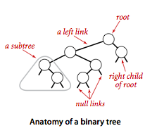
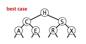
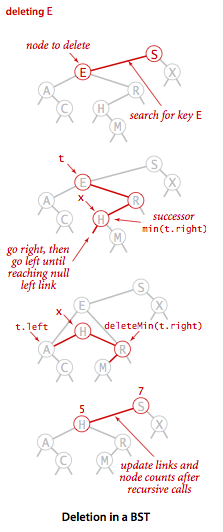
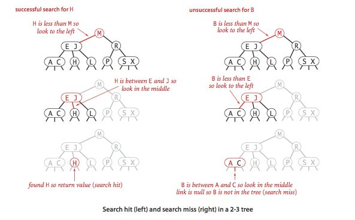
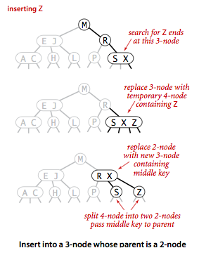
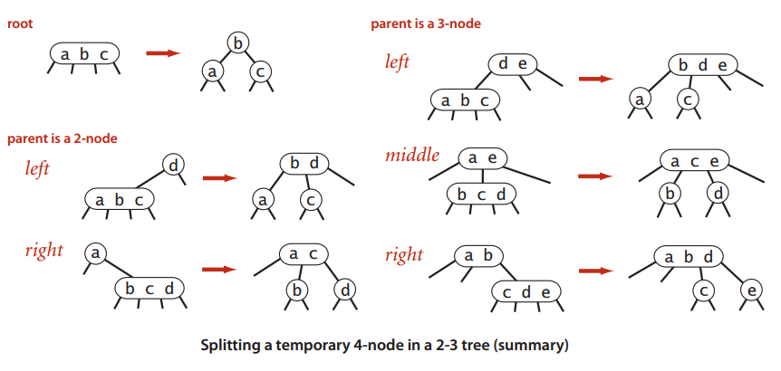

[顺序查找(基于无序链表)](#)

[二分查找(基于有序数组)](#)

[二叉查找树](#二叉查找树)

[平衡查找树](#平衡查找树)

[散列表](#散列表)

[应用](#应用)

# 符号表 #

> 符号表是一种存储键值对的数据结构，支持两种操作：插入(put)，即将一组新的键值对存入表中；查找(get)，即根据给定的键得到相应的值。

<table>
	<thead>
		<tr>
			<td>应用</td>
			<td>查找的目的</td>
			<td>键</td>
			<td>值</td>
		</tr>
	</thead>
	<tbody>
		<tr>
			<td>字典</td>
			<td>找出单词的解释</td>
			<td>单词</td>
			<td>释义</td>
		</tr>
		<tr>
			<td>图书索引</td>
			<td>找出相关页码</td>
			<td>术语</td>
			<td>一串页码</td>
		</tr>
		<tr>
			<td>文件共享</td>
			<td>找到歌曲的下载地址</td>
			<td>歌曲名</td>
			<td>计算机ID</td>
		</tr>
		<tr>
			<td>账户管理</td>
			<td>处理交易</td>
			<td>账户号码</td>
			<td>交易详情</td>
		</tr>
		<tr>
			<td>网络搜索</td>
			<td>找出相关网页</td>
			<td>关键字</td>
			<td>网页名称</td>
		</tr>
		<tr>
			<td>编译器</td>
			<td>找出符号的类型和值</td>
			<td>变量名</td>
			<td>类型和值</td>
		</tr>
	</tbody>
</table>

**顺序查找(基于无序链表)**
	
	public class SequentialSearchST<Key, Value>{
	
		private int n; // 键值对的数目
		private Node first; //头节点

		// 节点基本数据结构
		private class Node {
			private Key key;
			private Value val;
			private Node next;

			public Node(Key key, Value val, Node next)  {
			    this.key  = key;
			    this.val  = val;
			    this.next = next;
			}
		}

		public SequentialSearchST() {
		}

		public int size() {
			return n;
		}
		public boolean isEmpty() {
			return size() == 0;
		}
		public boolean contains(Key key) {
			if (key == null) 
				throw new IllegalArgumentException("argument to contains() is null");
			return get(key) != null;
		}
		public Value get(Key key) {
			if (key == null) 
				throw new IllegalArgumentException("argument to get() is null"); 
			for (Node x = first; x != null; x = x.next) {
			    if (key.equals(x.key))
				return x.val;
			}
			return null;
		}		
		public void put(Key key, Value value){
			if (key == null) 
				throw new IllegalArgumentException("first argument to put() is null"); 
			if (val == null) {
			    delete(key);
			    return;
			}

			//若找到已存在键，则跟新它的对应的值
			for(Node x = first; x != null;x = x.next){
				if(x.key.equals(key)){
					x.value = value;
					return;
				}
			}

			//若找不到，在链头插入
			first = new Node(key, value, first);
		}		
		public void delete(Key key) {
			if (key == null) 
				throw new IllegalArgumentException("argument to delete() is null"); 
			first = delete(first, key);
		}
		
		private Node delete(Node x, Key key) {
			if (x == null) return null;
			if (key.equals(x.key)) {
			    n--;
			    return x.next;
			}
			//使用递归
			x.next = delete(x.next, key);
			return x;
		}

		public Iterable<Key> keys()  {
			LinkedList<Key> queue = new LinkedList<Key>();
			for (Node x = first; x != null; x = x.next)
			    queue.add(x.key);
			return queue;
		}
	}
>向一个空表中插入N个不同的键需要~N^2/2次比较

**二分查找(基于有序数组)**

	public class BinarySearchST<Key extends Comparable<Key>, Value> {
		private static final int INIT_CAPACITY = 2;
		private Key[] keys;
		private Value[] vals;
		private int n = 0;//键值数

		//初始化 符号表
		public BinarySearchST() {
			this(INIT_CAPACITY);
		}
		
		public BinarySearchST(int capacity) { 
			keys = (Key[]) new Comparable[capacity]; 
			vals = (Value[]) new Object[capacity]; 
		}   
		
		public int size() {
			return n;
		}
		public boolean isEmpty() {
			return size() == 0;
		}
		public boolean contains(Key key) {
			if (key == null) 
				throw new IllegalArgumentException("argument to contains() is null");
			return get(key) != null;
		}

		//
		public Value get(Key key) {
			if (key == null) 
				throw new IllegalArgumentException("argument to get() is null"); 
			if (isEmpty()) return null;
			int i = rank(key); 
			if (i < n && keys[i].compareTo(key) == 0) 
				return vals[i];
			return null;
		} 

		public void put(Key key, Value val)  {
			if (key == null) 
				throw new IllegalArgumentException("first argument to put() is null"); 

			if (val == null) {
				delete(key);
				return;
			}

			int i = rank(key);//若表中不存在该键，rank返回表中小于它的键的数量

			//如果表已经存在表中
			if (i < n && keys[i].compareTo(key) == 0) {
				vals[i] = val;
				return;
			}

			//插入新的键值对

			if (n == keys.length)//数组不够存了，就延长数组
				resize(2 * keys.length);

			for (int j = n; j > i; j--)  {
				keys[j] = keys[j-1];
				vals[j] = vals[j-1];
			}
				keys[i] = key;
				vals[i] = val;
				n++;

			assert check();
		} 	

		private void resize(int capacity) {
			assert capacity >= n;
			Key[]   tempk = (Key[])new Comparable[capacity];
			Value[] tempv = (Value[])new Object[capacity];
			for (int i = 0; i < n; i++) {
				tempk[i] = keys[i];
				tempv[i] = vals[i];
			}
			vals = tempv;
			keys = tempk;
		}

		//找键的位置 （迭代）
		public int rank(Key key) {
			if (key == null) 
				throw new IllegalArgumentException("argument to rank() is null"); 

			int lo = 0, hi = n-1; 
			while (lo <= hi) { 
				int mid = lo + (hi - lo) / 2; 
				int cmp = key.compareTo(keys[mid]);
				if(cmp < 0) 
					hi = mid - 1; 
				else if (cmp > 0) 
					lo = mid + 1; 
				else 
					return mid; 
			} 
			return lo;
		} 

		//找键的位置（递归）
		public int rank2(Key key, int lo, int hi){
			if(hi < lo)
				return lo;
			int mid = lo + (hi - lo) / 2;
			int cmp = key.compareTo(keys[mid]);
			if(cmp < 0)
				return rank2(key, lo, mid - 1);
			else if(cmp > 0)
				return rank2(key, mid+1, hi);
			else
				return mid;
		}

		public void delete(Key key) {
			if (key == null) 
				throw new IllegalArgumentException("argument to delete() is null"); 
			if (isEmpty()) 
				return;

			// compute rank
			int i = rank(key);

			// key not in table
			if (i == n || keys[i].compareTo(key) != 0) {
				return;
			}

			//需要进行移位操作，覆盖要删除的值
			for (int j = i; j < n-1; j++)  {
				keys[j] = keys[j+1];
				 vals[j] = vals[j+1];
			}

			n--;
			keys[n] = null;  // to avoid loitering
			vals[n] = null;

			// resize if 1/4 full
			if (n > 0 && n == keys.length/4) 
			resize(keys.length/2);

			assert check();
		} 

		//次要方法
		public void deleteMin() {
			if (isEmpty()) 
				throw new NoSuchElementException("Symbol table underflow error");
			delete(min());
		}

		public void deleteMax() {
			if (isEmpty()) 
				throw new NoSuchElementException("Symbol table underflow error");
			delete(max());
		}

		public Key min() {
			if (isEmpty()) 
				throw new NoSuchElementException("called min() with empty symbol table");
			return keys[0]; 
		}

		public Key max() {
			if (isEmpty()) 
				throw new NoSuchElementException("called max() with empty symbol table");
			return keys[n-1];
		}	

		public Key select(int k) {
			if (k < 0 || k >= size()) {
				throw new IllegalArgumentException("called select() with invalid argument: " + k);
			}
			return keys[k];
		}	

		//小于等于key的最大的键
		public Key floor(Key key) {
			if (key == null) 
				throw new IllegalArgumentException("argument to floor() is null"); 
			int i = rank(key);
			if (i < n && key.compareTo(keys[i]) == 0) 
				return keys[i];
			if (i == 0) 
				return null;
			else 
				return keys[i-1];
		}

		//大于等于key的最小的键	
		public Key ceiling(Key key) {
			if (key == null) 
				throw new IllegalArgumentException("argument to ceiling() is null"); 
			int i = rank(key);
			if (i == n) 
				return null; 
			else 
				return keys[i];
		}

		public int size(Key lo, Key hi) {
			if (lo == null) 
				throw new IllegalArgumentException("first argument to size() is null"); 
			if (hi == null) 
				throw new IllegalArgumentException("second argument to size() is null"); 

			if (lo.compareTo(hi) > 0) 
				return 0;
			if (contains(hi)) 
				return rank(hi) - rank(lo) + 1;
			else              
				return rank(hi) - rank(lo);
		}
		
		public Iterable<Key> keys() {
			return keys(min(), max());
		}
		
		public Iterable<Key> keys(Key lo, Key hi) {
			if (lo == null) 
				throw new IllegalArgumentException("first argument to keys() is null"); 
			if (hi == null) 
				throw new IllegalArgumentException("second argument to keys() is null"); 

			LinkedList<Key> queue = new LinkedList<Key>(); 
			if (lo.compareTo(hi) > 0) 
				return queue;
			for (int i = rank(lo); i < rank(hi); i++) 
				queue.add(keys[i]);
			if (contains(hi)) 
				queue.add(keys[rank(hi)]);
			return queue; 
		}

		//检测符号表 的 完整性
		private boolean check() {
			return isSorted() && rankCheck();
		}

		// are the items in the array in ascending order?
		private boolean isSorted() {
			for (int i = 1; i < size(); i++)
				if (keys[i].compareTo(keys[i-1]) < 0) 
					return false;
			return true;
		}

		// check that rank(select(i)) = i
		private boolean rankCheck() {
			for (int i = 0; i < size(); i++)
				if (i != rank(select(i))) 
					return false;
			for (int i = 0; i < size(); i++)
				if (keys[i].compareTo(select(rank(keys[i]))) != 0) 
					return false;
			return true;
		}
	}

>在N个键的有序数组中进行二分查找最多需(lgN+1)次比较(无论是否成功)

**简单的符号表实现的成本总结**
<table>
	<thead>
		<tr>
			<td rowspan=2>算法(数据结构)</td>
			<td colspan=2>最坏情况的成本(N次插入后)</td>
			<td colspan=2>平均情况下的成本(N次随机插入后)</td>
			<td rowspan=2>是否 高效地 支持有序性相关操作</td>
		</tr>
		<tr>
			<td>查找</td>
			<td>插入</td>
			<td>查找</td>
			<td>插入</td>
		</tr>
	</thead>
	<tbody>
		<tr>
			<td>顺序查找（基于无序链表）</td>
			<td>N</td>
			<td>N</td>
			<td>N/2</td>
			<td>N</td>
			<td>否</td>
		</tr>
		<tr>
			<td>二分查找(基于有序数组)</td>
			<td>lgN</td>
			<td>2N</td>
			<td>lgN</td>
			<td>N</td>
			<td>是</td>
		</tr>
	</tbody>
</table>

---

**符号表的各种实现的优缺点**
<table>
	<thead>
		<tr>
			<td>使用的数据结构</td>
			<td>实现</td>
			<td>优点</td>
			<td>缺点</td>
		</tr>
	</thead>
	<tbody>
		<tr>
			<td>链表(顺序查找)</td>
			<td>SequentialSearchST</td>
			<td>适用小型问题</td>
			<td>对于大型符号表很慢</td>
		</tr>
		<tr>
			<td>有序数组(二分查找)</td>
			<td>BinarySearchST</td>
			<td>最优的查找效率和空间需求，能够进行有序相关的操作</td>
			<td>插入操作很慢</td>
		</tr>
		<tr>
			<td>二叉查找树</td>
			<td>BST</td>
			<td>实现简单，能够进行有序性的相关操作</td>
			<td>没有性能上界的保证 
				链接需要额外的空间
			</td>
		</tr>
		<tr>
			<td>平衡二叉树</td>
			<td>RedBlackBST</td>
			<td>最优的查找和插入效率，能够进行有序性相关的操作</td>
			<td>链接需要额外的空间</td>
		</tr>
		<tr>
			<td>散列表</td>
			<td>
				SeparateChainHashST
				 
				LinearProbingHashST
			</td>
			<td>能够快速地查找和插入常见类型的数据</td>
			<td>需要计算每种类型的数据的散列 
				无法进行有序性的相关操作 
				链接和空节点需要额外的空间
			</td>
		</tr>
	</tbody>
</table>

二叉查找树
---

>定义。一颗二叉查找树Binary Search Tree，其中每个结点都含有一个Comparable的键(以及相关联的值)且每个结点的键都大于其左子树中的任意结点的键而小于右子树的任意结点的键。

	public class BST<Key extends Comparable<Key>, Value> {
		private Node root; // root of BST
	
		private class Node {
			private Key key; // sorted by key
			private Value val; // associated data
			private Node left, right; // left and right subtrees
			private int size; // number of nodes in subtree
	
			public Node(Key key, Value val, int size) {
				this.key = key;
				this.val = val;
				this.size = size;
			}
		}

		public int size() {
			return size(root);
		}
	
		// return number of key-value pairs in BST rooted at x
		private int size(Node x) {
			if (x == null)
				return 0;
			else
				return x.size;
		}

	}

**详解二叉查找树**

**一个标准二叉查找树的实例图**

### 查找 ###

	/**
	 * 查找
	 * @param key
	 * @return
	 */
	public Value get(Key key) {
		return get(root, key);
	}

	private Value get(Node x, Key key) {
		if (key == null)
			throw new IllegalArgumentException("calls get() with a null key");
		if (x == null)
			return null;
		int cmp = key.compareTo(x.key);
		if (cmp < 0)
			return get(x.left, key);
		else if (cmp > 0)
			return get(x.right, key);
		else
			return x.val;
	}

	public boolean contains(Key key) {
		if (key == null)
			throw new IllegalArgumentException("argument to contains() is null");
		return get(key) != null;
	}

### 插入 ###

	public void put(Key key, Value val) {
		if (key == null)
			throw new IllegalArgumentException("calls put() with a null key");
		if (val == null) {
			//delete(key);
			return;
		}
		root = put(root, key, val);

	}

	private Node put(Node x, Key key, Value val) {
		if (x == null)
			return new Node(key, val, 1);
		int cmp = key.compareTo(x.key);
		if (cmp < 0)
			x.left = put(x.left, key, val);
		else if (cmp > 0)
			x.right = put(x.right, key, val);
		else
			x.val = val;
		x.size = 1 + size(x.left) + size(x.right);
		return x;
	}

### 分析 ###

>在由N个随机键构造的二叉查找树中，查找命中平均所需的比较次数、插入操作、查找未命中所需的比较次数 为 ~2InN(约1.39lgN)

### 有序性相关的方法与删除操作 ###

#### 最大键和最小键 ####

	public boolean isEmpty() {
		return size() == 0;
	}

	public Key min() {
		if (isEmpty())
			throw new NoSuchElementException("calls min() with empty symbol table");
		return min(root).key;
	}

	private Node min(Node x) {
		if (x.left == null)
			return x;
		else
			return min(x.left);
	}

找出最大键的方法类似的，只是变为查找右子树

	public Key max() {
		if (isEmpty())
			throw new NoSuchElementException("calls max() with empty symbol table");
		return max(root).key;
	}

	private Node max(Node x) {
		if (x.right == null)
			return x;
		else
			return max(x.right);
	}

#### 向上取整和向下取整 ####

	public Key floor(Key key) {
		if (key == null)
			throw new IllegalArgumentException("argument to floor() is null");
		if (isEmpty())
			throw new NoSuchElementException("calls floor() with empty symbol table");
		Node x = floor(root, key);
		if (x == null)
			return null;
		else
			return x.key;
	}

	private Node floor(Node x, Key key) {
		if (x == null)
			return null;
		int cmp = key.compareTo(x.key);
		if (cmp == 0)
			return x;
		if (cmp < 0)
			return floor(x.left, key);
		Node t = floor(x.right, key);
		if (t != null)
			return t;
		else
			return x;
	}

	public Key floor2(Key key) {
		return floor2(root, key, null);
	}

	private Key floor2(Node x, Key key, Key best) {
		if (x == null)
			return best;
		int cmp = key.compareTo(x.key);
		if (cmp < 0)
			return floor2(x.left, key, best);
		else if (cmp > 0)
			return floor2(x.right, key, x.key);
		else
			return x.key;
	}

---

	public Key ceiling(Key key) {
		if (key == null)
			throw new IllegalArgumentException("argument to ceiling() is null");
		if (isEmpty())
			throw new NoSuchElementException("calls ceiling() with empty symbol table");
		Node x = ceiling(root, key);
		if (x == null)
			return null;
		else
			return x.key;
	}

	private Node ceiling(Node x, Key key) {
		if (x == null)
			return null;
		int cmp = key.compareTo(x.key);
		if (cmp == 0)
			return x;
		if (cmp < 0) {
			Node t = ceiling(x.left, key);
			if (t != null)
				return t;
			else
				return x;
		}
		return ceiling(x.right, key);
	}

#### 排名 ####

	public Key select(int k) {
		if (k < 0 || k >= size()) {
			throw new IllegalArgumentException("argument to select() is invalid: " + k);
		}
		Node x = select(root, k);
		return x.key;
	}

	// Return key of rank k.
	private Node select(Node x, int k) {
		if (x == null)
			return null;
		int t = size(x.left);
		if (t > k)
			return select(x.left, k);
		else if (t < k)
			return select(x.right, k - t - 1);
		else
			return x;
	}

	public int rank(Key key) {
		if (key == null)
			throw new IllegalArgumentException("argument to rank() is null");
		return rank(key, root);
	}

	// Number of keys in the subtree less than key.
	private int rank(Key key, Node x) {
		if (x == null)
			return 0;
		int cmp = key.compareTo(x.key);
		if (cmp < 0)
			return rank(key, x.left);
		else if (cmp > 0)
			return 1 + size(x.left) + rank(key, x.right);
		else
			return size(x.left);
	}

#### 删除操作 ####

**删除最小键**

	public void deleteMin() {
		if (isEmpty())
			throw new NoSuchElementException("Symbol table underflow");
		root = deleteMin(root);
	}

	private Node deleteMin(Node x) {
		if (x.left == null)
			return x.right;
		x.left = deleteMin(x.left);
		x.size = size(x.left) + size(x.right) + 1;
		return x;
	}

deleteMax()与deleteMax()类似，关键deleteMax(x.right)

---
**删除操作**

在BST上删除x结点

1. 将指向即将被删除的结点的连接保存为t //Node t = x;
2. 将x指向他的后继结点min(t.right) //x = min(t.right);
3. 将x的右链接(原本指向一棵所有结点都大于x.key的二叉查找树)指向deleteMin(t.right),也就是在删除后所有结点仍然都大于x.key的子二叉树//x.right=deleteMin(t.right);
4. 将x的左链接设为t.left(其下所有的键都小于被删除的结点和它的后继结点)//x.left = t.left;

	public void delete(Key key) {
		if (key == null)
			throw new IllegalArgumentException("calls delete() with a null key");
		root = delete(root, key);
	}

	private Node delete(Node x, Key key) {
		if (x == null)
			return null;

		int cmp = key.compareTo(x.key);
		if (cmp < 0)
			x.left = delete(x.left, key);
		else if (cmp > 0)
			x.right = delete(x.right, key);
		else {
			if (x.right == null)
				return x.left;
			if (x.left == null)
				return x.right;
			Node t = x;
			x = min(t.right);
			x.right = deleteMin(t.right);
			x.left = t.left;
		}
		x.size = size(x.left) + size(x.right) + 1;
		return x;
	}

#### 范围查找 ####

	public Iterable<Key> keys(Key lo, Key hi) {
		if (lo == null)
			throw new IllegalArgumentException("first argument to keys() is null");
		if (hi == null)
			throw new IllegalArgumentException("second argument to keys() is null");

		Queue<Key> queue = new Queue<Key>();
		keys(root, queue, lo, hi);
		return queue;
	}

	private void keys(Node x, Queue<Key> queue, Key lo, Key hi) {
		if (x == null)
			return;
		int cmplo = lo.compareTo(x.key);
		int cmphi = hi.compareTo(x.key);
		if (cmplo < 0)
			keys(x.left, queue, lo, hi);
		if (cmplo <= 0 && cmphi >= 0)
			queue.enqueue(x.key);
		if (cmphi > 0)
			keys(x.right, queue, lo, hi);
	}

#### 高度 ####

	public int height() {
		return height(root);
	}

	private int height(Node x) {
		if (x == null)
			return -1;
		return 1 + Math.max(height(x.left), height(x.right));
	}

平衡查找树
---

### 2-3查找树 ###

	一棵 2-3 查找树或为一棵空树，或由以下结点组成：
	
	1. 2-结点，含有一个键（以及对应的值）和两条链接，左链接指向的2-3树中的键都小于该结点，右链接指向的2-3树中的键都大于该结点。
	2. 3-结点，含有两个键（以及对应的值）和三条链接，左链接指向的2-3树中的键都小于该结点，中链接指向的2-3中的键都位于该结点的两个之间，右链接指向的2-3树中的键都大于该结点。
	
	指向空树的链接称为 空链接。

#### 查找 ####

#### 向2-结点中插入新键 ####

#### 向一棵只含有一个3-结点的树中插入新键 ####

#### 向一个父结点为2-结点的3-结点中插入新键 ####

#### 向一个父结点为3-结点的3-结点中插入新键 ####

#### 分解根结点 ####

#### 在一棵2-3树中分解一个4-结点的情况汇总 ####

#### 2-3的构造轨迹 ####

### 红黑二叉查找树 ###

具有2-3树性质的平衡二叉树，这样可以复用平衡二叉树的代码。

散列表
---

特殊数组——用算数操作将键转化为数组索引来访问数组中的键值对。

使用散列的查找算法分为两步：

**第一步，利用散列函数将被查找的键转化为数组的一个索引**。理想情况下，不同的键都能转化为不同的索引值。但是，我们需要面对两个或多个键都会散列到相同的索引值情况。

因此，散列查找的**第二步就是一个处理碰撞冲突的过程**，解决碰撞的两个方法：拉链法 和 线性探测法

散列表是算法在时间和空间上作出权衡的经典例子。

要为一个数据类型实现一个优秀的散列方法需要满足三个条件

1. 一致性——等价的键必然产生相等的散列值
2. 高效性——计算简便
3. 均匀性——均匀散列所有

**假设J(均匀散列假设)。我们使用的散列函数能够均匀并独立地将所有的键散步于0到M-1之间**

### 基于拉链法的散列表 ###

拉链法——将大小为M的数组的每个元素指向一条链表，链表中的每个结点都存储了散列值为该元素的索引的键值对，发生冲突的元素都被存储在链表中

	public class SeparateChainingHashST<Key, Value>{
		private static final int INIT_CAPACITY = 4;

		private int numOfKvPairs;
		private int tableSize;
		private SequentialSearchST<Key, Value>[] st;// array of linked-list symbol tables一个链表数组

		//初始化 基于 拉链法的散列表
		public SeparateChainingHashST() {
			this(INIT_CAPACITY);
		}

		public SeparateChainingHashST(int tableSize) {
			this.tableSize = tableSize;
			st = (SequentialSearchST<Key, Value>[]) new SequentialSearchST[tableSize];
			for (int i = 0; i < tableSize; i++)
				st[i] = new SequentialSearchST<Key, Value>();
		} 

		//重新分配数组大小
		private void resize(int chains) {
			SeparateChainingHashST<Key, Value> temp = new SeparateChainingHashST<Key, Value>(chains);
			//重新插入
			for (int i = 0; i < tableSize; i++) {
				for (Key key : st[i].keys()) {
					temp.put(key, st[i].get(key));
				}
			}
			this.tableSize = temp.tableSize;
			this.numOfKvPairs = temp.numOfKvPairs;
			this.st = temp.st;
		}

		private int hash(Key key) {
			return (key.hashCode() & 0x7fffffff) % tableSize;
		}
		
		public int size() {
			return numOfKvPairs;
		}

		public boolean isEmpty() {
			return size() == 0;
		}

		public boolean contains(Key key) {
			if (key == null)
				throw new IllegalArgumentException("argument to contains() is null");
			return get(key) != null;
		}
		 
		public Value get(Key key) {
			if (key == null)
				throw new IllegalArgumentException("argument to get() is null");
			int i = hash(key);
			return st[i].get(key);
		}

		public void put(Key key, Value val) {
			if (key == null)
				throw new IllegalArgumentException("first argument to put() is null");
			if (val == null) {
				delete(key);
				return;
			}
	
			// double table size if average length of list >= 10
			if (numOfKvPairs >= 10 * tableSize)
				resize(2 * tableSize);
	
			int i = hash(key);
			if (!st[i].contains(key))
				numOfKvPairs++;
			st[i].put(key, val);
		}

		public void delete(Key key) {
			if (key == null)
				throw new IllegalArgumentException("argument to delete() is null");
	
			int i = hash(key);
			if (st[i].contains(key))
				numOfKvPairs--;
			st[i].delete(key);
	
			// halve table size if average length of list <= 2
			if (tableSize > INIT_CAPACITY && numOfKvPairs <= 2 * tableSize)
				resize(tableSize / 2);
		}

		// return keys in symbol table as an Iterable
		public Iterable<Key> keys() {
			LinkedList<Key> queue = new LinkedList<Key>();
			for (int i = 0; i < tableSize; i++) {
				for (Key key : st[i].keys())
					queue.add(key);
			}
			return queue;
		}
	}

**命题K 在一张含有M条链表和N个键的散列表中，（在假设J成立的前提下）任意一条链表中的键的数量（链长）均在N/M的常数因子范围内的概率（N/M > 0）**

书中证明 涉及二项分布

	假设你要生孩子，生男孩子概率p，生女孩纸概率1-p
	
	伯努利实验：生一次孩子
	
	伯努利分布：生一次孩子，生男孩子概率为p,生女孩纸概率1-p，这个就是伯努利分布
	
	n重伯努利实验：将伯努利实验重复n次，就是生n次孩子。
	
	二项分布：n重伯努利试验「成功」次数的离散概率分布，这里的「成功」假设是生女孩纸（喜欢男孩子就把成功看出生男孩子）。举个例子：生孩子n次(n重伯努利试验)，成功次数(生女孩纸的个数)为k次的概率就是「一个」二项分布概率。二项分布就是生孩子n次，成功0次，1次，2次，。。。。n次(生女孩纸0个，1个，2个。。。n个)，这个情况下的一堆概率。。。
	
	可以看到，如果你做一次实验（1重伯努利试验），这个时候就变成了伯努利分布。

[阮一峰关于 泊松分布 解释](http://www.ruanyifeng.com/blog/2015/06/poisson-distribution.html)

**命题L 在一张含有M条链表和N个键的散列表中，|未命中查找| 和 插入 操作所需的比较次数为 ~N/M（平均链长）**

### 基于线性探测法的散列表 ###

实现散列表的另一种方式就是用大小为M数组保存N个键值对，其中M>N。
我们需要依靠数组中的**空位**解决碰撞冲突。
基于这种策略的所有方法被统称为**开放地址**散列表。

开放地址散列表中最简单的方法叫做**线性探测法**：当碰撞发生时（当一个散列值已经被另一个不同的键占用），我们直接检查散列表中的下一个位置（将索引值加1）。这样的线性探测可能产生3个结果：

1. 命中，该位置的键和被查找的键相同
2. 未命中，键为空（该位置没有键）
3. 继续查找，该位置的键和被查找的键不同

用散列函数找到键在数组中的索引，检查其中的键和被查找的键是否相同。如果不同则继续查找（将索引增大，到达数组结尾时折回数组的开头）直到找到该键或者遇到一个空元素。

	public class LinearProbingHashST<Key, Value> {
		private static final int INIT_CAPACITY = 4;
	
		private int numOfKvPairs; // number of key-value pairs in the symbol table
		private int tableSize; // size of linear probing table
		private Key[] keys; // the keys
		private Value[] vals; // the values

		public LinearProbingHashST() {
			this(INIT_CAPACITY);
		}
	
		@SuppressWarnings("unchecked")
		public LinearProbingHashST(int capacity) {
			tableSize = capacity;
			numOfKvPairs = 0;
			keys = (Key[]) new Object[tableSize];
			vals = (Value[]) new Object[tableSize];
		}
	
		public int size() {
			return numOfKvPairs;
		}
	
		public boolean isEmpty() {
			return size() == 0;
		}
	
		public boolean contains(Key key) {
			if (key == null)
				throw new IllegalArgumentException("argument to contains() is null");
			return get(key) != null;
		}
	
		private void resize(int capacity) {
			LinearProbingHashST<Key, Value> temp = new LinearProbingHashST<Key, Value>(capacity);
			for (int i = 0; i < tableSize; i++) {
				if (keys[i] != null) {
					temp.put(keys[i], vals[i]);
				}
			}
			keys = temp.keys;
			vals = temp.vals;
			tableSize = temp.tableSize;
		}
	
		public void put(Key key, Value val) {
			if (key == null)
				throw new IllegalArgumentException("first argument to put() is null");
	
			if (val == null) {
				delete(key);
				return;
			}
	
			// double table size if 50% full
			if (numOfKvPairs >= tableSize / 2)
				resize(2 * tableSize);
	
			int i;
			for (i = hash(key); keys[i] != null; i = (i + 1) % tableSize) {
				if (keys[i].equals(key)) {
					vals[i] = val;
					return;
				}
			}
			keys[i] = key;
			vals[i] = val;
			numOfKvPairs++;
		}
	
		public Value get(Key key) {
			if (key == null)
				throw new IllegalArgumentException("argument to get() is null");
			for (int i = hash(key); keys[i] != null; i = (i + 1) % tableSize)
				if (keys[i].equals(key))
					return vals[i];
			return null;
		}
	
		public void delete(Key key) {
			if (key == null)
				throw new IllegalArgumentException("argument to delete() is null");
			if (!contains(key))
				return;
	
			// find position i of key
			int i = hash(key);
			while (!key.equals(keys[i])) {
				i = (i + 1) % tableSize;
			}
	
			// delete key and associated value
			keys[i] = null;
			vals[i] = null;
	
			// rehash all keys in same cluster
			i = (i + 1) % tableSize;
			while (keys[i] != null) {
				// delete keys[i] an vals[i] and reinsert
				Key keyToRehash = keys[i];
				Value valToRehash = vals[i];
				keys[i] = null;
				vals[i] = null;
				numOfKvPairs--;
				put(keyToRehash, valToRehash);
				i = (i + 1) % tableSize;
			}
	
			numOfKvPairs--;
	
			// halves size of array if it's 12.5% full or less
			if (numOfKvPairs > 0 && numOfKvPairs <= tableSize / 8)
				resize(tableSize / 2);
	
			assert check();
		}
	
		public Iterable<Key> keys() {
			LinkedList<Key> queue = new LinkedList<Key>();
			for (int i = 0; i < tableSize; i++)
				if (keys[i] != null)
					queue.add(keys[i]);
			return queue;
		}
	
		private boolean check() {
	
			// check that hash table is at most 50% full
			if (tableSize < 2 * numOfKvPairs) {
				System.err.println("Hash table size m = " + tableSize + "; array size n = " + numOfKvPairs);
				return false;
			}
	
			// check that each key in table can be found by get()
			for (int i = 0; i < tableSize; i++) {
				if (keys[i] == null)
					continue;
				else if (get(keys[i]) != vals[i]) {
					System.err.println("get[" + keys[i] + "] = " + get(keys[i]) + "; vals[i] = " + vals[i]);
					return false;
				}
			}
			return true;
		}
	}

线性探测的平均成本取决于元素在插入数组后聚集成的一组连接条目，也叫做 **键簇**

α=N/M

N为 键值对总数

M为 散列表的大小

对于拉链法，α是每条链表的长度，因此一般>1

对于线性探测法，α是散列表的使用率，不可能超过1

**命题M 在大小为M并含有N=α个键的基于线性探测的散列表中，基于假设J，命中和未命中的查找所需的探测次数分别为：~1/2(1+1/(1-α)) 和 ~1/2(1+1/(1-α)^2)**

**特别是当α约为1/2时，查找命中所需的探测次数约为3/2，未命中所需要的约为5、2**

**当α趋近与1时，这些估计值精确度会下降，但不需要担心这些情况，因为保证散列表的使用率小于 1/2**

---
**命题N 假设一张散列表能够自己调整数组大小，初始为空。基于假设J，执行任意顺序的t次 查找、插入、删除操作所需的时间和t成正比，所使用的内存量总是在表中的键的总数的常数因子范围内**

散列表并非包治百病的灵丹妙药，因为：

1. 每种类型的键都要一个优秀的散列表
2. 性能保证来自 散列函数 的质量
3. 散列函数的计算可能复杂而且昂贵
4. 难以支持有序性相关的符号表操作

应用
---

<table>

	<tr>
		<td rowspan=2>算法（数据结构）</td>
		<td colspan=2>最坏情况下的运行时间的增长数量级（N次插入后）</td>
		<td colspan=2>平均情况下的运行时间的增长数量级（N次插入后）</td>
		<td rowspan=2>关键接口</td>
		<td rowspan=2>内存使用（字节）</td>
	</tr>
	<tr>
		<td>查找</td>
		<td>插入</td>
		<td>查找</td>
		<td>插入</td>
	</tr>

</table>

<table>

	<tr>
		<td>顺序查询（无序链表）</td>
		<td>N</td>
		<td>N</td>
		<td>N/2</td>
		<td>N</td>
		<td>equals()</td>
		<td>48N</td>
	</tr>
	<tr>
		<td>二分查找（有序数组）</td>
		<td>lgN</td>
		<td>N</td>
		<td>lgN</td>
		<td>N/2</td>
		<td rowspan=3>compareTo()</td>
		<td>16N</td>
	</tr>
	<tr>
		<td>二叉树查找（二叉查找树）</td>
		<td>N</td>
		<td>N</td>
		<td>1.39lgN</td>
		<td>1.39lgN</td>
		<td>64N</td>
	</tr>
	<tr>
		<td>2-3树查找（红黑树）</td>
		<td>2lgN</td>
		<td>2lgN</td>
		<td>1.00lgN</td>
		<td>1.00lgN</td>
		<td>64N</td>

	</tr>
	<tr>
		<td>拉链法（链表数组）</td>
		<td>&lt;lgN</td>
		<td>&lt;lgN</td>
		<td>N/(2M)</td>
		<td>N/M</td>
		<td rowspan=2>
			equals()  
			hashCode()
		</td>
		<td>48N+32M</td>
	</tr>
	<tr>
		<td>线性探测法（并行数组）</td>
		<td>clgN</td>
		<td>clgN</td>
		<td>&lt;1.5</td>
		<td>&lt;2.5</td>
		<td>(32N, 128N)</td>
	</tr>
</table>

### 重复键 ###

符号表的实现优势需要专门考虑重复键的可能性。许多应用都希望能够为同一个键绑定多个值。例如在一个交易处理系统中，多笔交易的客户属性都是相同。

符号表不允许重复键，因此用例只能自己管理重复键。

### Java标准库 ###

Java的TreeMap,HashMap分别基于 红黑树的符号表 和 基于 拉链法的散列表的符号表

### SET(类似HashSet) ###

本SET用到java.util.TreeSet

**应用**

1. 去除重复元素
2. 黑名单 （防火墙）
3. 白名单

---

	public class SET<Key extends Comparable<Key>> implements Iterable<Key> {
		private TreeSet<Key> set;
	
		public SET() {
			set = new TreeSet<Key>();
		}
	
		public SET(SET<Key> x) {
			set = new TreeSet<Key>(x.set);
		}
	
		public void add(Key key) {
			if (key == null)
				throw new IllegalArgumentException("called add() with a null key");
			set.add(key);
		}
	
		public boolean contains(Key key) {
			if (key == null)
				throw new IllegalArgumentException("called contains() with a null key");
			return set.contains(key);
		}
	
		public void delete(Key key) {
			if (key == null)
				throw new IllegalArgumentException("called delete() with a null key");
			set.remove(key);
		}
	
		public int size() {
			return set.size();
		}
	
		public boolean isEmpty() {
			return size() == 0;
		}
	
		public Iterator<Key> iterator() {
			return set.iterator();
		}
	
		public Key max() {
			if (isEmpty())
				throw new NoSuchElementException("called max() with empty set");
			return set.last();
		}
	
		public Key min() {
			if (isEmpty())
				throw new NoSuchElementException("called min() with empty set");
			return set.first();
		}
	
		public Key ceiling(Key key) {
			if (key == null)
				throw new IllegalArgumentException("called ceiling() with a null key");
			Key k = set.ceiling(key);
			if (k == null)
				throw new NoSuchElementException("all keys are less than " + key);
			return k;
		}
	
		public Key floor(Key key) {
			if (key == null)
				throw new IllegalArgumentException("called floor() with a null key");
			Key k = set.floor(key);
			if (k == null)
				throw new NoSuchElementException("all keys are greater than " + key);
			return k;
		}
	
		public SET<Key> union(SET<Key> that) {
			if (that == null)
				throw new IllegalArgumentException("called union() with a null argument");
			SET<Key> c = new SET<Key>();
			for (Key x : this) {
				c.add(x);
			}
			for (Key x : that) {
				c.add(x);
			}
			return c;
		}
	
		public SET<Key> intersects(SET<Key> that) {
			if (that == null)
				throw new IllegalArgumentException("called intersects() with a null argument");
			SET<Key> c = new SET<Key>();
			if (this.size() < that.size()) {
				for (Key x : this) {
					if (that.contains(x))
						c.add(x);
				}
			} else {
				for (Key x : that) {
					if (this.contains(x))
						c.add(x);
				}
			}
			return c;
		}
	
		@Override
		public boolean equals(Object other) {
			if (other == this)
				return true;
			if (other == null)
				return false;
			if (other.getClass() != this.getClass())
				return false;
			SET that = (SET) other;
			return this.set.equals(that.set);
		}
		@Override
		public int hashCode() {
			throw new UnsupportedOperationException("hashCode() is not supported because sets are mutable");
		}
	
		public String toString() {
			String s = set.toString();
			return "{ " + s.substring(1, s.length() - 1) + " }";
		}
	
		public static void main(String[] args) {
			SET<String> set = new SET<String>();
			System.out.println("set = " + set);
	
			// insert some keys
			set.add("www.cs.princeton.edu");
			set.add("www.cs.princeton.edu"); // overwrite old value
			set.add("www.princeton.edu");
			set.add("www.math.princeton.edu");
			set.add("www.yale.edu");
			set.add("www.amazon.com");
			set.add("www.simpsons.com");
			set.add("www.stanford.edu");
			set.add("www.google.com");
			set.add("www.ibm.com");
			set.add("www.apple.com");
			set.add("www.slashdot.com");
			set.add("www.whitehouse.gov");
			set.add("www.espn.com");
			set.add("www.snopes.com");
			set.add("www.movies.com");
			set.add("www.cnn.com");
			set.add("www.iitb.ac.in");
	
			System.out.println(set.contains("www.cs.princeton.edu"));
			System.out.println(!set.contains("www.harvardsucks.com"));
			System.out.println(set.contains("www.simpsons.com"));
			System.out.println();
	
			System.out.println("ceiling(www.simpsonr.com) = " + set.ceiling("www.simpsonr.com"));
			System.out.println("ceiling(www.simpsons.com) = " + set.ceiling("www.simpsons.com"));
			System.out.println("ceiling(www.simpsont.com) = " + set.ceiling("www.simpsont.com"));
			System.out.println("floor(www.simpsonr.com)   = " + set.floor("www.simpsonr.com"));
			System.out.println("floor(www.simpsons.com)   = " + set.floor("www.simpsons.com"));
			System.out.println("floor(www.simpsont.com)   = " + set.floor("www.simpsont.com"));
			System.out.println();
	
			System.out.println("set = " + set);
			System.out.println();
	
			// print out all keys in this set in lexicographic order
			for (String s : set) {
				System.out.println(s);
			}
	
			System.out.println();
			SET<String> set2 = new SET<String>(set);
			System.out.println(set.equals(set2));
		}
	
	}

**典型的字典类的应用**

<table>
	<tr>
		<td>应用领域</td>
		<td>键Key</td>
		<td>值Value</td>
	</tr>
	<tr>
		<td>电话黄页</td>
		<td>人名</td>
		<td>电话号码</td>
	</tr>
	<tr>
		<td>字典</td>
		<td>单词</td>
		<td>定义</td>
	</tr>
	<tr>
		<td>银行账户</td>
		<td>账号</td>
		<td>余额</td>
	</tr>
	<tr>
		<td>基因组</td>
		<td>密码子</td>
		<td>氨基酸</td>
	</tr>
	<tr>
		<td>实验数据</td>
		<td>数据/时间</td>
		<td>实验结果</td>
	</tr>
	<tr>
		<td>编译器</td>
		<td>变量名</td>
		<td>内存地址</td>
	</tr>
	<tr>
		<td>文件共享</td>
		<td>歌曲名</td>
		<td>计算机</td>
	</tr>
	<tr>
		<td>DNS</td>
		<td>网站</td>
		<td>IP地址</td>
	</tr>
</table>

**索引类用例**

字典的主要特点是每个键都有一个对应的值。

索引来描述一个键和多个值相关联的符号表。

**典型的索引类的引用**

<table>
	<tr>
		<td>应用领域</td>
		<td>键Key</td>
		<td>值Value</td>
	</tr>
	<tr>
		<td>基因组学</td>
		<td>氨基酸</td>
		<td>一系列密码子</td>
	</tr>
	<tr>
		<td>网络搜索</td>
		<td>关键值</td>
		<td>一系列网页</td>
	</tr>
	<tr>
		<td>商业交易</td>
		<td>账号</td>
		<td>一系列交易</td>
	</tr>
	<tr>
		<td>IMDB</td>
		<td>电影</td>
		<td>一系列演员</td>
	</tr>

</table>

**反向索引**
<table>
	<tr>
		<td>应用领域</td>
		<td>键Key</td>
		<td>值Value</td>
	</tr>
	<tr>
		<td>基因组学</td>
		<td>基因片段</td>
		<td>一系列位置</td>
	</tr>
	<tr>
		<td>IMDB</td>
		<td>演员</td>
		<td>一系列电影</td>
	</tr>
	<tr>
		<td>图书</td>
		<td>术语</td>
		<td>一系列页码</td>
	</tr>
	<tr>
		<td>编译器</td>
		<td>标识符</td>
		<td>一系列使用的位置</td>
	</tr>
	<tr>
		<td>文件搜索</td>
		<td>关键字</td>
		<td>文件集合</td>
	</tr>

</table>

**稀疏矩阵**

	public class SparseVector {
		private int d; // dimension
		private SeparateChainingHashST<Integer, Double> st; // the vector, represented by index-value pairs
	
		public SparseVector(int d) {
			this.d = d;
			this.st = new SeparateChainingHashST<Integer, Double>();
		}
	
		public void put(int i, double value) {
			if (i < 0 || i >= d)
				throw new IllegalArgumentException("Illegal index");
			if (value == 0.0)
				st.delete(i);
			else
				st.put(i, value);
		}
	
		public double get(int i) {
			if (i < 0 || i >= d)
				throw new IllegalArgumentException("Illegal index");
			if (st.contains(i))
				return st.get(i);
			else
				return 0.0;
		}
	
		public int nnz() {
			return st.size();
		}
	
		@Deprecated
		public int size() {
			return d;
		}
	
		public int dimension() {
			return d;
		}
	
		public double dot(SparseVector that) {
			if (this.d != that.d)
				throw new IllegalArgumentException("Vector lengths disagree");
			double sum = 0.0;
	
			// iterate over the vector with the fewest nonzeros
			if (this.st.size() <= that.st.size()) {
				for (int i : this.st.keys())
					if (that.st.contains(i))
						sum += this.get(i) * that.get(i);
			} else {
				for (int i : that.st.keys())
					if (this.st.contains(i))
						sum += this.get(i) * that.get(i);
			}
			return sum;
		}
	
		public double dot(double[] that) {
			double sum = 0.0;
			for (int i : st.keys())
				sum += that[i] * this.get(i);
			return sum;
		}
	
		public double magnitude() {
			return Math.sqrt(this.dot(this));
		}
	
		@Deprecated
		public double norm() {
			return Math.sqrt(this.dot(this));
		}
	
		public SparseVector scale(double alpha) {
			SparseVector c = new SparseVector(d);
			for (int i : this.st.keys())
				c.put(i, alpha * this.get(i));
			return c;
		}
	
		public SparseVector plus(SparseVector that) {
			if (this.d != that.d)
				throw new IllegalArgumentException("Vector lengths disagree");
			SparseVector c = new SparseVector(d);
			for (int i : this.st.keys())
				c.put(i, this.get(i)); // c = this
			for (int i : that.st.keys())
				c.put(i, that.get(i) + c.get(i)); // c = c + that
			return c;
		}
	
		public String toString() {
			StringBuilder s = new StringBuilder();
			for (int i : st.keys()) {
				s.append("(" + i + ", " + st.get(i) + ") ");
			}
			return s.toString();
		}
	
		public static void main(String[] args) {
			SparseVector a = new SparseVector(10);
			SparseVector b = new SparseVector(10);
			a.put(3, 0.50);
			a.put(9, 0.75);
			a.put(6, 0.11);
			a.put(6, 0.00);
			b.put(3, 0.60);
			b.put(4, 0.90);
			System.out.println("a = " + a);
			System.out.println("b = " + b);
			System.out.println("a dot b = " + a.dot(b));
			System.out.println("a + b   = " + a.plus(b));
		}
	
	}

稀疏矩阵的用例：Google的PageRank（网页排名）算法，请查阅吴军著的《数学之美》

**这种应用虽然简单但非常重要，不愿意挖掘其中省时省力的潜力的程序员解决实际问题的潜力也必然是有限的，能够将运行速度提升几十亿的程序员勇于面对看似无法解决的问题。**