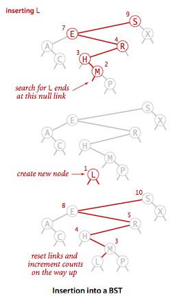
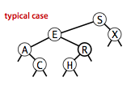
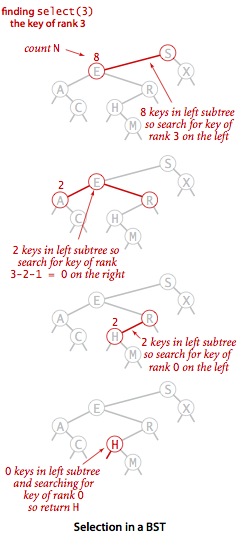
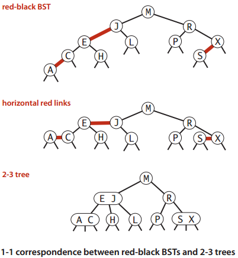
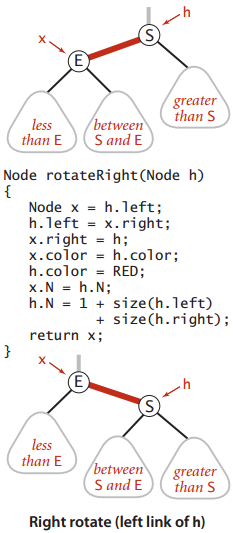

# 查找 #

[顺序查找(基于无序链表)](#)

[二分查找(基于有序数组)](#)

[二叉查找树](#二叉查找树)

[平衡查找树](#平衡查找树)

[散列表](#散列表)

[应用](#应用)

# 符号表 #

> 符号表是一种存储键值对的数据结构，支持两种操作：插入(put)，即将一组新的键值对存入表中；查找(get)，即根据给定的键得到相应的值。

应用|查找的目的|键|值
---|---|---|---
字典|找出单词的解释|单词|释义
图书索引|找出相关页码|术语|一串页码
文件共享|找到歌曲的下载地址|歌曲名|计算机ID
账户管理|处理交易|账户号码|交易详情
网络搜索|找出相关网页|关键字|网页名称
编译器|找出符号的类型和值|变量名|类型和值

[符号表用例(统计出现频率最高的单词)](FrequencyCounter.java)

[FrequencyCounterTest](../../../../../../../test/java/com/lun/algorithms4th/c3/searching/FrequencyCounterTest.java)

### 无序链表中的顺序查找 ###

**顺序查找(基于无序链表)**

[SequentialSearchST](SequentialSearchST.java)

>**命题A** 在含有N对键值的基于（无序）链表的符号表中，未命中的查找的插入操作都需要N次比较。命中的查找在最坏情况下需要N次比较。向一个空表中插入N个不同的键需要~N^2/2次比较

对上图坐标点解释，对于第i次put操作

1. 以**横坐标**为i，**纵坐标**为**该i次操**作进行比较的总次数 的位置画一个**灰点**。
2. 以**横坐标**为i，**纵坐标**为**前i次**put()操作所需的平均比较次数的位置画一个**红点**。

### 有序数组中的二分查找 ###

**二分查找(基于有序数组)**

[BinarySearchST](BinarySearchST.java)

>**命题B** 在N个键的有序数组中进行二分查找最多需(lgN+1)次比较(无论是否成功)。向大小为N的有序数组中插入一个新的元素在最坏情况下需要访问~2N次数组，因此向一个**空符号表**中插入N个元素在最坏情况下需要访问~N^2

**简单的符号表实现的成本总结**
<table>

<thead>
<tr>
<td rowspan=2>算法(数据结构)</td>
<td colspan=2>最坏情况的成本(N次插入后)</td>
<td colspan=2>平均情况下的成本(N次随机插入后)</td>
<td rowspan=2>是否 高效地 支持有序性相关操作</td>
</tr>

<tr>
<td>查找</td>
<td>插入</td>
<td>查找</td>
<td>插入</td>
</tr>

</thead>
<tbody>
<tr>
<td>顺序查找（基于无序链表）</td>
<td>N</td>
<td>N</td>
<td>N/2</td>
<td>N</td>
<td>否</td>
</tr>

<tr>
<td>二分查找(基于有序数组)</td>
<td>lgN</td>
<td>2N</td>
<td>lgN</td>
<td>N</td>
<td>是</td>
</tr>

</tbody>
</table>

---

**符号表的各种实现的优缺点**

使用的数据结构|实现|优点|缺点
---|---|---|---
链表(顺序查找)|SequentialSearchST|适用小型问题|对于大型符号表很慢
有序数组(二分查找)|BinarySearchST|最优的查找效率和空间需求，能够进行有序相关的操作|插入操作很慢
二叉查找树|BST|实现简单，能够进行有序性的相关操作|没有性能上界的保证链接需要额外的空间
平衡二叉树|RedBlackBST|最优的查找和插入效率，能够进行有序性相关的操作|链接需要额外的空间
散列表|SeparateChainHashST LinearProbingHashST|能够快速地查找和插入常见类型的数据|需要计算每种类型的数据的散列无法进行有序性的相关操作链接和空节点需要额外的空间

## 二叉查找树 ##

>定义。一颗二叉查找树Binary Search Tree，其中每个结点都含有一个Comparable的键(以及相关联的值)且每个结点的键都大于其左子树中的任意结点的键而小于右子树的任意结点的键。

---

>树的基本术语——**结点的层次和树的高度**：

>树中的每个结点都处在一定的**层次**上。结点的层次从树根开始定义，根结点为**第一层**，它的孩子结点为**第二层**，以此类推，一个结点所在的层次为其双亲结点所在的层次+1。树中结点的最大层次称为**树的高度**(或**树的深度**)

**详解二叉查找树**

**一个标准二叉查找树的实例图**

[二叉查找树](BinarySearchST.java)

### 查找 ###

[二叉查找树#get](BinarySearchST.java)

### 插入 ###

[二叉查找树#put](BinarySearchST.java)

### 分析 ###

>**命题C** 在由N个随机键构造的二叉查找树中，查找命中平均所需的比较次数、插入操作、查找未命中所需的比较次数 为 ~2InN(约1.39lgN)

### 有序性相关的方法与删除操作 ###

#### 最大键和最小键 ####

[二叉查找树#min](BinarySearchST.java)

找出最大键的方法类似的，只是变为查找右子树

[二叉查找树#max](BinarySearchST.java)

#### 向上取整和向下取整 ####

[二叉查找树#floor](BinarySearchST.java)

---

[二叉查找树#ceiling](BinarySearchST.java)

#### 排名 ####

[二叉查找树#select](BinarySearchST.java)

[二叉查找树#rank](BinarySearchST.java)

#### 删除操作 ####

**删除最小键**

[二叉查找树#deleteMin](BinarySearchST.java)

deleteMax()与deleteMax()类似，关键deleteMax(x.right)

---
**删除操作**

在BST上删除x结点

1. 将指向即将被删除的结点的连接保存为t //Node t = x;
2. 将x指向他的后继结点min(t.right) //x = min(t.right);
3. 将x的右链接(原本指向一棵所有结点都大于x.key的二叉查找树)指向deleteMin(t.right),也就是在删除后所有结点仍然都大于x.key的子二叉树//x.right=deleteMin(t.right);
4. 将x的左链接设为t.left(其下所有的键都小于被删除的结点和它的后继结点)//x.left = t.left;

[二叉查找树#delete](BinarySearchST.java)

#### 范围查找 ####

[二叉查找树#keys](BinarySearchST.java)

#### 性能分析 ####

>**命题E** 在一棵二叉查找树中，所有操作在最坏情况下所需的时间都和树的高度成正比。

**简单的符号表实现的成本总结**
<table>

<thead>
<tr>
<td rowspan=2>算法(数据结构)</td>
<td colspan=2>最坏情况的成本(N次插入后)</td>
<td colspan=2>平均情况下的成本(N次随机插入后)</td>
<td rowspan=2>是否 高效地 支持有序性相关操作</td>
</tr>

<tr>
<td>查找</td><td>插入</td>
<td>查找</td><td>插入</td>
</tr>

</thead>
<tbody>
<tr>
<td>顺序查找（基于无序链表）</td>
<td>N</td><td>N</td>
<td>N/2</td><td>N</td>
<td>否</td>
</tr>

<tr>
<td>二分查找(基于有序数组)</td>
<td>lgN</td><td>2N</td>
<td>lgN</td><td>N</td>
<td>是</td>
</tr>

<tr>
<td>二叉树查找(二叉查找树)</td>
<td>N</td><td>N</td>
<td>1.39lgN</td><td>1.39lgN</td>
<td>是</td>
</tr>

</tbody>
</table>

## 平衡查找树 ##

### 2-3查找树 ###

一棵 2-3 查找树或为一棵空树，或由以下结点组成：

1. 2-结点，含有一个键（以及对应的值）和两条链接，左链接指向的2-3树中的键都小于该结点，右链接指向的2-3树中的键都大于该结点。
2. 3-结点，含有两个键（以及对应的值）和三条链接，左链接指向的2-3树中的键都小于该结点，中链接指向的2-3中的键都位于该结点的两个之间，右链接指向的2-3树中的键都大于该结点。
	
指向空树的链接称为 **空链接**。

#### 查找 ####

#### 向2-结点中插入新键 ####

#### 向一棵只含有一个3-结点的树中插入新键 ####

#### 向一个父结点为2-结点的3-结点中插入新键 ####

#### 向一个父结点为3-结点的3-结点中插入新键 ####

#### 分解根结点 ####

#### 在一棵2-3树中分解一个4-结点的情况汇总 ####

#### 2-3的构造轨迹 ####

>**命题F** 在一棵大小为N的2-3树中，查找和插入操作访问的结点必然不超过lgN个。

尽管我们可以用不同的数据类型表示2-结点和3-结点并写出变换所需的代码，但用这种直白的表示方法实现大多数的操作并不方便，因此需要处理的情况实在太多。

我们需要维护两种不同类型的结点，将被查找的键和结点中的每个键进行比较，将连接和其他信息从一种结点复制到另一种结点，将结点从一种数据类型转换到另一种数据类型，等等

实现这些不仅需要大量的代码，而且它们所产生的额外开销可能会使算法比标准的二叉查找树更慢。

平衡一棵树的初衷是为了消除最坏的情况，但我们希望这种保障所需的代码能够越少越好。

红黑二叉查找树就应运而生。

### 红黑二叉查找树 ###

红黑树背后的基本思想是用标准的二叉查找树（完全由2-结点构成）和一些额外的信息（替换3-结点）来表示2-3树。

#### 替换3-结点 ####

树中的链接分两种类型：

1. **红链接**将两个2-结点连接起来构成一个**3-结点**
2. **黑链接**这是2-3树中的普通链接

准确的说，将3-结点表示为有一条**左斜**得红色链接（两个2-结点其中之一是另一个的左子结点）相连的两个2-结点。

这表示法的一个优点是，无需修改get()方法

红黑树的另一种定义是含有红黑链接并满足下列条件的二叉查找树：

- **红链接**均为左链接
- 没有任何一个结点同时和两条**红链接**相连
- 该数是完美黑色平衡的，即任意空链接到根结点的路径上的**黑链接**数量相同

#### 结点表示 ####

#### 旋转 ####

在实现的操作中可能会出现

1. 红色**右**链接
2. 两条连续的红链接

但在操作完成前这些情况都会被小心地**旋转**并修复

#### 向单个2-结点中插入新值 ####

#### 向树底部的2-结点插入新键 ####

#### 向一棵双键树（即一个3-结点）中插入新键 ####

#### 颜色转换 ####

用filpColors()来转换一个结点的**两个红色子结点**的颜色，同时还要将父结点的颜色由黑变红。

**根结点总是黑色的**

每次插入后都会将根结点设为黑色。注意，每当跟结点有红变黑时树的黑链接高度就会加1

#### 向树底部的3-结点插入新键 ####

#### 将红链接在树中向上传递 ####

2-3树中的插入算法需要我们分解3-结点，将中间键插入父结点，如此这般直到遇到一个2-结点或是跟结点。

在沿着插入点到根结点的路径向上移动时所在经过的每个结点中顺序完成以下操作：

- 若 右子结点是红色的 而 左子结点是黑色的，进行左旋转
- 若 右子结点是红色的 且 它的左子结点也是红色的，进行右旋转
- 若 左右子结点均为公社，进行 颜色转化

[红黑树#put](RedBlackBST.java)

### 实现 ###

[红黑树](RedBlackBST.java)

### 删除操作 ###

TODO:

### 红黑树的性质 ###

>**命题G** 一棵大小为N的红黑树的高度不会超过2lgN

>**命题H** 一棵大小为N的红黑树，根结点的任意结点的平均长度为~1.00lgN

---

**tale.txt**|单词数|不同单词数|比较次数(模型预测)|比较次数(实际)
---|---|---|---|---
长度大于等于8的单词|14350|5737|12.6|12.1

---

>**命题I** 一棵红黑树中，以下操作在最坏情况下所需的时间是对数级别的
>- get()
>- put()
>- min()查找最小键
>- max()查找最大键
>- floor()
>- ceiling()
>- rank()
>- select()
>- deleteMin()
>- deleteMax()
>- delete()
>- range()

**各种符号表实现的成本总结**
<table>

<thead>
<tr>
<td rowspan=2>算法(数据结构)</td>
<td colspan=2>最坏情况的成本(N次插入后)</td>
<td colspan=2>平均情况下的成本(N次随机插入后)</td>
<td rowspan=2>是否 高效地 支持有序性相关操作</td>
</tr>

<tr>
<td>查找</td><td>插入</td>
<td>查找</td><td>插入</td>
</tr>

</thead>
<tbody>
<tr>
<td>顺序查找（基于无序链表）</td>
<td>N</td><td>N</td>
<td>N/2</td><td>N</td>
<td>否</td>
</tr>

<tr>
<td>二分查找(基于有序数组)</td>
<td>lgN</td><td>2N</td>
<td>lgN</td><td>N</td>
<td>是</td>
</tr>

<tr>
<td>二叉树查找(二叉查找树)</td>
<td>N</td><td>N</td>
<td>1.39lgN</td><td>1.39lgN</td>
<td>是</td>
</tr>

<tr>
<td>2-3树查找(红黑树)</td>
<td>2lgN</td><td>2lgN</td>
<td>1.00lgN</td><td>1.00lgN</td>
<td>是</td>
</tr>

</tbody>
</table>

## 散列表 ##

特殊数组——用算数操作将键转化为数组索引来访问数组中的键值对。

使用散列的查找算法分为两步：

**第一步，利用散列函数将被查找的键转化为数组的一个索引**。理想情况下，不同的键都能转化为不同的索引值。但是，我们需要面对两个或多个键都会散列到相同的索引值情况。

因此，散列查找的**第二步就是一个处理碰撞冲突的过程**，解决碰撞的两个方法：拉链法 和 线性探测法

散列表是算法在时间和空间上作出权衡的经典例子。

要为一个数据类型实现一个优秀的散列方法需要满足三个条件

1. 一致性——等价的键必然产生相等的散列值
2. 高效性——计算简便
3. 均匀性——均匀散列所有

**假设J(均匀散列假设)。我们使用的散列函数能够均匀并独立地将所有的键散步于0到M-1之间**

### 基于拉链法的散列表 ###

拉链法——将大小为M的数组的每个元素指向一条链表，链表中的每个结点都存储了散列值为该元素的索引的键值对，发生冲突的元素都被存储在链表中

[基于拉链法的散列表](SeparateChainingHashST.java)

**命题K 在一张含有M条链表和N个键的散列表中，（在假设J成立的前提下）任意一条链表中的键的数量（链长）均在N/M的常数因子范围内的概率（N/M > 0）**

书中证明 涉及二项分布

	假设你要生孩子，生男孩子概率p，生女孩纸概率1-p
	
	伯努利实验：生一次孩子
	
	伯努利分布：生一次孩子，生男孩子概率为p,生女孩纸概率1-p，这个就是伯努利分布
	
	n重伯努利实验：将伯努利实验重复n次，就是生n次孩子。
	
	二项分布：n重伯努利试验「成功」次数的离散概率分布，这里的「成功」假设是生女孩纸（喜欢男孩子就把成功看出生男孩子）。举个例子：生孩子n次(n重伯努利试验)，成功次数(生女孩纸的个数)为k次的概率就是「一个」二项分布概率。二项分布就是生孩子n次，成功0次，1次，2次，。。。。n次(生女孩纸0个，1个，2个。。。n个)，这个情况下的一堆概率。。。
	
	可以看到，如果你做一次实验（1重伯努利试验），这个时候就变成了伯努利分布。

[阮一峰关于 泊松分布 解释](http://www.ruanyifeng.com/blog/2015/06/poisson-distribution.html)

**命题L 在一张含有M条链表和N个键的散列表中，|未命中查找| 和 插入 操作所需的比较次数为 ~N/M（平均链长）**

### 基于线性探测法的散列表 ###

实现散列表的另一种方式就是用大小为M数组保存N个键值对，其中M>N。
我们需要依靠数组中的**空位**解决碰撞冲突。
基于这种策略的所有方法被统称为**开放地址**散列表。

开放地址散列表中最简单的方法叫做**线性探测法**：当碰撞发生时（当一个散列值已经被另一个不同的键占用），我们直接检查散列表中的下一个位置（将索引值加1）。这样的线性探测可能产生3个结果：

1. 命中，该位置的键和被查找的键相同
2. 未命中，键为空（该位置没有键）
3. 继续查找，该位置的键和被查找的键不同

用散列函数找到键在数组中的索引，检查其中的键和被查找的键是否相同。如果不同则继续查找（将索引增大，到达数组结尾时折回数组的开头）直到找到该键或者遇到一个空元素。

[基于线性探测法的散列表](LinearProbingHashST.java)

线性探测的平均成本取决于元素在插入数组后聚集成的一组连接条目，也叫做 **键簇**

α=N/M

N为 键值对总数

M为 散列表的大小

对于拉链法，α是每条链表的长度，因此一般>1

对于线性探测法，α是散列表的使用率，不可能超过1

**命题M 在大小为M并含有N=α个键的基于线性探测的散列表中，基于假设J，命中和未命中的查找所需的探测次数分别为：~1/2(1+1/(1-α)) 和 ~1/2(1+1/(1-α)^2)**

**特别是当α约为1/2时，查找命中所需的探测次数约为3/2，未命中所需要的约为5、2**

**当α趋近与1时，这些估计值精确度会下降，但不需要担心这些情况，因为保证散列表的使用率小于 1/2**

---
**命题N 假设一张散列表能够自己调整数组大小，初始为空。基于假设J，执行任意顺序的t次 查找、插入、删除操作所需的时间和t成正比，所使用的内存量总是在表中的键的总数的常数因子范围内**

散列表并非包治百病的灵丹妙药，因为：

1. 每种类型的键都要一个优秀的散列表
2. 性能保证来自 散列函数 的质量
3. 散列函数的计算可能复杂而且昂贵
4. 难以支持有序性相关的符号表操作

## 应用 ##

**各种符号表实现的渐进性能的总结**

<table>

<tr>
<td rowspan=2>算法（数据结构）</td>
<td colspan=2>最坏情况下的运行时间的增长数量级（N次插入后）</td>
<td colspan=2>平均情况下的运行时间的增长数量级（N次插入后）</td>
<td rowspan=2>关键接口</td>
<td rowspan=2>内存使用（字节）</td>
</tr>

<tr>
<td>查找</td><td>插入</td>
<td>查找</td><td>插入</td>
</tr>

<tr>
<td>顺序查询（无序链表）</td>
<td>N</td><td>N</td>
<td>N/2</td><td>N</td>
<td>equals()</td>
<td>48N</td>
</tr>

<tr>
<td>二分查找（有序数组）</td>
<td>lgN</td><td>N</td>
<td>lgN</td><td>N/2</td>
<td rowspan=3>compareTo()</td>
<td>16N</td>
</tr>

<tr>
<td>二叉树查找（二叉查找树）</td>
<td>N</td><td>N</td>
<td>1.39lgN</td><td>1.39lgN</td>
<td>64N</td>
</tr>

<tr>
<td>2-3树查找（红黑树）</td>
<td>2lgN</td><td>2lgN</td>
<td>1.00lgN</td><td>1.00lgN</td>
<td>64N</td>
</tr>

<tr>
<td>拉链法（链表数组）</td>
<td>&lt;lgN</td><td>&lt;lgN</td>
<td>N/(2M)</td><td>N/M</td>
<td rowspan=2>equals() hashCode()</td>
<td>48N+32M</td>
</tr>

<tr>
<td>线性探测法（并行数组）</td>
<td>clgN</td><td>clgN</td>
<td>&lt;1.5</td><td>&lt;2.5</td>
<td>(32N, 128N)</td>
</tr>

</table>

### 重复键 ###

符号表的实现优势需要专门考虑重复键的可能性。许多应用都希望能够为同一个键绑定多个值。例如在一个交易处理系统中，多笔交易的客户属性都是相同。

符号表不允许重复键，因此用例只能自己管理重复键。

### Java标准库 ###

Java的TreeMap,HashMap分别基于 红黑树的符号表 和 基于 拉链法的散列表的符号表

### SET(类似HashSet) ###

本SET用到java.util.TreeSet

**应用**

1. 去除重复元素
2. 黑名单 （防火墙）
3. 白名单

[SET集合](SET.java)

[DeDup过滤器](DeDup.java)

[DeDupTest](../../../../../../../test/java/com/lun/algorithms4th/c3/searching/DeDupTest.java)

[白名单](WhiteFilter.java)

[WhiteFilterTest](../../../../../../../test/java/com/lun/algorithms4th/c3/searching/WhiteFilterTest.java)

[黑名单](BlackFilter.java)

[BlackFilterTest](../../../../../../../test/java/com/lun/algorithms4th/c3/searching/BlackFilterTest.java)

### 字典类用例 ###

**典型的字典类的应用**

<table>
<tr>
<td>应用领域</td>
<td>键Key</td>
<td>值Value</td>
</tr>

<tr>
<td>电话黄页</td>
<td>人名</td>
<td>电话号码</td>
</tr>

<tr>
<td>字典</td>
<td>单词</td>
<td>定义</td>
</tr>

<tr>
<td>银行账户</td>
<td>账号</td>
<td>余额</td>
</tr>

<tr>
<td>基因组</td>
<td>密码子</td>
<td>氨基酸</td>
</tr>

<tr>
<td>实验数据</td>
<td>数据/时间</td>
<td>实验结果</td>
</tr>

<tr>
<td>编译器</td>
<td>变量名</td>
<td>内存地址</td>
</tr>

<tr>
<td>文件共享</td>
<td>歌曲名</td>
<td>计算机</td>
</tr>

<tr>
<td>DNS</td>
<td>网站</td>
<td>IP地址</td>
</tr>

</table>

[字典的查找](LookupCSV.java)

[LookupCSVTest](../../../../../../../test/java/com/lun/algorithms4th/c3/searching/LookupCSVTest.java)

### 索引类用例 ###

字典的主要特点是每个键都有一个对应的值。

索引来描述一个键和多个值相关联的符号表。

**典型的索引类的引用**

<table>
<tr>
<td>应用领域</td>
<td>键Key</td>
<td>值Value</td>
</tr>

<tr>
<td>基因组学</td>
<td>氨基酸</td>
<td>一系列密码子</td>
</tr>

<tr>
<td>网络搜索</td>
<td>关键值</td>
<td>一系列网页</td>
</tr>

<tr>
<td>商业交易</td>
<td>账号</td>
<td>一系列交易</td>
</tr>

<tr>
<td>IMDB</td>
<td>电影</td>
<td>一系列演员</td>
</tr>

</table>

**反向索引**

<table>

<tr>
<td>应用领域</td>
<td>键Key</td>
<td>值Value</td>
</tr>

<tr>
<td>基因组学</td>
<td>基因片段</td>
<td>一系列位置</td>
</tr>

<tr>
<td>IMDB</td>
<td>演员</td>
<td>一系列电影</td>
</tr>

<tr>
<td>图书</td>
<td>术语</td>
<td>一系列页码</td>
</tr>

<tr>
<td>编译器</td>
<td>标识符</td>
<td>一系列使用的位置</td>
</tr>

<tr>
<td>文件搜索</td>
<td>关键字</td>
<td>文件集合</td>
</tr>

</table>

[索引(以及反向索引)的查找](LookupIndex.java)

[LookupIndexTest](../../../../../../../test/java/com/lun/algorithms4th/c3/searching/LookupIndexTest.java)

[文件索引](FileIndex.java)

[FileIndexTest](../../../../../../../test/java/com/lun/algorithms4th/c3/searching/FileIndexTest.java)

### 稀疏矩阵 ###

[稀疏矩阵](SparseVector.java)

稀疏矩阵的用例：Google的PageRank（网页排名）算法，请查阅吴军著的《数学之美》

**这种应用虽然简单但非常重要，不愿意挖掘其中省时省力的潜力的程序员解决实际问题的潜力也必然是有限的，能够将运行速度提升几十亿的程序员勇于面对看似无法解决的问题。**