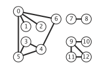
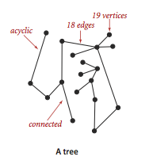
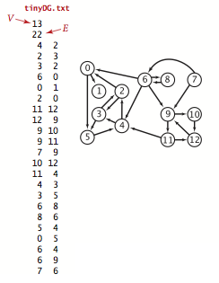

# 图 #

**理解算法的最好方法是在一个简单的例子中跟踪它的行为。**

**图的典型利用**

应用|结点|连接
---|---
地图|十字路口|公路
网络内容|网页|超链接
电路|元器件|导线
任务调度|任务|限制条件
商业交易|客户|交易
配对|学生|申请
计算机网络|网站|物理连接
软件|方法|调用关系
社交网络|人|友谊关系

## 无向图 ##

边edge仅仅是两个顶点vertex之间的连接

**图由 一组顶点和 一组能够将两个顶点相连的边 组成的**

一般使用0~V-1来表示一张含有V个顶点的图中的各个顶点，这样方便使用数组索引访问各个顶点中信息。

### 术语glossary ###

1. **自环**，即一条连接一个顶点和其自身的边；
2. 连接同一对顶点的两条边称为**平行边**；
3. 当两个顶点通过一条边相连时，我们成这连个顶点是**相邻的adjacent**，并称这条边**依附于incident**这两个顶点；
4. 某个顶点的**度数**为依附它的边的总数；
5. **子图**是由一幅图的所有边的一个子集（以及他们所依附的所有顶点）组成的图；
6. **路径**是由 边 顺序连接的一系列顶点。**简单路径**是一条没有 重复 顶点 的路径；
7. **环**是一条至少含有一条边 且 起点和终点相同 的路径，**简单环**是一条（除了起点和终点必须相同之外）不含有重复顶点和边的环；
8. 路径或者环的**长度**为其中所包含的边数；
9. 当两个顶点之间存在一条连接双方路径时，我们称一个顶点和另一个顶点是**连通**的；
10. 如果从任意一个顶点都存在一条路径到大另一个任意顶点，我们称这幅图是**连通图**。一幅**非连通的图**由若干个连通的部分组成，它们都是其极大连通子图；
11. **无环图**是一种不包含环的图；
12. **树**是一幅无环连通子图，互不相连的树组成的集合称为**森林**；
13. 连通图的**生成树**是它的一幅子图，它含有图中的所有顶点且是一棵树。图的**生成树森林**是它的所有连通子图的生成树集合；
14. **二分图**是一种能够将所有结点分为两部分的图，其中图的每条边所连接的连个顶点都分为属于不同的部分。(二分图例子：电影和演员)
15. 图的**密度**是指已经连接的顶点对占所有可能被连接的顶点对的比例。(稠密、稀疏)

上图为二分图的实例，其中红色的结点是一个集合，黑色的结点是另一个集合

### 表示无向图的数据类型 ###

可以表示图的数据结构

1. 邻接矩阵
2. 边的数组
3. 邻接表数组（Bag）(我们使用这个数据结构)
4. 邻接集数组（SET）

**典型Graph实现的性能复杂度**

数据结构|所需时间|添加一条边v-w|检查w和v是否相邻|遍历v的所有相邻顶点
---|
边的数组|E|1|E|E
邻接矩阵|V^2|1|1|V
邻接表|E+V|1|degree(V)|degree(V)
邻接集|E+V|logV|logV|logV+degree(v)

---

[Graph数据类型代码](Graph.java)

---

准备数据

**tinyG.txt**

	13
	13
	0 5
	4 3
	0 1
	9 12
	6 4
	5 4
	0 2
	11 12
	9 10
	0 6
	7 8
	9 11
	5 3

该文件表示图为

连接表图示为

---

[Graph](Graph.java) 运行结果

	13 vertices, 13 edges 
	0: 6 2 1 5 
	1: 0 
	2: 0 
	3: 5 4 
	4: 5 6 3 
	5: 3 4 0 
	6: 0 4 
	7: 8 
	8: 7 
	9: 11 10 12 
	10: 9 
	11: 9 12 
	12: 11 9 

[其他常用图处理代码GraphClient](GraphClient.java)

注意：多个不同的邻接表可能表示着同一幅图。

**理解算法的最好方法是在一个简单的例子中跟踪它的行为。**

### 深度优先搜索DFS(DepthFirstSearch) ###

DFS的基本思想

要搜索一幅图，只需用一个递归方法来**遍历所有顶点。**

在访问其中一个顶点时：

- 将它标记为已访问
- 递归地访问它的所有没有被标记过的邻居顶点

如果图是连通的，每个邻接链表中的元素都会被检查到

**命题A 深度优先搜索标记与起点连通的所有顶点 所需的时间t 和 顶点的度数之和sumOfDegree 成正比**

[深度优先搜索DFS](DepthFirstSearch.java)

---

输入参数：tinyG.txt(请查看上文) 0(顶点)

输出结果：

	0 1 2 3 4 5 6 
	NOT connected

---

输入参数：tinyCG.txt 0(顶点)

	6
	8
	0 5
	2 4
	2 3
	1 2
	0 1
	3 4
	3 5
	0 2

输出结果：

	0 1 2 3 4 5 
	connected

使用深度优先搜索的轨迹，寻找所有和顶点0连通的顶点：

### 寻找路径（如是否存在从s到v的路径）（使用DFS思想） ###

[使用深度优先搜索查找图中的路径DepthFirstPaths](DepthFirstPaths.java)

输入tinyCG.txt 0（起点）

输出结果：

	0 to 0:  0
	0 to 1:  0-2-1
	0 to 2:  0-2
	0 to 3:  0-2-3
	0 to 4:  0-2-3-4
	0 to 5:  0-2-3-5

**命题A(续)。使用深度优先搜索得到 从给定起点到任意标记顶点的路径所需的时间t 与 路径的长度L 成正比**

### 广度优先搜索BFS(BreadthFirstPath) ###

能解决的问题

单点最短路劲。给定一幅图和一个起点是s,回答“从s到给定目的顶点v是否存在一条路径？如果有，找出其中最短的那条（所含边数最少）”等类似问题。

类比：

- 深度优先搜索就好像是一个人在走迷宫，(Tremaux搜索)a.选择一条么有标记过的通路，在你走过的路上铺一条绳子;b.标记所有你第一次路过的路口和通道;c.当来到一个标记过的路口时（用绳子）回退到上一个路口；d.当回退到的路口已没有可走的通道时继续回退
- 广度优先搜索则好像一组人在一起朝各个方向走这座迷宫，每个人都有自己的绳子。当出现新的叉路时，可以假设一个探索者可以分裂为更多的人来搜索它们，当两个探索者相遇时，会合二为一（并继续使用先到达者的绳子）

---

[使用广度优先搜索查找图中路径BreadthFirstPaths](BreadthFirstPaths.java)

---

输入：tinyCG.txt 0（起点）

输出结果：

	0 to 0 (0):  0
	0 to 1 (1):  0-1
	0 to 2 (1):  0-2
	0 to 3 (2):  0-2-3
	0 to 4 (2):  0-2-4
	0 to 5 (1):  0-5

轨迹图

**命题B。对于从s可达的任意顶点v,广度优先搜索都能够找到一条从s到v的最短路径（没有其他从s到v的路径所含的边比这条路径更少）**

**命题B（序）。广度优先搜索所需的时间在最好坏情况下和V+E成正比**

### DFS和BFS总结 ###

在搜索中我们都会先将起点存入数据结构中，然后重复以下步骤知道数据结构被清空：

- 取其中的下一个顶点并标记它
- 将v的所有相邻而又被标记的顶点加入数据结构

不同之处仅在于 从数据结构中获取下一个顶点规则

DFS|BFS
---|
晚加入的顶点|早加入的顶点
不断深入图中并在栈Stack中保存所有分叉的顶点|像扇面一般扫描图，用一个队列Queue保存访问过的最前端的顶点
探索一幅图的方式是寻找离起点更远的顶点，只在碰到死胡同时才访问近处的顶点|首先覆盖起点附近的顶点，只在邻近的所有顶点都被访问了之后才向前前进
路径通常较长而且曲折|路径则短而直接

### 连通分量 ###

找出一幅图所有的连通分量（一个顶点组之间的任意两点能相互连通，就算一个连通）

[使用深度优先搜索找出图中的所有连通分量](ConnectedComponents.java)

**环**是一条至少含有一条且起点和终点相同的路径。

其他示例：

[G是不是无环图](Cycle.java)：另外检测有没有自环或平行边

[G是不是符号图](Bipartite.java)

### 符号图SymbolGraph ###

在典型应用中，图都是通过文件或者网页定义的，使用的是字符串而非整数来表示和指代顶点。

准备数据

需要用到的数据结构

[符号图SymbolGraph实现源码](SymbolGraph.java)

---

**间隔的度数**

图处理的一个经典问题就是，找到一个社交网络之中两人间隔的度数。

两个顶点之间需要找到**最短**长度，需要用到BreadthFirstPaths BFS

**命题B。对于从s可达的任意顶点v,广度优先搜索都能够找到一条从s到v的最短路径（没有其他从s到v的路径所含的边比这条路径更少）**

综合SymbolGraph和BFS来解决间隔的度数问题

[间隔的度数](DegreesOfSeparation.java)

**小结**

得到解决的无向图处理问题

问题|解决方法
---|---
单点连通性|[DFS](DepthFirstSearch.java)
单点路径|[DepthFirstPaths](DepthFirstPaths.java)
单点最短路径|[BreadthFirstPaths](BreadthFirstPaths.java)
连通性|[ConnectedComponents](ConnectedComponents.java)
检测环|[Cycle](Cycle.java)
双色问题(图的二分性)|[Bipartite](Bipartite.java)

## 有向图 ##

实际生活中的典型生活

应用|顶点|边
---|---|---
食物链|物种|捕食关系
互联网连接|网页|超链接
程序|模块|外部引用
手机|电话|呼叫
学术研究|论文|引用
金融|股票|交易
网络|计算机|网络连接

**一幅有方向性的图（或有向图）是由 一组顶点 和 一组方向边组成的，每条有方向的边都连接着有序的一对顶点**

- 一条有向边由第一顶点**指出**并**指向**第二个顶点
- 一个顶点的**出度**为由该顶点指出的边的总和
- 一个顶点的**入度**为由该顶点指入的边的总和
- 一条有向边的第一个顶点称为它的**头**，第二个顶点则被它的**尾**
- 将有向边画为由头指向尾的一个箭头
- 用v->m表示有向图中一条由v指向w的边。
- 除了特殊的图，一幅有向图中的两个顶点的关系可能有4中：
	- 没有边相连
	- 存在从v到W的边v->w
	- 存在从w到v的边w->v
	- 既存在v->w也存在w->v，即双向连接

在一幅有向图中，**有向路径**由一系列顶点组成，对于其中的每个顶点都存在一条有向边从它指向序列中的下一个顶点。**有向环**为一条至少含有一条边且起点和终点相同的有向路径。简单有向环是一条（除了起点和终点必须相同之外）不含有重复的顶点和边的环。路径或者环的长度即为其中所包含的边数。

当存在从v到w的有向图路径时，称顶点w能够由顶点v达到。

有向图中的可达性和无向图的连通性有所区别

有向图两顶点**可达性**可能很难目测得到。

### 有向图的数据类型 ###

使用邻接表表示有向图

[Digraph有向图数据类型](Digraph.java)

### 有向图的可达性 ###

**单点可达性** 是否存在一条从s到达给定顶点v的有向路径

**多点可达性** 是否存在一条从集合中的任意顶点到达给定顶点v的有向路径

使用DFS解决这问题

**命题D 有向图中，深度优先搜索标记由一个集合的顶点可达的所有顶点所需的事件与被标记得所有 顶点的出度 之和成正比**

**多点可达性**的一个重要的**实际应用**是在典型的内存管理系统中，例如Java内存垃圾回收

**有向图的寻路**

[单点有向路径](image/DepthFirstDirectedPaths.java) 给定一幅有向图和一个起点s，回答“从s到给定目的顶点v**是否存在一条有向路径**？若有，找出这条路径。”等类似问题。

[单点最短有向路径](image/BreadthFirstDirectedPaths) 给定一幅有向图和一个起点s，回答“从s到给定目的顶点v**是否存在一条有向路径**？若有，找出其中最短的那条（所含边数最少）。”等类似问题。

### 环和有向无环图 ###

在有计算机的帮助下，可较容易找出有向图含有有向环

为了有向图处理中研究有向环的作用更加有趣，有向图模型的原型应用——**调度问题**

一种应用广泛模型是**给定一组任务并安排它们的执行顺序**，限制条件是这些任务的执行方法和起始时间。限制条件还可能包括任务的时耗以及消耗其他的资源。**最重要**的一种限制条件叫做优先级限制，它指明了哪些任务必须在哪些任务之前完成。

若该学生一次只能修一门课，实际上就遇到了下面这个问题

**优先级限制下的调度问题**。给定一组需要完成的任务，以及一组关于任务完成的先后次序的优先级限制。在满足限制条件的前提下应该如何安排并完成所有任务？

用序号简化上图，弄成标准的有向图模型

	优先级限制下的调度问题等价于**拓扑排序**

**拓扑排序**。给定一幅有向图，将所有的顶点排序，使得所有的有向边均从排在前面的元素指向排在后面的元素（或者说明无法做到这一点）

所有边多事向下的。

根据上图，学生可以容易选择适合的课程

**拓扑排序的典型应用**

应用|顶点|边
---|---|---
任务调度|任务|优先级限制
课程安排|课程|先导课程限制
继承|Java类|extends关系
电子表格|单元格cell|公式
符号链接|文件名|链接

**有向图中的环**

若一个有优先级限制的问题中存在有向环，那么这问题无解。

解决优先级限制的问题前，最需要进行**有向环检测**

**定义 有向无环图 DAG (directed acyclic a.非循环的 graph)就是一幅不含有向环的有向图**

环检测思路：

在递归dfs()方法添加了一个布尔类型的数组onStack[]来保存递归调用期间栈上的所有顶点。当它找到一条边v->w在栈中时，它就找到了一个有向环。环上的所有顶点可以通过edgeTo[]中的链接得到。

[寻找有向环](DirectedCycle.java)

**顶点的深度优先排序与拓扑排序**

优先级限制下的调度问题等价于**拓扑排序**

**命题E 当且仅当一幅有向图是无环图时它才能进行拓扑排序**

其实

	拓扑排序 = BFS + 逆后序

了解下**逆后序**

[DepthFirstOrder](DepthFirstOrder.java) 有向图基于深度优先搜索的顶点排序。它的基本思想是深度优先搜索正好只访问每个顶点一次。如果将dfs()的参数顶点保存在一个数据结构中，遍历这个数据结构实际上就能访问图中的所有点，遍历的顺序取决于这个数据结构的性质以及是在递归调用**之前**还是**之后**进行保存

在典型的应用中，人们感兴趣的是顶点的3种排序顺序

- 前序：在递归调用之前将顶点加入队列。pre()
- 后序：在递归调用之后将顶点加入队列。post()
- 逆后序：在递归调用之后检点压入栈。reversePost()

---

**[拓扑排序](Topological.java)**

**命题F。一幅有向无环图的拓扑顺序即为所有顶点的逆后序排列**

**命题G。使用深度优先搜索对有向无环图进行拓扑所需的时间和V+E成正比**

**小结**

解决任务调度类应用通常需要以下3步

- 指明任务和优先级条件
- 不断检测并去除有向图中的所有环，以确保存在可行的方案
- 使用拓扑排序解决调度问题

### 有向图中强连通性 ###

