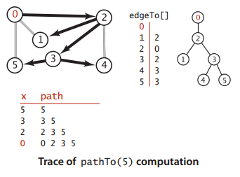
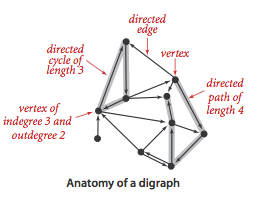
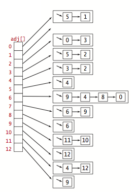
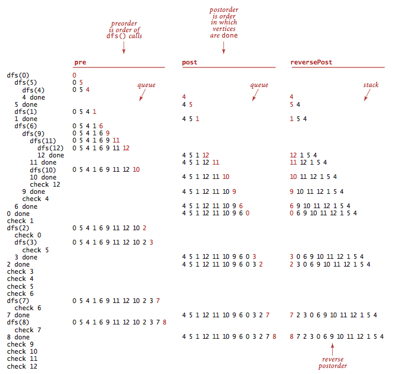
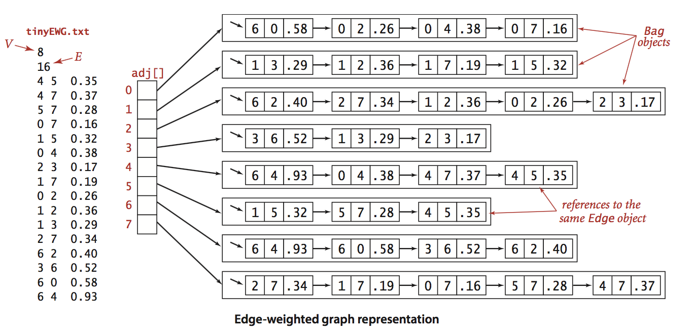
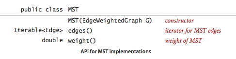
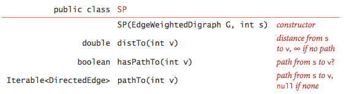
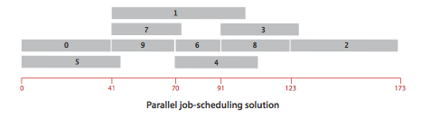
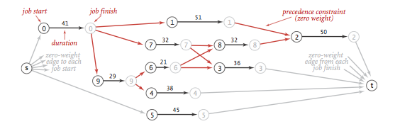
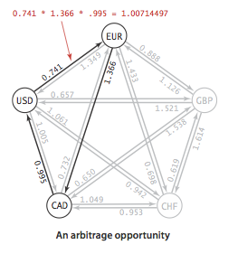

# 图 #

**理解算法的最好方法是在一个简单的例子中跟踪它的行为。**

---

**索引**

[1.无向图](#无向图)

[无向图小结](#无向图小结)

[2.有向图](#有向图)

[有向图小结](#有向图小结)

[3.最小生成树](#最小生成树)

[最小生成树小结](#最小生成树小结)

[4.最短路径](#最短路径)

[最短路径小结](#最短路径小结)

---

**图的典型利用**

应用|结点|连接
---|---|---
地图|十字路口|公路
网络内容|网页|超链接
电路|元器件|导线
任务调度|任务|限制条件
商业交易|客户|交易
配对|学生|申请
计算机网络|网站|物理连接
软件|方法|调用关系
社交网络|人|友谊关系

## 无向图 ##

边edge仅仅是两个顶点vertex之间的连接

**图由 一组顶点和 一组能够将两个顶点相连的边 组成的**

一般使用0~V-1来表示一张含有V个顶点的图中的各个顶点，这样方便使用数组索引访问各个顶点中信息。

### 术语glossary ###

1. **自环**，即一条连接一个顶点和其自身的边；
2. 连接同一对顶点的两条边称为**平行边**；
3. 当两个顶点通过一条边相连时，我们成这连个顶点是**相邻的adjacent**，并称这条边**依附于incident**这两个顶点；
4. 某个顶点的**度数**为依附它的边的总数；
5. **子图**是由一幅图的所有边的一个子集（以及他们所依附的所有顶点）组成的图；
6. **路径**是由 边 顺序连接的一系列顶点。**简单路径**是一条没有 重复 顶点 的路径；
7. **环**是一条至少含有一条边 且 起点和终点相同 的路径，**简单环**是一条（除了起点和终点必须相同之外）不含有重复顶点和边的环；
8. 路径或者环的**长度**为其中所包含的边数；
9. 当两个顶点之间存在一条连接双方路径时，我们称一个顶点和另一个顶点是**连通**的；
10. 如果从任意一个顶点都存在一条路径到大另一个任意顶点，我们称这幅图是**连通图**。一幅**非连通的图**由若干个连通的部分组成，它们都是其极大连通子图；
11. **无环图**是一种不包含环的图；
12. **树**是一幅无环连通子图，互不相连的树组成的集合称为**森林**；
13. 连通图的**生成树**是它的一幅子图，它含有图中的所有顶点且是一棵树。图的**生成树森林**是它的所有连通子图的生成树集合；
14. **二分图**是一种能够将所有结点分为两部分的图，其中图的每条边所连接的连个顶点都分为属于不同的部分。(二分图例子：电影和演员)
15. 图的**密度**是指已经连接的顶点对占所有可能被连接的顶点对的比例。(稠密、稀疏)

上图为二分图的实例，其中红色的结点是一个集合，黑色的结点是另一个集合

### 表示无向图的数据类型 ###

可以表示图的数据结构

1. 邻接矩阵
2. 边的数组
3. 邻接表数组（Bag）(我们使用这个数据结构)
4. 邻接集数组（SET）

**典型Graph实现的性能复杂度**

数据结构|所需时间|添加一条边v-w|检查w和v是否相邻|遍历v的所有相邻顶点
---|
边的数组|E|1|E|E
邻接矩阵|V^2|1|1|V
邻接表|E+V|1|degree(V)|degree(V)
邻接集|E+V|logV|logV|logV+degree(v)

---

[Graph数据类型代码](Graph.java)

---

准备数据

**tinyG.txt**

	13
	13
	0 5
	4 3
	0 1
	9 12
	6 4
	5 4
	0 2
	11 12
	9 10
	0 6
	7 8
	9 11
	5 3

该文件表示图为

连接表图示为

---

[Graph](Graph.java) 运行结果

	13 vertices, 13 edges 
	0: 6 2 1 5 
	1: 0 
	2: 0 
	3: 5 4 
	4: 5 6 3 
	5: 3 4 0 
	6: 0 4 
	7: 8 
	8: 7 
	9: 11 10 12 
	10: 9 
	11: 9 12 
	12: 11 9 

[其他常用图处理代码GraphClient](GraphClient.java)

注意：多个不同的邻接表可能表示着同一幅图。

**理解算法的最好方法是在一个简单的例子中跟踪它的行为。**

### 深度优先搜索DFS(DepthFirstSearch) ###

DFS的基本思想

要搜索一幅图，只需用一个递归方法来**遍历所有顶点。**

在访问其中一个顶点时：

- 将它标记为已访问
- 递归地访问它的所有没有被标记过的邻居顶点

如果图是连通的，每个邻接链表中的元素都会被检查到

>**命题A 深度优先搜索标记与起点连通的所有顶点 所需的时间t 和 顶点的度数之和sumOfDegree 成正比**

[深度优先搜索DFS](DepthFirstSearch.java)

---

输入参数：tinyG.txt(请查看上文) 0(顶点)

输出结果：

	0 1 2 3 4 5 6 
	NOT connected

---

输入参数：tinyCG.txt 0(顶点)

	6
	8
	0 5
	2 4
	2 3
	1 2
	0 1
	3 4
	3 5
	0 2

输出结果：

	0 1 2 3 4 5 
	connected

使用深度优先搜索的轨迹，寻找所有和顶点0连通的顶点：

### 寻找路径（如是否存在从s到v的路径）（使用DFS思想） ###

[使用深度优先搜索查找图中的路径DepthFirstPaths](DepthFirstPaths.java)

输入tinyCG.txt 0（起点）

输出结果：

	0 to 0:  0
	0 to 1:  0-2-1
	0 to 2:  0-2
	0 to 3:  0-2-3
	0 to 4:  0-2-3-4
	0 to 5:  0-2-3-5

>**命题A(续)。使用深度优先搜索得到 从给定起点到任意标记顶点的路径所需的时间t 与 路径的长度L 成正比**

### 广度优先搜索BFS(BreadthFirstPath) ###

能解决的问题

单点最短路劲。给定一幅图和一个起点是s,回答“从s到给定目的顶点v是否存在一条路径？如果有，找出其中最短的那条（所含边数最少）”等类似问题。

类比：

- 深度优先搜索就好像是一个人在走迷宫，(Tremaux搜索)a.选择一条么有标记过的通路，在你走过的路上铺一条绳子;b.标记所有你第一次路过的路口和通道;c.当来到一个标记过的路口时（用绳子）回退到上一个路口；d.当回退到的路口已没有可走的通道时继续回退
- 广度优先搜索则好像一组人在一起朝各个方向走这座迷宫，每个人都有自己的绳子。当出现新的叉路时，可以假设一个探索者可以分裂为更多的人来搜索它们，当两个探索者相遇时，会合二为一（并继续使用先到达者的绳子）

---

[使用广度优先搜索查找图中路径BreadthFirstPaths](BreadthFirstPaths.java)

---

输入：tinyCG.txt 0（起点）

输出结果：

	0 to 0 (0):  0
	0 to 1 (1):  0-1
	0 to 2 (1):  0-2
	0 to 3 (2):  0-2-3
	0 to 4 (2):  0-2-4
	0 to 5 (1):  0-5

轨迹图

>**命题B。对于从s可达的任意顶点v,广度优先搜索都能够找到一条从s到v的最短路径（没有其他从s到v的路径所含的边比这条路径更少）**

>**命题B（序）。广度优先搜索所需的时间在最好坏情况下和V+E成正比**

### DFS和BFS总结 ###

在搜索中我们都会先将起点存入数据结构中，然后重复以下步骤知道数据结构被清空：

- 取其中的下一个顶点并标记它
- 将v的所有相邻而又被标记的顶点加入数据结构

不同之处仅在于 从数据结构中获取下一个顶点规则

DFS|BFS
---|
晚加入的顶点|早加入的顶点
不断深入图中并在栈Stack中保存所有分叉的顶点|像扇面一般扫描图，用一个队列Queue保存访问过的最前端的顶点
探索一幅图的方式是寻找离起点更远的顶点，只在碰到死胡同时才访问近处的顶点|首先覆盖起点附近的顶点，只在邻近的所有顶点都被访问了之后才向前前进
路径通常较长而且曲折|路径则短而直接

### 连通分量 ###

找出一幅图所有的连通分量（一个顶点组之间的任意两点能相互连通，就算一个连通）

[使用深度优先搜索找出图中的所有连通分量](ConnectedComponents.java)

**环**是一条至少含有一条且起点和终点相同的路径。

其他示例：

[G是不是无环图](Cycle.java)：另外检测有没有自环或平行边

[G是不是符号图](Bipartite.java)

### 符号图SymbolGraph ###

在典型应用中，图都是通过文件或者网页定义的，使用的是字符串而非整数来表示和指代顶点。

准备数据

需要用到的数据结构

[符号图SymbolGraph实现源码](SymbolGraph.java)

---

**间隔的度数**

图处理的一个经典问题就是，找到一个社交网络之中两人间隔的度数。

两个顶点之间需要找到**最短**长度，需要用到BreadthFirstPaths BFS

>**命题B。对于从s可达的任意顶点v,广度优先搜索都能够找到一条从s到v的最短路径（没有其他从s到v的路径所含的边比这条路径更少）**

综合SymbolGraph和BFS来解决间隔的度数问题

[间隔的度数](DegreesOfSeparation.java)

---

### 无向图小结 ###

得到解决的无向图处理问题

问题|解决方法
---|---
单点连通性|[DFS](DepthFirstSearch.java)
单点路径|[DepthFirstPaths](DepthFirstPaths.java)
单点最短路径|[BreadthFirstPaths](BreadthFirstPaths.java)
连通性|[ConnectedComponents](ConnectedComponents.java)
检测环|[Cycle](Cycle.java)
双色问题(图的二分性)|[Bipartite](Bipartite.java)

---

## 有向图 ##

实际生活中的典型生活

应用|顶点|边
---|---|---
食物链|物种|捕食关系
互联网连接|网页|超链接
程序|模块|外部引用
手机|电话|呼叫
学术研究|论文|引用
金融|股票|交易
网络|计算机|网络连接

**一幅有方向性的图（或有向图）是由 一组顶点 和 一组方向边组成的，每条有方向的边都连接着有序的一对顶点**

- 一条有向边由第一顶点**指出**并**指向**第二个顶点
- 一个顶点的**出度**为由该顶点指出的边的总和
- 一个顶点的**入度**为由该顶点指入的边的总和
- 一条有向边的第一个顶点称为它的**头**，第二个顶点则被它的**尾**
- 将有向边画为由头指向尾的一个箭头
- 用v->m表示有向图中一条由v指向w的边。
- 除了特殊的图，一幅有向图中的两个顶点的关系可能有4中：
	- 没有边相连
	- 存在从v到W的边v->w
	- 存在从w到v的边w->v
	- 既存在v->w也存在w->v，即双向连接

在一幅有向图中，**有向路径**由一系列顶点组成，对于其中的每个顶点都存在一条有向边从它指向序列中的下一个顶点。**有向环**为一条至少含有一条边且起点和终点相同的有向路径。简单有向环是一条（除了起点和终点必须相同之外）不含有重复的顶点和边的环。路径或者环的长度即为其中所包含的边数。

当存在从v到w的有向图路径时，称顶点w能够由顶点v达到。

有向图中的可达性和无向图的连通性有所区别

有向图两顶点**可达性**可能很难目测得到。

### 有向图的数据类型 ###

使用邻接表表示有向图

[Digraph有向图数据类型](Digraph.java)

### 有向图的可达性 ###

**单点可达性** 是否存在一条从s到达给定顶点v的有向路径

**多点可达性** 是否存在一条从集合中的任意顶点到达给定顶点v的有向路径

使用DFS解决这问题

>**命题D 有向图中，深度优先搜索标记由一个集合的顶点可达的所有顶点所需的事件与被标记得所有 顶点的出度 之和成正比**

**多点可达性**的一个重要的**实际应用**是在典型的内存管理系统中，例如Java内存垃圾回收

**有向图的寻路**

[单点有向路径](image/DepthFirstDirectedPaths.java) 给定一幅有向图和一个起点s，回答“从s到给定目的顶点v**是否存在一条有向路径**？若有，找出这条路径。”等类似问题。

[单点最短有向路径](image/BreadthFirstDirectedPaths) 给定一幅有向图和一个起点s，回答“从s到给定目的顶点v**是否存在一条有向路径**？若有，找出其中最短的那条（所含边数最少）。”等类似问题。

### 环和有向无环图 ###

在有计算机的帮助下，可较容易找出有向图含有有向环

为了有向图处理中研究有向环的作用更加有趣，有向图模型的原型应用——**调度问题**

一种应用广泛模型是**给定一组任务并安排它们的执行顺序**，限制条件是这些任务的执行方法和起始时间。限制条件还可能包括任务的时耗以及消耗其他的资源。**最重要**的一种限制条件叫做优先级限制，它指明了哪些任务必须在哪些任务之前完成。

若该学生一次只能修一门课，实际上就遇到了下面这个问题

**优先级限制下的调度问题**。给定一组需要完成的任务，以及一组关于任务完成的先后次序的优先级限制。在满足限制条件的前提下应该如何安排并完成所有任务？

用序号简化上图，弄成标准的有向图模型

	优先级限制下的调度问题等价于**拓扑排序**

**拓扑排序**。给定一幅有向图，将所有的顶点排序，使得所有的有向边均从排在前面的元素指向排在后面的元素（或者说明无法做到这一点）

所有边多事向下的。

根据上图，学生可以容易选择适合的课程

**拓扑排序的典型应用**

应用|顶点|边
---|---|---
任务调度|任务|优先级限制
课程安排|课程|先导课程限制
继承|Java类|extends关系
电子表格|单元格cell|公式
符号链接|文件名|链接

**有向图中的环**

若一个有优先级限制的问题中存在有向环，那么这问题无解。

解决优先级限制的问题前，最需要进行**有向环检测**

>**定义 有向无环图 DAG (directed acyclic a.非循环的 graph)就是一幅不含有向环的有向图**

环检测思路：

在递归dfs()方法添加了一个布尔类型的数组onStack[]来保存递归调用期间栈上的所有顶点。当它找到一条边v->w在栈中时，它就找到了一个有向环。环上的所有顶点可以通过edgeTo[]中的链接得到。

[寻找有向环](DirectedCycle.java)

**顶点的深度优先排序与拓扑排序**

优先级限制下的调度问题等价于**拓扑排序**

>**命题E 当且仅当一幅有向图是无环图时它才能进行拓扑排序**

其实

	拓扑排序 = BFS + 逆后序

了解下**逆后序**

[DepthFirstOrder](DepthFirstOrder.java) 有向图基于深度优先搜索的顶点排序。它的基本思想是深度优先搜索正好只访问每个顶点一次。如果将dfs()的参数顶点保存在一个数据结构中，遍历这个数据结构实际上就能访问图中的所有点，遍历的顺序取决于这个数据结构的性质以及是在递归调用**之前**还是**之后**进行保存

在典型的应用中，人们感兴趣的是顶点的3种排序顺序

- 前序：在递归调用之前将顶点加入队列。pre()
- 后序：在递归调用之后将顶点加入队列。post()
- 逆后序：在递归调用之后检点压入栈。reversePost()

---

**[拓扑排序](Topological.java)**

>**命题F。一幅有向无环图的拓扑顺序即为所有顶点的逆后序排列**

>**命题G。使用深度优先搜索对有向无环图进行拓扑所需的时间和V+E成正比**

**小结**

解决任务调度类应用通常需要以下3步

- 指明任务和优先级条件
- 不断检测并去除有向图中的所有环，以确保存在可行的方案
- 使用拓扑排序解决调度问题

### 有向图中强连通性 ###

在一幅无向图，如果有一条路径连接顶点v和w，则它们就是连通的——既可以由这路径从w到达v，也可以从v到达w

>**定义 如果两个顶点v和w是相互可达的，则称它们为强连通的。也就是说，既存在一条从v到w的有向路径，也存在一条w到v的有效路径。若一幅有向图的任意两个顶点都是强连通的，则称这幅有向图也是强连通的**

**两个顶点是强连通的当且仅当它们都在一个普通的有向环中**

---

**强连通分量**

有向图强连通性具有自反性、对称性、传递性性质

作为一种等价关系，强连通性将所有顶点分为了一些等价类，每个等价类都是由相互均为强连通的顶点的最大子集合组成的。我们将这些子集称为**强连通分量**

上图有5个强连通分量

**注意**一个含有V个顶点的有向图含有1~V个强连通分量——一个强连通只含有一个强连通分量，而一个有向无环图中则含有V个强连通分量

**强连通分量的定义是基于顶点的，而非边**

---

**强连通分量的应用**

应用|顶点|边
---|---|---
网络|网页|超链接
教科书|话题|引用
软件|模块|调用
食物网|物种|捕食关系

食物网这种有向图能够帮助生态学家理解食物链中的能量流动

下图是网络内容的有向图，其中顶点表示网页，而边表示从页面指向另一个页面的超链接。

这样一幅有向图，强连通分量能够帮助网络工程师将网络中数量庞大的网页分为多个大小可以接受的部分分别进行处理。

---

**[计算强连通分量的Kosaraju的算法](KosarajuSharirSCC.java)**

- 在给定的一幅图G中，使用[DepthFirstOrder](DepthFirstOrder.java)计算它的反向图G^R的**逆后序排序**
- 在G中进行标准的**深度优先搜索DFS**，但是要按照刚才计算得到的顺序而非标准的顺序来访问所有未被标记的顶点
- 在构造函数中，所有同一个递归dfs()调用中被访问到的顶点都在同一个**强连通分量重**中，将它们按照和[ConnectedComponents](ConnectedComponents.java)相同方式识别出来

>**命题H 使用深度优先搜索查找给定有向图G的 反向**图G^R **，根据由此得到的所有顶点的 **逆后序** 再次用DFS处理有向图（Kosaraju算法），其构造函数中的每一次递归调用所标记的顶点都在同一个强连通分量中。**

**强连通性** 给定一幅有向图，回答“给定的两个顶点是强连通的吗？这幅有向图含有多少强连通分量？”等类似问题

>**命题I Kosaraju算法的预处理所需的时间和空间与V+E成正比且支持常数时间的有向图强连通性的查询。**

---

**再谈可达性**

**顶点对的可达性** 给定一幅有向图，回答“是否存在一条从一个给定的顶点v到另一个给定的顶点w的路径”

>**定义 有向图G的传递闭包是由相同的一组顶点组成的另一幅有向图，在传递闭包中存在一条从v指向w的边当且仅当在G中w是从v可达的**

[顶点对的可达性](TransitiveClosure.java)

这是理想的解决方法，但是它不适用于大型有向图，因为 **构造函数所需的空间和V^2成正比，所需的时间和V(V+E)成正比**：共有V个DirectedDFS对象，每个所需的空间都与V成正比（它们都含有大小为V的marked[]数组并会检查E条边来计算标记）

能够大幅度较少预处理所需的时间和空间同时又保证常数时间的查询吗？用远小于平方级的空间支持常数级别的查询的一般解决方案仍然是一个有待解决的研究问题。

---

### 有向图小结 ###

得到解决的有向图处理的问题

问题|解决方法
---|---
单点和多点的可达性|[DirectedDFS](DirectedDFS.java)
单点有向路径|[DepthFirstDirectedPaths](DepthFirstDirectedPaths.java)
单点最短有向路径|[BreadthFirstDirectedPaths](BreadthFirstDirectedPaths.java)
有向环检测|[DirectedCycle](DirectedCycle.java)
深度优先的顶点排序|[DepthFirstOrder](DepthFirstOrder.java)
优先级限制下的调度问题|[Topological](Topological.java)
拓扑排序|[Topological](Topological.java)
强连通性|[KosarajuSharirSCC](KosarajuSharirSCC.java)
顶点对的可达性|[TransitiveClosure](TransitiveClosure.java)

---

## 最小生成树 ##

加权图是一种为每条边关联一个**权值**或是**成本**的图模型

>定义 图的生成树是它的一颗含有其所有顶点的无环连通子图。

>一幅加权图的最小生成树是它的一颗权值（树中所有边的权值之和）最小生成树

最小生成树的典型**应用**

应用领域|顶点|边
---|---|---
电路|元器件|导线
航空|机场|航线
电力分配|电站|输电线
图像分析|面部容貌|相似关系

---

考虑到计算最小生成树时可能遇到各种特殊的情况

**一些约定**

- 只考虑连通图
- 边的权重不一定表示距离
- 边的权重可能是0或者负数
- 所有边的权重都各不相同

### 原理 ###

数的两个基本性质

- 用一条边连接数的任意两个顶点都会产生一个新的环
- 从树中删去一条边将会得到两颗独立的树

这两条性质是证明最小生成树的另一条基本性质的基础

---

**切分定理**

>定义 图的一种**切分**是将图的所有顶点分为两个非空且不重叠的两个集合。横切边是一条连接两个属于不同集合的顶点的边

>**命题J(切分定理)** 在一幅加权图，给定任意的切分，它的横切边中的权重最小者必然属于图的最小生成树

**注意** 权重最小的横切并不一定是所有横切边中**唯一**属于图的最小生成树的边。

---

**贪心算法**

切分定理是解决最小生成树问题的所有算法的基础。更确切地所，这些算法都是一种**贪心算法**的特殊情况：使用切分定理找到最小生成树的一条边，不断重复直到找到最小生成树的所有边。

>**命题K(最小生成树的贪心算法)** 下面这种方法会将含有V个顶点的任意加权连通图中属于最小生成树的边标记为黑色：初始状态下所有边均为灰色，找到一种切分，它产生的横切边均不为黑色。将它权重最小的横切边标记为黑色。反复，直到标记了V-1条黑色边为止。

### 加权无向图的数据类型 ###

[加权边](Edge.java)

[加权无向图](EdgeWeightedGraph.java)

Edge需实现Comparable接口，让加权无边图中次序就按权重排序

允许存在平行边、自环

Edge能让代码变得干净整洁，有小小的代价：每个邻接表的结点都是一个指向Edge对象的引用，它们含有一些冗余信息（V的邻接链表中的每个结点都会用一个变量保存V）

### 最小生成树的API和测试用例 ###

测试数据tinyEWG.txt

	8
	16
	4 5 0.35
	4 7 0.37
	5 7 0.28
	0 7 0.16
	1 5 0.32
	0 4 0.38
	2 3 0.17
	1 7 0.19
	0 2 0.26
	1 2 0.36
	1 3 0.29
	2 7 0.34
	6 2 0.40
	3 6 0.52
	6 0 0.58
	6 4 0.93

>A Euclidean graph is a graph in which the vertices represent points in the plane, and the edges are assigned lengths equal to the Euclidean distance between those points.

>From [Geometric graph theory](https://en.wikipedia.org/wiki/Geometric_graph_theory)

一幅含有250个顶点的无向加权欧几里得图(共含有1273条边)和它的最小生成树

### Prim算法的延迟实现 ###

一开始这颗树只有一个顶点，然后会向它添加V-1条边，每次总是将下一条连接树中的顶点与不在树中的顶点且权重最小的边（黑色表示）加入树中（即由树中的顶点所定义的切分中的一条横切边）

>Prim算法能够得到任意加权连通图的最小生成树

---

Prim算法用到数据结构

- 顶点。使用一个由顶点索引的布尔数组marked[]，如果顶点v在树中，则marked[v]=true
- 边。下面二选一
	- 一条队列mst来保存最小生成树
	- 一个由顶点索引Edge对象的数组edgeTo[]，其中edgeTo[]为将v连接到树中的Edge对象
- 横切边。使用一条优先队列MinPQ<Edge>来根据权重比较所有边

---

[最小生成树的Prim算法的延时实现](LazyPrimMST.java)

>**命题M Prim算法的延时实现计算一幅含有V个顶点和E条边的连通加权无向图的最小生成树所需的空间与E成正比，所需的时间与ElogE成正比（最坏情况）**

### Prim算法的即时实现 ###

其实，我们不需要在优先队列中保存所有从w到树顶点的边[LazyPrimMST](LazyPrimMST.java)——而**只需要保存其中权重最小的那条**，在将v添加到树中后检查是否需要更新这条权重最小的边(因为v-w的权重可能更小)

**换句话说，我们只会在优先队列中保存每个非树顶点w的一条边：将它与树中的顶点连接起来的权重最小的那条边。**

[最小生成树的Prim算法的即时实现](PrimMST.java)

>命题N Prim算法的即时实现计算一幅含有V个顶点和E条边的连通加权无向图的最小生成树所需的空间

### Kruskal算法 ###

主要思想

按照边的权重顺序(从小到大)处理它们，将边加入最小生成树中(图中的黑色边)，加入的边不会与已经加入的边构成环，直到树中含有V-1条边为止。

>**命题O Kruskal算法能够计算任意加权连通图的最小生成树。**

Kruskal算法的实现并不困难：我们将会使用一条优先队列来按照权重排序，用一个union-find数据结构来识别会形成环的边，以及一条队列来保存最小生成树对的所有边。

[最小生成树的KruskalMST算法](KruskalMST.java)

>**命题N(续) Kruskal算法的计算一幅含有V个顶点和E条边的连通加权无向图的最小生成树所需的空间和E成正比，所需时间和ElogE成正比(最坏情况)**

### 最小生成树小结 ###

算法|空间|时间
---|---|---
[延时Prim算法](LazyPrimMST.java)|E|ElogE
[即时Prim算法](PrimMST.java)|V|ElogE
[Kruskal](KruskalMST.java)|E|ElogE

---

## 最短路径 ##

>问题：找到从一个顶点到达另一个顶点的成本最小路径

**最短路径的典型利用**

应用|顶点|边
---|---|---
地图|交叉路口|公路
网络|路由器|网络连接
任务调度|任务|优先级限制
套汇|货币|汇率

采用一般性的模型，即**加权有向图**

>定义 在一幅**加权有向图**中，从顶点s到顶点t的最短路径是所有从s到t的路径中的权重最小者。

>**单点最短路径** 给定一幅加权有向图和起点s，回答“从s到给定的目的顶点v是否存在一条有向路径？”如果有，找出最短（总权重最小）的那条路径等类似的问题。

### 最短路径的性质 ###

- 路径是有向的
- 权重不一定等价于距离
- 并不是所有顶点都是可达的
- 负权重会使问题更复杂
- 最短路径一般都是简单的
- 最短路径不一定是唯一的
- 可能存在平行边和自环

**最短路径树**

>**定义** 给定一幅加权有向图和一个顶点s，以s为起点的一颗**最短路径树SPT**(Shortest Paths Tree)是图的一幅子图，它包含s和从s可达的所有的顶点。这棵有向树的根结点为s，树的每条路径都是有向图中的一条最短路径

### 加权有向图的数据结构 ###

[加权有向边的数据类型](DirectedEdge.java)

[加权有向图的数据类型](EdgeWeightedDigraph.java)

**加权有向图时所构造的数据结构**

**最短路径的测试用例**

	public static void main(String[] args){
		EdgeWeightedDigraph G;
		G = new EdgeWeightedDigraph(new In(args[0]));
		int s = Integer.parseInt(args[1]);
		SP sp = new SP(G, s);
		for (int t = 0; t < G.V(); t++){
			StdOut.print(s + " to " + t);
			StdOut.printf(" (%4.2f): ", sp.distTo(t));
			if (sp.hasPathTo(t))
			for (DirectedEdge e : sp.pathTo(t))
			StdOut.print(e + " ");
			StdOut.println();
		}
	}

	% java SP tinyEWD.txt 0
	0 to 0 (0.00):
	0 to 1 (1.05): 0->4 0.38 4->5 0.35 5->1 0.32
	0 to 2 (0.26): 0->2 0.26
	0 to 3 (0.99): 0->2 0.26 2->7 0.34 7->3 0.39
	0 to 4 (0.38): 0->4 0.38
	0 to 5 (0.73): 0->4 0.38 4->5 0.35
	0 to 6 (1.51): 0->2 0.26 2->7 0.34 7->3 0.39 3->6 0.52
	0 to 7 (0.60): 0->2 0.26 2->7 0.34

**最短路径的数据结构**

- 最短路径树中的边 edgeTo[]
- 到达起点的距离 distTo[]

**边的松弛Relaxation**

>定义 **放松边v->w**意味着检查从s到w的最短路径是否是先从s到v，然后再由v到w。如果是，则根据这个情况更新数据结构的内容。

	private void relax(DirectedEdge e) {
	    int v = e.from(), w = e.to();
	    if (distTo[w] > distTo[v] + e.weight()) {
	        distTo[w] = distTo[v] + e.weight();
	        edgeTo[w] = e;
	    }
	}

>The term **relaxation** follows from the idea of a rubber band stretched拉展 tight on a path connecting two vertices: relaxing an edge is akin to类似于 relaxing the tension拉力 on the rubber band along a shorter path, if possible. 

**顶点的松弛**

实际上，实现会放松一个给定顶点指出的所有边

	private void relax(EdgeWeightedDigraph G, int v){
		for (DirectedEdge e : G.adj(v)){
			int w = e.to();
			if (distTo[w] > distTo[v] + e.weight()){
				distTo[w] = distTo[v] + e.weight();
				edgeTo[w] = e;
			}
		}
	}

**查询方法**

	public double distTo(int v)
	{ return distTo[v]; }

	public boolean hasPathTo(int v)
	{ return distTo[v] < Double.POSITIVE_INFINITY; }
	
	public Iterable<DirectedEdge> pathTo(int v)
	{
		if (!hasPathTo(v)) return null;
		Stack<DirectedEdge> path = new Stack<DirectedEdge>();
		for (DirectedEdge e = edgeTo[v]; e != null; e = edgeTo[e.from()])
			path.push(e);
		return path;
	}

### 最短路径算法的理论基础 ###

以下命题证明了 判断路径**是否为最短路径的全局条件**与**放松一条边时所检测的局部条件**是等价的。

>命题P (**最短路径的最优性条件**)。 
>令G为一幅加权有向图，顶点s是G的起点，**distTo[]**是一个由顶点索引的数组，保存的是G中路径的长度。

>对于从**s**可达的所有顶点**v**，distTo[v]的值是从s到v的某条路径的长度，对于从s不可达的所有顶点v，该值为无穷大。

>当且仅当对于从v到w的任意一条边e，这些值都满足**distTo[w]<=distTo[v]+e.weight()**时（换句话说，不存在有效边时），它们是最短路径的长度。

---

>命题Q(**通用最短路径算法**)
>将distTo[s]初始化为0，其他distTo[]元素的初始化为无穷大，继续以下操作：

>**放松G中的任意边，直到不存在有效边为止**

>对于任意从s可达的顶点w，在进行这些操作之后，distTo[w]的值即为从s到w的最短路径的长度（且edgeTo[w]的值即为该路径上的最后一条边）。

### Dijkstra（音 Die si zhua）算法 ###

>**命题R** Dijkstra算法能够解决边权重非负的加权有向图的单起点最短路径问题

>Dijkstra算法基本思想：首先将distTo[s]初始化为0，distTo中的其他元素初始化为正无穷。然后将distTo[]最小的非树点放松并加入树中，如此一来，直到所有顶点都在树中或者所有的非树顶点的distTo[]值均为无穷大

>**命题R(续)** 在一幅含有V个顶点和E条边的加权有向图中，使用Dijkstra算法计算根节点为给定起点的最短路径树所需的空间与V成正比，时间与ElogV成正比

[Dijkstra算法](DijkstraSP.java)

[任意顶点对之间的最短路径](DijkstraAllPairsSP.java)

Dijkstra算法局限：1.非线性时间，2.权重不能为负数

### 无环加权有向图的最短路径算法 ###

该算法的特点

- 能够在线性时间内解决单点最短路径的问题
- 能够处理负权重的边
- 能够解决相关的问题，如，找出最长的路径

该算法是**顶点的放松**和**拓扑排序**结合起来

>命题 按照拓扑顺序放松顶点，就能在和**E+V**成正比的时间内解决**无环加权有向图**的单点最短路径问题

[无环加权有向图的最短路径算法](AcyclicSP.java)

---

**最长路径**

**无环加权有向图中的单点最长路径**。给定一幅无环加权有向图(边的边重可能为负)和一个起点s，回答“是否存在一条从s到给定的顶点v的路径？”若有，找出最长(总权重最大)的那条路径等类似问题。

>命题 解决无环加权有向图中的最长路径问题所需的事件与E+V成正比

[无环图中最长路径算法](AcyclicLP.java)

在relax()中distTo[w] < distTo[v] + e.weight()，就是**改变了原先的小于号**

**并行任务调度**

**优先级限制下的并行任务调度**。给定一组需要完成的任务和每个任务**所需的时间**，以及一组关于任务完成的先后次序的优先级限制。在满足限制条件的前提下应该如何在**若干相同的处理器上(数量不限)**安排任务并在**最短的时间内**完成所有任务

>定义 解决并行任务调度问题的关键路径方法的步骤如下：

>1. 创建一幅无环加权图，其中包含一个起点s和一个终点t且每个任务都对应着两个顶点(一个**起点**顶点和一个**结束**顶点)。

>2. 对于每个任务都有一条从它的起始顶点指向结束的边，边的权重为任务所需的时间。

>3. 对于每条优先级限制v->w，添加一条从v的结束顶点指向w的起始顶点的权重为0的边。

>4. 还需为每个任务添加一条从起点指向该任务的起始**顶点**的权重为0的边以及一条从该任务的结束顶点到**终点**的权重为0的边。

>这样，每个任务预计的开始时间即为从起点到它的起始顶点的最长距离

[优先级限制下的并行任务调度问题的关键路径方法](CPM.java)

**CPM运行结果**

	 job   start  finish
	--------------------
	   0     0.0    41.0
	   1    41.0    92.0
	   2   123.0   173.0
	   3    91.0   127.0
	   4    70.0   108.0
	   5     0.0    45.0
	   6    70.0    91.0
	   7    41.0    73.0
	   8    91.0   123.0
	   9    41.0    70.0
	Finish time:   173.0

>**命题** 解决优先级限制下的并行任务调度问题的关键路径所需的时间为线性级别

---

**相对最后期限限制下的并行任务调度**

一般的最后期限deadline都是相对于第一个任务的开始时间而言的。假设在任务调度问题中加入一种新类型的限制，需要某个任务必须在指定的时间点之前开始，即指定和另一个任务的开始时间的相对时间。

这种类型的限制条件在争分夺秒的生产线上以及许多其他应用中都很常见，但它会任务调度问题更难解决。

### 一般加权有向图中的最短路径问题 ###

>**定义** 加权有向图中的**负权重环**是一个总权重(环上的所有边的权重之和)为负的有向环

>命题w 当且仅当加权有向图中至少存在一条从s到v的有向路径**且**所有从s到v的有向路径上的任意顶点都**不存在于任何负权重环**时

能解决的问题

- 负权重环的检测
- 负权重不可达时的单点最短路径

>**命题X**(Bellman-Ford算法) 在任意含有V个顶点的加权有向图中给定起点s，从s无法到达任何负权重，以下算法能够解决其中的单点最短路径问题:将distTo[s]初始化为0，其他distTo[]元素初始化为无穷大。以任意顺序放松有向图的所有边，重复V轮。

>**命题W** Bellman-Ford 算法所需的时间和EV成正比，空间和V成正比

**基于队列的Bellman-Ford算法**

实现

- 一条用来保存即将被放松的顶点的队列queue
- 一个由顶点索引的boolean数组onQ[]，用来指示顶点是否已经存在于队列中，以防止将顶点重复插入队列

    // relax vertex v and put other endpoints on queue if changed
    private void relax(EdgeWeightedDigraph G, int v) {
        for (DirectedEdge e : G.adj(v)) {
            int w = e.to();
            if (distTo[w] > distTo[v] + e.weight()) {
                distTo[w] = distTo[v] + e.weight();
                edgeTo[w] = e;
                if (!onQueue[w]) {
                    queue.enqueue(w);
                    onQueue[w] = true;
                }
            }
            if (cost++ % G.getNumOfVertex() == 0) {
                findNegativeCycle();
                if (hasNegativeCycle()) return;  // found a negative cycle
            }
        }
    }

[Bellman-Ford算法](BellmanFordSP.java)

>命题Y 对于任意含有V个顶点的加权有向图和给定的起点s，在最坏情况下基于队列的Bellman-Ford算法解决最短路径问题(或者找出从s可达的负权重环)所需的时间与EV成正比，空间和V成正比

---

**负权重的边**

---

**负权重环的检测**

    public boolean hasNegativeCycle() {
        return cycle != null;
    }

    public Iterable<DirectedEdge> negativeCycle() {
        return cycle;
    }

    // by finding a cycle in predecessor graph
    private void findNegativeCycle() {
        int V = edgeTo.length;
        EdgeWeightedDigraph spt = new EdgeWeightedDigraph(V);
        for (int v = 0; v < V; v++)
            if (edgeTo[v] != null)
                spt.addEdge(edgeTo[v]);

        EdgeWeightedDirectedCycle finder = new EdgeWeightedDirectedCycle(spt);
        cycle = finder.cycle();
    }

---

**套汇**

	% more rates.txt
	5
	USD 1 0.741 0.657 1.061 1.005
	EUR 1.349 1 0.888 1.433 1.366
	GBP 1.521 1.126 1 1.614 1.538
	CHF 0.942 0.698 0.619 1 0.953
	CAD 0.995 0.732 0.650 1.049 1

第s行的第t个数字表示一个汇率，即购买一个单位的第s行的货币需要多少个单位的第t行货币。

顶点对应货币，边则对应着汇率

>**命题Z** 套汇问题等价于加权有向图中的负权重环的检测问题

	对汇率w进行对数处理
	
	w -> -In w
	
	这样的转换边的权重可正可负

[货币兑换中的套汇](Arbitrage.java)

---

### 最短路径小结 ###

最短路径算法的性能比较

<table>

<tr>
<td rowspan=2>算法</td>
<td rowspan=2>局限</td>
<td colspan=2>路径长度的比较次数 (增长数量级)</td>

<td rowspan=2>所需空间</td>
<td rowspan=2>优势</td>
</tr>

<tr>
<td>一般情况</td>
<td>最坏情况</td>
</tr>

<tr>
<td>[Dijkstra算法(即时)(基于优先队列)](DijkstraSP.java)</td>
<td>边的权重必须为正</td>
<td>ElogV</td>
<td>ElogV</td>
<td>V</td>
<td>最坏情况下仍有较好的性能</td>
</tr>

<tr>
<td>拓扑排序</td>
<td>只适用于无环加权有向图</td>
<td>E+V</td>
<td>E+V</td>
<td>V</td>
<td>是无环图中的最优算法</td>
</tr>

<tr>
<td>[Bellman-Ford算法(基于队列)](BellmanFordSP.java)</td>
<td>不能存在负权重环</td>
<td>E+V</td>
<td>VE</td>
<td>V</td>
<td>适用领域广泛</td>
</tr>

<table>

