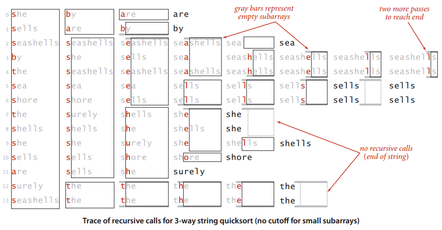

# 字符串 #

[1.字符串排序](#字符串排序)

[字符串排序小结](#字符串排序小结)

[2.单词查找树](#单词查找树)

---

一些基于字符串处理的领域

- 信息处理 给定搜索网页
- 基因组学 根据密码子将DNA转换为由4个碱基(A、C、T、G)组成的字符串
- 通信系统 发短信、电邮等
- 编译系统 编译器

**Java中表示字符串的两种方法**

操作|字符数组|Java字符串
---|---|---
生命|char[] a|String s
根据索引访问字符|a[i]|s.charAt(i)
获取字符串长度|a.length|s.length()
表示方法转换|a=s.toCharArray()|s=new String(a)
子字符串|-|s.substring()
字符串的链接|-| + 的重载用于字符串

---

**字母表**

一些应用会对字符串的字母表作出限制

**Alphabet API**

public class Alphabet|--
---|---
Alphabet(String s)|create a new alphabet from chars in s
char toChar(int index)|convert index to corresponding alphabet char
int toIndex(char c)|convert c to an index between 0 and R-1
boolean contains(char c)|is c in the alphabet?
int R()|radix (number of characters in alphabet)
int lgR()|number of bits to represent an index
int[] toIndices(String s)|convert s to base-R integer
String toChars(int[] indices)|convert base-R integer to string over this alphabet

**标准字母表**

name|R()|lgR()|characters
---|---|---|---
BINARY|2|1|01
DNA|4|2|ACTG
OCTAL|8|3|01234567
DECIMAL|10|4|0123456789
HEXADECIMAL|16|4|0123456789ABCDEF
PROTEIN|20|5|ACDEFGHIKLMNPQRSTVWY
LOWERCASE|26|5|abcdefghijklmnopqrstuvwxyz
UPPERCASE|26|5|ABCDEFGHIJKLMNOPQRSTUVWXYZ
BASE64|64|6|ABCDEFGHIJKLMNOPQRSTUVWXYZ abcdefghijklmnopqrstuvwxyz0123456789+/
ASCII|128|7|ASCII characters
EXTENDED_ASCII|256|8|extended ASCII characters
UNICODE16|65536|16|Unicode characters

[Alphabet](Alphabet.java)

[Alphabet类的典型用例](Count.java)

没有实现基于通用字母表Alphabet类型得到的字符串类型，这是因为

- 大多应用使用String类型
- 使程序更复杂
- 将字符串转化为索引或是由索引得到字符串常常落入内循环，这会大幅降低实现的性能

**总结，还是用回String类型**

## 字符串排序 ##

### 键索引计数法 ###

该算法是接下来字符串排序算法的基础

场景为学生分组并排序

---

**算法步骤**

- 频率统计

- 将频率转换为索引

- 数据索引

- 回写

---

总的程序

	int N = a.length;
	String[] aux = new String[N];
	int[] count = new int[R+1];

	//1.Compute frequency counts.
	for (int i = 0; i < N; i++)
	count[a[i].key() + 1]++;

	//2.Transform counts to indices.
	for (int r = 0; r < R; r++)
	count[r+1] += count[r];

	//3.Distribute the records.
	for (int i = 0; i < N; i++)
	aux[count[a[i].key()]++] = a[i];

	//4.Copy back.
	for (int i = 0; i < N; i++)
	a[i] = aux[i];

>命题A 键索引计数法排序 N个键为0到R-1之间的整数的元素需要访问数组8N + 3R + 1次

### 低位优先的字符串排序 ###

**LSD** leastsignificant-digit first (LSD) string sort

**一个应用**

假设有一位工程师架设了一个设备来记录给定时间段内某条忙碌的告诉公路上的所有车辆的车牌号，他希望**知道总共有多少辆不同的车辆经过这段高速公路**

LSD思想 若字符串长度均为W，那就从右向左以每个位置的字符作为键，用键索引计数法将字符串排序W遍

>**命题B** 低位优先的字符串排序算法能够**稳定地**将定长字符串排序

>**命题B续** 对于基于R个字符的字母表的N个以长为W的字符串为键的元素，低位优先的字符串排序需要访问~W(7N+3R)次数组，使用额外空间与 N+R 成正比

### 高位优先的字符串排序 ###

首先用键索引计数法将所有字符串按照首字母排序，然后递归地再将每个首字母所对应的子数组排序(忽略首字母，因为每一类中的所有字符串的首字母都是相同的)

---

**高位优先的字符串排序中count[]数组的意义**

<table>

<tr>
<td rowspan=2>第d个字符排序的完成阶段</td>
<td colspan=5>count[r]的值</td>
</tr>

<tr>
<td>r=0</td>
<td>r=1</td>
<td>r∈(2, R-1)</td>
<td>r=R</td>
<td>r=R+1</td>
</tr>

<tr>
<td>频率统计</td>
<td>0(未使用)</td>
<td>长度为d的字符串数量</td>
<td colspan=3>第d个字符的 索引值是r-2的字符串的 **数量**</td>
</tr>

<tr>
<td>将频率转换成索引</td>
<td>长度为d的字符串的子数组的起始索引</td>
<td colspan=3>第d个字符的索引值是r-1的字符串的子数组</td>
<td>未使用</td>
</tr>

<tr>
<td rowspan=2>数据分类</td>
<td colspan=3>第d个字符的索引值为r的字符串的子数组的起始索引</td>
<td colspan=2>未使用</td>
</tr>

<tr>
<td>1 + 长度为d的字符串的子数组的结束**索引**</td>
<td colspan=3>1 + 第d个字符串的索引值是r-1的字符串的数组的结束索引</td>
<td>未使用</td>
</tr>

</table>

---

[高位优先的字符串排序](MSD.java)

注意：在这段轨迹中，小数组的插入排序切换阈值M为0，因此可看到完整的过程。

**小型子数组对于高位优先的字符串排序的性能至关重要**

对于过多字符的字符集（如Unicode）,会分配过多的数组进行辅助运算（频率统计等），递归后以此类推，造成性能上的问题

因此，将 小数组切换到插入排序 对于 MSD是必须的。

>**命题C** 要将基于大小为R的字母表的N个字符串排序，MSD平均需要检查N(logN/LogR)

>**命题D** 将基于大小为R的字母表的N个字符串排序，MSD的次数在8N+3R 到 ~w(7N+3R), 其中w是字符串的平均长度；**最坏的情况下**MSD所需的空间与R乘以最长的字符串的长度之积成正比(再加上N)，也就是N+wR

### 三向字符串快速排序 ###

根据键的首字母进行三向切分，仅在中间子数组中的下一个字符(因为键的首字母都与切分字母都与切分字符相等)继续递归排序。

[三向字符串快速排序](Quick3string.java)

>**命题E** 要将含有N个随机字符串的数组排序，三向字符串快速排序平均需要比较字符~2N*InN

**对于字符串类型的键**，标准的快速排序以及常用的排序算法实际上都是MSD，这是因为String类的compareTo()方法是从左到右访问字符串的所有字符的。也就是说，compareTo()在首字母不同时只会访问首字母，在首字母相同且第二个字母不同时只会访问前两个字母，等等。

### 字符串排序小结 ###

<table>

<tr>
<td rowspan=2>排序算法</td>
<td rowspan=2>是否稳定</td>
<td rowspan=2>原地排序</td>
<td colspan=2>在将基于大小为**R**的字母表的**N**个字符串排序的过程中调用charAt()方法次数的增长数量级(平均长度为**w**，最大长度为**W**)</td>
<td rowspan=2>优势领域</td>
</tr>

<tr>
<td>运行时间</td>
<td>额外空间</td>
</tr>

<tr>
<td>字符串的插入</td>
<td>是</td>
<td>是</td>
<td>(N, N^2)</td>
<td>1</td>
<td>小数组or已经有序的数组</td>
</tr>

<tr>
<td>快速</td>
<td>否</td>
<td>是</td>
<td>N(logN)^2</td>
<td>logN</td>
<td>通用排序算法，特别适用于空间不足的情况</td>
</tr>

<tr>
<td>归并</td>
<td>是</td>
<td>否</td>
<td>N(logN)^2</td>
<td>N</td>
<td>稳定的通用排序算法</td>
</tr>

<tr>
<td>三向快速排序</td>
<td>否</td>
<td>是</td>
<td>(N, NlogN)</td>
<td>logN</td>
<td>大量重复的键</td>
</tr>

<tr>
<td>低位优先字符串</td>
<td>是</td>
<td>否</td>
<td>NW</td>
<td>N</td>
<td>较短的定长字符串</td>
</tr>

<tr>
<td>高位优先字符串</td>
<td>是</td>
<td>否</td>
<td>(N, Nw)</td>
<td>N+WR</td>
<td>随机字符串</td>
</tr>

<tr>
<td>三向字符串快速排序</td>
<td>否</td>
<td>是</td>
<td>(N, Nw)</td>
<td>W+logN</td>
<td>通用排序算法，特别适用于含有较长公共前缀的字符串</td>
</tr>

</table>

## 单词查找树 ##

