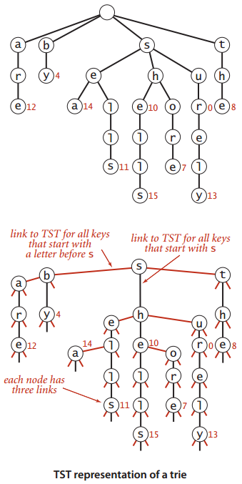
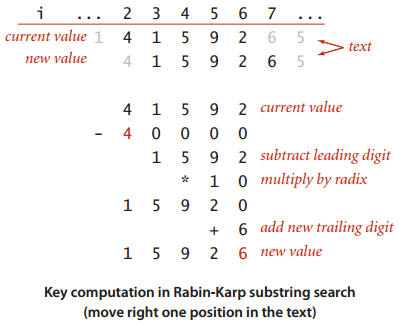
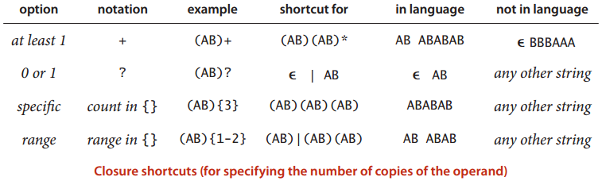

# 字符串 #

[1.字符串排序](#字符串排序)

[字符串排序小结](#字符串排序小结)

[2.单词查找树](#单词查找树)

[单词查找树小结](#单词查找树小结)

[3.子字符串查找](#子字符串查找)

[子字符串查找小结](#子字符串查找小结)

[4.正则表达式](#正则表达式)

[5.数据压缩](#数据压缩)

---

一些基于字符串处理的领域

- 信息处理 给定搜索网页
- 基因组学 根据密码子将DNA转换为由4个碱基(A、C、T、G)组成的字符串
- 通信系统 发短信、电邮等
- 编译系统 编译器

**Java中表示字符串的两种方法**

操作|字符数组|Java字符串
---|---|---
生命|char[] a|String s
根据索引访问字符|a[i]|s.charAt(i)
获取字符串长度|a.length|s.length()
表示方法转换|a=s.toCharArray()|s=new String(a)
子字符串|-|s.substring()
字符串的链接|-| + 的重载用于字符串

---

**字母表**

一些应用会对字符串的字母表作出限制

**Alphabet API**

public class Alphabet|--
---|---
Alphabet(String s)|create a new alphabet from chars in s
char toChar(int index)|convert index to corresponding alphabet char
int toIndex(char c)|convert c to an index between 0 and R-1
boolean contains(char c)|is c in the alphabet?
int R()|radix (number of characters in alphabet)
int lgR()|number of bits to represent an index
int[] toIndices(String s)|convert s to base-R integer
String toChars(int[] indices)|convert base-R integer to string over this alphabet

**标准字母表**

name|R()|lgR()|characters
---|---|---|---
BINARY|2|1|01
DNA|4|2|ACTG
OCTAL|8|3|01234567
DECIMAL|10|4|0123456789
HEXADECIMAL|16|4|0123456789ABCDEF
PROTEIN|20|5|ACDEFGHIKLMNPQRSTVWY
LOWERCASE|26|5|abcdefghijklmnopqrstuvwxyz
UPPERCASE|26|5|ABCDEFGHIJKLMNOPQRSTUVWXYZ
BASE64|64|6|ABCDEFGHIJKLMNOPQRSTUVWXYZ abcdefghijklmnopqrstuvwxyz0123456789+/
ASCII|128|7|ASCII characters
EXTENDED_ASCII|256|8|extended ASCII characters
UNICODE16|65536|16|Unicode characters

[Alphabet](Alphabet.java)

[Alphabet类的典型用例](Count.java)

没有实现基于通用字母表Alphabet类型得到的字符串类型，这是因为

- 大多应用使用String类型
- 使程序更复杂
- 将字符串转化为索引或是由索引得到字符串常常落入内循环，这会大幅降低实现的性能

**总结，还是用回String类型**

## 字符串排序 ##

### 键索引计数法 ###

该算法是接下来字符串排序算法的基础

场景为学生分组并排序

---

**算法步骤**

- 频率统计

- 将频率转换为索引

- 数据索引

- 回写

---

总的程序

	int N = a.length;
	String[] aux = new String[N];
	int[] count = new int[R+1];

	//1.Compute frequency counts.
	for (int i = 0; i < N; i++)
	count[a[i].key() + 1]++;

	//2.Transform counts to indices.
	for (int r = 0; r < R; r++)
	count[r+1] += count[r];

	//3.Distribute the records.
	for (int i = 0; i < N; i++)
	aux[count[a[i].key()]++] = a[i];

	//4.Copy back.
	for (int i = 0; i < N; i++)
	a[i] = aux[i];

>命题A 键索引计数法排序 N个键为0到R-1之间的整数的元素需要访问数组8N + 3R + 1次

### 低位优先的字符串排序 ###

**LSD** leastsignificant-digit first (LSD) string sort

**一个应用**

假设有一位工程师架设了一个设备来记录给定时间段内某条忙碌的告诉公路上的所有车辆的车牌号，他希望**知道总共有多少辆不同的车辆经过这段高速公路**

LSD思想 若字符串长度均为W，那就从右向左以每个位置的字符作为键，用键索引计数法将字符串排序W遍

>**命题B** 低位优先的字符串排序算法能够**稳定地**将定长字符串排序

>**命题B续** 对于基于R个字符的字母表的N个以长为W的字符串为键的元素，低位优先的字符串排序需要访问~W(7N+3R)次数组，使用额外空间与 N+R 成正比

### 高位优先的字符串排序 ###

首先用键索引计数法将所有字符串按照首字母排序，然后递归地再将每个首字母所对应的子数组排序(忽略首字母，因为每一类中的所有字符串的首字母都是相同的)

---

**高位优先的字符串排序中count[]数组的意义**

<table>

<tr>
<td rowspan=2>第d个字符排序的完成阶段</td>
<td colspan=5>count[r]的值</td>
</tr>

<tr>
<td>r=0</td>
<td>r=1</td>
<td>r∈(2, R-1)</td>
<td>r=R</td>
<td>r=R+1</td>
</tr>

<tr>
<td>频率统计</td>
<td>0(未使用)</td>
<td>长度为d的字符串数量</td>
<td colspan=3>第d个字符的 索引值是r-2的字符串的 **数量**</td>
</tr>

<tr>
<td>将频率转换成索引</td>
<td>长度为d的字符串的子数组的起始索引</td>
<td colspan=3>第d个字符的索引值是r-1的字符串的子数组</td>
<td>未使用</td>
</tr>

<tr>
<td rowspan=2>数据分类</td>
<td colspan=3>第d个字符的索引值为r的字符串的子数组的起始索引</td>
<td colspan=2>未使用</td>
</tr>

<tr>
<td>1 + 长度为d的字符串的子数组的结束**索引**</td>
<td colspan=3>1 + 第d个字符串的索引值是r-1的字符串的数组的结束索引</td>
<td>未使用</td>
</tr>

</table>

---

[高位优先的字符串排序](MSD.java)

注意：在这段轨迹中，小数组的插入排序切换阈值M为0，因此可看到完整的过程。

**小型子数组对于高位优先的字符串排序的性能至关重要**

对于过多字符的字符集（如Unicode）,会分配过多的数组进行辅助运算（频率统计等），递归后以此类推，造成性能上的问题

因此，将 小数组切换到插入排序 对于 MSD是必须的。

>**命题C** 要将基于大小为R的字母表的N个字符串排序，MSD平均需要检查N(logN/LogR)

>**命题D** 将基于大小为R的字母表的N个字符串排序，MSD的次数在8N+3R 到 ~w(7N+3R), 其中w是字符串的平均长度；**最坏的情况下**MSD所需的空间与R乘以最长的字符串的长度之积成正比(再加上N)，也就是N+wR

### 三向字符串快速排序 ###

根据键的首字母进行三向切分，仅在中间子数组中的下一个字符(因为键的首字母都与切分字母都与切分字符相等)继续递归排序。

[三向字符串快速排序](Quick3string.java)

>**命题E** 要将含有N个随机字符串的数组排序，三向字符串快速排序平均需要比较字符~2N*InN

**对于字符串类型的键**，标准的快速排序以及常用的排序算法实际上都是MSD，这是因为String类的compareTo()方法是从左到右访问字符串的所有字符的。也就是说，compareTo()在首字母不同时只会访问首字母，在首字母相同且第二个字母不同时只会访问前两个字母，等等。

### 字符串排序小结 ###

<table>

<tr>
<td rowspan=2>排序算法</td>
<td rowspan=2>是否稳定</td>
<td rowspan=2>原地排序</td>
<td colspan=2>在将基于大小为**R**的字母表的**N**个字符串排序的过程中调用charAt()方法次数的增长数量级(平均长度为**w**，最大长度为**W**)</td>
<td rowspan=2>优势领域</td>
</tr>

<tr>
<td>运行时间</td>
<td>额外空间</td>
</tr>

<tr>
<td>字符串的插入</td>
<td>是</td>
<td>是</td>
<td>(N, N^2)</td>
<td>1</td>
<td>小数组or已经有序的数组</td>
</tr>

<tr>
<td>快速</td>
<td>否</td>
<td>是</td>
<td>N(logN)^2</td>
<td>logN</td>
<td>通用排序算法，特别适用于空间不足的情况</td>
</tr>

<tr>
<td>归并</td>
<td>是</td>
<td>否</td>
<td>N(logN)^2</td>
<td>N</td>
<td>稳定的通用排序算法</td>
</tr>

<tr>
<td>三向快速排序</td>
<td>否</td>
<td>是</td>
<td>(N, NlogN)</td>
<td>logN</td>
<td>大量重复的键</td>
</tr>

<tr>
<td>低位优先字符串</td>
<td>是</td>
<td>否</td>
<td>NW</td>
<td>N</td>
<td>较短的定长字符串</td>
</tr>

<tr>
<td>高位优先字符串</td>
<td>是</td>
<td>否</td>
<td>(N, Nw)</td>
<td>N+WR</td>
<td>随机字符串</td>
</tr>

<tr>
<td>三向字符串快速排序</td>
<td>否</td>
<td>是</td>
<td>(N, Nw)</td>
<td>W+logN</td>
<td>通用排序算法，特别适用于含有较长公共前缀的字符串</td>
</tr>

</table>

## 单词查找树 ##

接下来算法在应用场景中(甚至对于巨型符号列表)都能够取得以下性能

- 查找命中所需的时间与被查找的键的长度成正比
- 查找未命中只需检查若干个字符

性能惊人

以字符串为键的符号表的API

StringST<Value>|-|-
---|---|---
-|StringST()|create a symbol table
void|put(String key, Value val)|put key-value pair into the table(remove key if value is null)
Value|get(String key)|value paired with key(null if key is absent)
void|delete(String key)|remove key (and its value)
boolean|contains(String key)|is there a value paired with key?
boolean|isEmpty()|is the table empty?
String|longestPrefixOf(String s)|the longest key that is a prefx of s
Iterable<String>|keysWithPrefix(String s)|all the keys having s as a prefx
Iterable<String>|keysThatMatch(String s)|all the keys that match s(where . matches any character)
int|size()|number of key-value pairs
Iterable<String>|keys()|all the keys in the table

### 单词查找树 ###

单词查找树Trie/音try/

**值为空的结点在符号表中没有对应的键，它们的存在是为了简化单词查找操作**

---

**单词查找树中的查找操作**

---

**单词查找树中的插入操作**

---

**结点的表示**

将空链接考虑进来将会突出单词查找树以下重要性质

- 每个结点都含有R个链接，对应着每个可能出现的字符
- 字符和键均隐式地保存在查询数据结构中

---

**大小**

- 即使实现(通过实例变量N,put()时就N++,delete()就N--)
- 延迟实现

	public int size(){
		return size(root); 
	}
	
	private int size(Node x){
		if (x == null) return 0;
		
		int cnt = 0;
		
		if (x.val != null) 
			cnt++;
		
		for (char c = 0; c < R; c++)
			cnt += size(next[c]);
		return cnt;
	}

[基于单词查找树的符号表](TrieST.java)

---

**查找所有键**

    public Iterable<String> keys() {
        return keysWithPrefix("");
    }

    public Iterable<String> keysWithPrefix(String prefix) {
        Queue<String> results = new Queue<String>();
        Node x = get(root, prefix, 0);
        collect(x, new StringBuilder(prefix), results);
        return results;
    }

    private void collect(Node x, StringBuilder prefix, Queue<String> results) {
        if (x == null) return;
        if (x.val != null) results.enqueue(prefix.toString());
        for (char c = 0; c < R; c++) {
            prefix.append(c);
            collect(x.next[c], prefix, results);
            prefix.deleteCharAt(prefix.length() - 1);
        }
    }

---

**通配符匹配**

    public Iterable<String> keysThatMatch(String pattern) {
        Queue<String> results = new Queue<String>();
        collect(root, new StringBuilder(), pattern, results);
        return results;
    }

    private void collect(Node x, StringBuilder prefix, String pattern, Queue<String> results) {
        if (x == null) return;
        int d = prefix.length();
        if (d == pattern.length() && x.val != null)
            results.enqueue(prefix.toString());
        if (d == pattern.length())
            return;
        char c = pattern.charAt(d);
        if (c == '.') {
            for (char ch = 0; ch < R; ch++) {
                prefix.append(ch);
                collect(x.next[ch], prefix, pattern, results);
                prefix.deleteCharAt(prefix.length() - 1);
            }
        }
        else {
            prefix.append(c);
            collect(x.next[c], prefix, pattern, results);
            prefix.deleteCharAt(prefix.length() - 1);
        }
    }

---

**最长前缀**

    public String longestPrefixOf(String query) {
        if (query == null) throw new IllegalArgumentException("argument to longestPrefixOf() is null");
        int length = longestPrefixOf(root, query, 0, -1);
        if (length == -1) return null;
        else return query.substring(0, length);
    }

    private int longestPrefixOf(Node x, String query, int d, int length) {
        if (x == null) return length;
        if (x.val != null) length = d;
        if (d == query.length()) return length;
        char c = query.charAt(d);
        return longestPrefixOf(x.next[c], query, d+1, length);
    }

---

**删除操作**

    public void delete(String key) {
        if (key == null) throw new IllegalArgumentException("argument to delete() is null");
        root = delete(root, key, 0);
    }

    private Node delete(Node x, String key, int d) {
        if (x == null) return null;
        if (d == key.length()) {
            if (x.val != null) n--;
            x.val = null;
        }
        else {
            char c = key.charAt(d);
            x.next[c] = delete(x.next[c], key, d+1);
        }

        // remove subtrie rooted at x if it is completely empty
        if (x.val != null) return x;
        for (int c = 0; c < R; c++)
            if (x.next[c] != null)
                return x;
        return null;
    }

### 单词查找树的性质 ###

>**命题F** 单词查找树的链表结构(形状)和键的插入或删除顺序无关的：对任意给定的一组键，其单词查找树都是唯一的。

>**命题G** 在单词查找树中查找一个键或是插入一个键时，访问数组的次数最多为键的长度 + 1

>**命题H** 字母表大小为R，在一棵由N个随机键构造的单词查找树，未命中查找平均所需检查的结点数量为~logN/logR

>**命题I** 一棵单词查找树的链接总数在RN到RNw之间，其中w为键的平均长度

application|typical key|average length w|alphabet size R|links in trie built from 1 million keys
---|---|---|---|---
CA license plates|4PGC938|7|256|256 million
account numbers|02400019992993299111|20|256 10|4 billion 256 million
URLs|www.cs.princeton.edu|28|256|4 billion
text processing|seashells|11|256|256 million
proteins in  genomic data|ACTGACTG|8|256 4|256 million 4 million

根据上表，可得出一些经验性的规律

- 当所有键均较短时，链接的总数接近于RN
- 当所有键均较长时，链接的总数接近于RNw
- 因此缩小R能够节省大量空间

**不要用 单词查找树算法 处理来自于 大型字母表 的 大量长键**

### 三向单词查找树 ###

为了避免R向单词查找树过度空间消耗，三向单词查找树TST粉墨登场。

TST中，每个结点都含有一个字符，三条连接和一个值。这三条连接分别对应着当前字母小于、等于和大于结点字母的所有键

[基于三向单词查找树的符号表](TrieST.java)

### 三向单词查找树的性质 ###

>**命题J** 由N个平均长度为w的字符串构造的三向单词查找树中的链接总数在3N到3Nw之间。

>**命题K** 在一棵由N个随机字符串构造的三向单词查找树中，查找未命中平均需要比较字符~InN次。除~InN次外，一次插入或命中的查找会比较一次被查找键中的每个字符

>**命题L** 由N个随机字符串构造的根结点进行R^t向分支且不含有外部单向分支的三向单词查找树中，一次插入或查找操作平均需要进行约InT-tInR次字符进行比较

### 单词查找树小结 ###

各种字符串查找算法的性能特点

<table>

<tr>

<td rowspan=2>算法或数据结构</td>
<td colspan=2>处理由大小为R的字母表构造的N个字符串(平均长度为w)的增长数量级</td>
<td rowspan=2>优点</td>

</tr>

<tr>

<td>未命中查找检查的字符数量</td>
<td>内存使用</td>

</tr>

<tr>

<td>二叉查找树BST</td>
<td>c1(lgN)^2</td>
<td>64N</td>
<td>适用于随机排列的键</td>

</tr>

<tr>

<td>红黑树</td>
<td>c2(lgN)^2</td>
<td>64N</td>
<td>性能保证</td>

</tr>

<tr>

<td>线性探测法</td>
<td>w</td>
<td>32N~128N</td>
<td>内置类型 缓存散列值</td>

</tr>

<tr>

<td>R向单词查找树</td>
<td>logN/logR</td>
<td>(8R+56)N~(8R+56)Nw</td>
<td>适用于较短的键和较小字母表</td>

</tr>

<tr>

<td>三向单词查找树</td>
<td>1.39lgN</td>
<td>64N~64Nw</td>
<td>适用于非随机的键</td>

</tr>

</table>

Java的系统排序方法**没有**使用了本节介绍的方法来查找String类型的键

## 子字符串查找 ##

给定一段长度为N的文本和长度为M的模式pattern字符串，在文本中找到一个和该模式相符的子字符串。

解决该问题的大部分算法都可以很容易扩展为找出文本中所有和该模式相符的子字符串、统计该模式在文本中的出现次数、或者找出上下文（和该模式相符的子字符串周围的文字）的算法。

### 暴力子字符串查找算法 Brute Force Substring Search ###

指针i跟踪文本text，指针j跟踪模式pattern

	public static int search(String pat, String txt){
		int M = pat.length();
		int N = txt.length();
		for (int i = 0; i <= N - M; i++){
			int j;
			for (j = 0; j < M; j++)
				if (txt.charAt(i+j) != pat.charAt(j))
					break;
			if (j == M) return i; // found
		}
		return N; // not found
	}

>**命题M** 在最坏的情况下，暴力子字符串查找算法在长度为N的文本中查找长度为M的模式需要~NM次字符比较

**另一种实现(显示回退)**

	public static int search(String pat, String txt)
	{
		int j, M = pat.length();
		int i, N = txt.length();
		for (i = 0, j = 0; i < N && j < M; i++) {
			if (txt.charAt(i) == pat.charAt(j))
				j++;
			else { 
				i -= j;
				j = 0;
			}
		}
		if (j == M) return i - M; // found
		else return N; // not found
	}

### Knuth-Morris-Pratt子字符串查找算法 ###

KMP发明的算法的基本思想是当出现不匹配时，就能知晓一部分的内容（因为在匹配失败之前它们已经和模式相匹配）。我们可以利用这些信息避免将指针回退到所有这些已知的字符之前。

	DFA 
	
	Deterministic Finite Automaton 
	
	确定性 有限（状态）自动机

KMP算法(DFA模拟)

	public int search(String txt){ // Simulate operation of DFA on txt.
		int i, j, N = txt.length();
		for (i = 0, j = 0; i < N && j < M; i++)
			j = dfa[txt.charAt(i)][j];
		if (j == M) 
			return i - M; // found
		else 
			return N; // not found
	}

---

KMP算法的关键问题——构造DFA

解决这个问题仍然是DFA本身

Knuth、Morris和Pratt发明这种巧妙（但也相当复杂）的构造方式。

当在字符匹配失败时，希望了解的是，若回退了文本指针并在右移一位之后重新扫描已知的文本字符，**DFA的状态会是什么**

我们其实并不想回退，只是想将DFA重置到适当的状态，就好像已经回退过文本指针一样。

**DFA构造方法**

	dfa[pat.charAt(0)][0] = 1;
	for (int X = 0, j = 1; j < M; j++){ // Compute dfa[][j].
		for (int c = 0; c < R; c++)
			dfa[c][j] = dfa[c][X];

		dfa[pat.charAt(j)][j] = j+1;
		X = dfa[pat.charAt(j)][X];
	}

[Knuth-Morris-Pratt子字符串查找算法](KMP.java)

>**命题N** 对于长度为M的模式字符串的长度为N的文本，KMP字符串查找算法访问的字符不会超过M+N个

在实际应用中，它比暴力算法的速度优势并不明显，因为极少有应用程序需要重复性很高的文本查找重复性很高的模式。

但该方法的一个优点是不需要在输入中回退。

### Boyer-Moore 字符串查找算法 ###

从右向左扫描模式字符串的更有效的方法

---

right[]记录字母表中的每个字符在模式中出现的最靠右的地方（若字符在模式中不存在则表示为-1）

这个值揭示了如果该字符出现在文本中且在查找时造成了一次匹配失败，应该向右跳跃多远。

---

用一个索引i在**文本**中**从左向右**移动，用另一个索引j在**模式**中**从右向左**移动。内循环会检查正文和模式字符串在位置i是否一致。若从M-1到0的所有j，txt.charAt(i+j)都和pat.charAt(j)相等，那么就找到了一个匹配。否则，匹配失败，就会遇到三种情况。

>命题O 在一般情况下，对于长度为N的文本和长度为M的模式字符串，使用Boyer-Moore的子字符串查找算法通过启发式处理不匹配的字符需要~N/M次字符比较

[Boyer-Moore字符串匹配算法（启发式地处理不匹配的字符）](BoyerMoore.java)

### Rabin-Karp指纹字符串查找算法 ###

它是基于**散列**的字符串查找算法。

我们需要计算模式字符串的散列函数，然后用相同的散列函数计算文本中所有可能的M个字符的子字符串散列值并寻找匹配。

如果找到了一个散列值和模式字符串相同的子字符串，那么再继续验证两者是否匹配。

#### 基本思想 ####

长度为M的字符串对应着一个R进制的M位数。

为了用一张大小为Q的散列表保存这种类型的键，需要一个能够将R进制的M位数转换为一个[0,Q-1]之间的int值散列函数。

**除留余数法**:将该数除以Q并取余。在实际应用中会使用一个随机的**素数Q**，在不溢出的情况下选择一个尽可能大的值。（因为并不需要这的需要一张散列表）。

#### 计算散列函数 ####

使用Horner方法，用于除留余数法计算散列值

    // Compute hash for key[0..m-1]. 
    private long hash(String key, int m) { 
        long h = 0; 
        for (int j = 0; j < m; j++) 
            h = (R * h + key.charAt(j)) % q;
        return h;
    }

可用这方法计算文本中的子字符串散列值，但这样一来字符串查找算法的成本就将是对文本中的每个字符进行乘、加、取余计算成本之和。

在最坏情况下这需要NM次操作，相对于暴力子字符串查找算法来说并没有任何改进。

#### 关键思想 ####

Rabin-Karp算法基础是对于所有位置i，高效计算文本中i+1位置的子字符串散列值。

R表示几进制，表示txt.charAt(i)，那么文本txt中起始于位置i的含有M个字符的子字符所对应的数即为：

将模式字符串右移一位即等价于将替换为：

关键一点在于不需要保存这些数的值，而只需要保存它们除以Q之后的余数。

**取余操作的一个基本性质**是如果在每次算术操作之后都将结果除以Q并取余，这**等价于**完成了所有算术操作之后再将最后的结果除以Q并取余。

这样Horner利用上述性质可在常数时间内，高效地不断向右一个一个移动。

#### Rabin-Karp算法版本 ####

- **Monte Carlo**版本 Q设为**任意大的一个值**，因为我们并不会真构造一张散列表而只是希望用模式字符串验证是否会产生冲突。我们取一个大于10^20的long型值，使得一个随机值的散列值与模式字符串冲突的概率小于10^-20。这是极小值，若它不够小，你可将这种方法运行两遍，这样概率将小于10^-40。

- **Las Vegas**版本 找到散列值匹配的子字符串，然后逐个比较他们的字符。

[Rabin-Karp指纹字符串查找算法Monte Carlo版本](RabinKarp.java)

>命题P 使用**Monte Carloba**版本的Rabin-Karp子字符串查找算法的运行时间是**线性级别**的且**出错的概率极小**。使用**Las Vegas**版本的Rabin-Karp子字符串查找算法能够**保证正确性**且**性能及其接近线性级别**

### 子字符串查找小结 ###

<table>

<thead>
<tr>
<td rowspan=2>算法</td>
<td rowspan=2>版本</td>
<td rowspan=2>操作指数</td>
<td colspan=2>在文本中回退？</td>
<td rowspan=2>正确性</td>
<td rowspan=2>额外的空间需求</td>
</tr>
<tr>
<td>最坏情况</td>
<td>一般情况</td>
</tr>
</thead>

<tr>
<td>暴力算法brute force</td>
<td>-</td>
<td>MN</td>
<td>1.1N</td>
<td>Y</td>
<td>Y</td>
<td>1</td>
</tr>

<tr>
<td rowspan=3>Knuth-Morris-Pratt</td>
<td>完整的DFA</td>
<td>2N</td>
<td>1.1N</td>
<td>N</td>
<td>Y</td>
<td>MR</td>
</tr>

<tr>
<td>仅构造不匹配的状态转换</td>
<td>3N</td>
<td>1.1N</td>
<td>N</td>
<td>Y</td>
<td>M</td>
</tr>

<tr>
<td>完整版本</td>
<td>3N</td>
<td>N/M</td>
<td>Y</td>
<td>Y</td>
<td>R</td>
</tr>

<tr>
<td>Boyer-Moore</td>
<td>启发式查找不匹配的字符</td>
<td>MN</td>
<td>N/M</td>
<td>Y</td>
<td>Y</td>
<td>R</td>
</tr>

<tr>
<td rowspan=2>Rabin-Karp†</td>
<td>Monte Carlo</td>
<td>7N</td>
<td>7N</td>
<td>N</td>
<td>Y†</td>
<td>1</td>
</tr>

<tr>
<td>Las Vegas</td>
<td>7N</td>
<td>7N†</td>
<td>Y</td>
<td>Y</td>
<td>1</td>
</tr>

</table>

†概率保证，需要使用均匀和独立的散列函数

## 正则表达式 ##

### 使用正则表达式描述模式 ###

- 连接操作 AB
- 或操作 A|E|I|O|U
- 闭包操作 A\*B 由将模式和自身连接任意多次（包括零次）而得到所有字符串所组成的语言
- 括号() 用来改变默认的优先级顺序

∈表示**空字符串**，它存在于所有文本字符串之中(包括A*)

---

**定义** 一个正则表达式可以是：

- 空字符串∈
- 单个字符
- 包含在括号中的另一个正则表达式
- 两个或多个连接起来的正则表达式
- 由**或**运算符分隔的两个或多个正则表达式
- 由**闭包**运算符标记的一个正则表达式

### 缩略写法 ###

#### 字符集描述符 ####

#### 闭包简写 ####

#### 转义序列 ####

- \ . | \* ( ) 等正则表达式**元字符**，需要加**反斜杠**进行转义
- \t制表 \n换行 \s表示任意空白字符

### 正则表达式的实际应用 ###

- 子字符串查找
- 合法性检查
- 程序员工具，如Unix的grep
- 基因组
- 搜索
- 正则表达式的可能性 RE能够实现取余操作：如 ( 0 | 1 ( 0 1 \* 0 ) \* 1 ) \*描述的所有由0和1组成的字符串都是3的倍数的二进制表示。（美丽的巧合）
- 局限 并不是所有语言都可以用正则表达式定义。如不存在能够描述所有合法正则表达式字符串的集合的正则表达式

### 非确定有限状态自动机 ###

Nondeterministic Finite Automata

>Kleene定理证明了对于任意正则表达式都存在一个与对应的**NFA非确定有限状态自动机**

根据定义的NFA有以下特点：

- 长度为M的正则表达式中的每个字符在所对应的NFA中都**有且只有**一个对应的状态。NFA的起始状态为0并含有一个（虚拟的）接受状态M。
- 字母表中的字符所对应的状态都有一条从它指出的边，这条边指向模式中的下一个字符所对应的状态（图中的**黑色**的边）。
- **元字符** ( ) | \* 所对应的状态**至少**含有一条指出的边（图中的**红色**的边），这些边可能指向其他的任意状态。
- 有些状态有多条指出的边，但一个状态只能有一条指出的黑色边。

约定将所有的模式都包含在括号中，因此NFA中的第一个状态对应的是 **左括号(**，而最后一个状态对应的**右括号)**（并能够转化为接受状态）

---

**NFA 与 DFA有限状态机的不同**

- 在NFA图中，字符对应的是结点而不是边
- NFA只有在读取了文本中的所有字符之后才能识别它，而DFA并不一定需要读取文本中的全部内容就能够识别一个模式。

---

**在NFA中从一个状态转移到另一个状态的规则**

- 若当前状态和**字母表中的一个字符**相对应 且 文本中的当前字符和该字符相匹配，自动机可以扫过文本中的该字符并（由**黑色**的边）转换到下一个状态。我们称之为**匹配转换**
- 自动机可以通过**红色**的边转换到另一个状态 而 **不扫描文本中的任何字符**。我们称之为**∈-转换**，也就是说它所对应的“匹配”是一个**空字符串∈**

即使对于类似于A A A A B D这种NFA本应该能够识别的输入文本，也可以找到一个使NFA停滞的状态转换序列。

当且仅当一个NFA从状态0开始从头读取了一段文本中的所有字符，进行了一系列状态转换并最终到达了接受状态时，则称该**NFA识别了一个文本字符串**。

相反，当且仅当对于一个NFA没有任何**匹配转换**和**∈-转换**的序列能够扫描所有文本字符并到大接受状态时，则称该**NFA无法识别这段文本字符串**。

### 模拟NFA的运行 ###

使用**有向图G**表示所有∈-转换，算法中使用有向图的多点可达性。

>**命题Q** 判定一个长度为M的正则表达式所对应的NFA能否识别一段长度为N的文本所需的时间最坏情况下和MN成正比

### 构造NFA ###

用栈记录所有**左括号**和**或运算符**的位置，且只需要构造一个由所有∈-转换组成的有向图G。

[正则表达式的模式匹配](NFA.java)

>**命题R** 构造和长度为M的正则表达式相对应的NFA所需的时间和空间在最坏的情况下与M成正比。

## 数据压缩 ##

压缩数据的原因主要有两点：节省保存信息所需空间和节省传输信息所需的时间。

当你在处理数字图像、声音、电影和其他数据时，就已经在与数据压缩打交道了。

压缩算法之所以能够节省空间，是因为大多数数据文件都有很大的冗余，例如：

- 文本文件中有些字符序列的出现频率远高于其他字符串
- 用来将图片编码的位图文件中可能有大片的同质区域
- 保存数字图像、电影、声音等其他类似信号的文件都含有大量重复的模式

### 游戏规则 ###

数据最终都是用二进制表示的。

数据压缩模型有两部分组成

- 压缩盒 能够将一个比特流B转化为压缩后的版本C(B)
- 展开盒 能够将C(B)转化为B。

若|B|表示为比特流中比特的数量的话，|C(B)|/|B|称为**压缩率**，这玩意越小越好

这模型叫**无损压缩模型**——保证不丢失任何信息，即压缩和展开后的比特流必须和原始的比特流完全相同。

对于某些类型文件（例如图像、视频、音乐）、压缩方法也是可接受的，此时解码器所产生的输出只是与原输入文件近似。

### 读写二进制规则 ###

**读写二进制**

[二进制输入](../../util/BinaryStdIn.java)

[二进制输入测试](../../../../../../../test/java/com/lun/algorithms4th/util/BinaryStdInTest.java)

[二进制输出](../../util/BinaryStdOut.java)

[二进制输出测试](../../../../../../../test/java/com/lun/algorithms4th/util/BinaryStdOutTest.java)

---

**二进制转储**

[用0和1表示比特流](../../util/BinaryDump.java)

[BinaryDumpTest](../../../../../../../test/java/com/lun/algorithms4th/util/BinaryDumpTest.java)

[用十六进制数字表示的比特流](../../util/HexDump.java)

[HexDumpTest](../../../../../../../test/java/com/lun/algorithms4th/util/HexDumpTest.java)

[用Picture对象中的像素表示的比特流](../../util/PictureDump.java)

[PictureDumpTest](../../../../../../../test/java/com/lun/algorithms4th/util/PictureTest.java)

---

**ASCII编码**

-|0|1|2|3|4|5|6|7|8|9|A|B|C|D|E|F
-|-|-|-|-|-|-|-|-|-|-|-|-|-|-|-|-
0|NUL|SOH|STX|ETX|EOT|ENQ|ACK|BEL|BS|HT|LF|VT|FF|CR|SO|SI
1|DLE|DC1|DC2|DC3|DC4|NAK|SYN|ETB|CAN|EM|SUB|ESC|FS|GS|RS|US
2|SP|!|"|#|$|%|&|‘|(|)|*|+|,|-|.|/
3|0|1|2|3|4|5|6|7|8|9|:|;|<|=|>|?
4|@|A|B|C|D|E|F|G|H|I|J|K|L|M|N|O
5|P|Q|R|S|T|U|V|W|X|Y|Z|[|\|]|^|_
6|`|a|b|c|d|e|f|g|h|i|j|k|l|m|n|o
7|p|q|r|s|t|u|v|w|x|y|z|{|&#124;|}|~|DEL

4A表示J

### 局限 ###

>命题S 不存在能够压缩任意比特流的算法。

[RandomBits](RandomBits.java)

[RandomBitsTest](../../../../../../../test/java/com/lun/algorithms4th/util/RandomBitsTest.java)

最优数据压缩(找到能够产生给定字符串的最短程序)是一个**不可判定**的问题。

这局限性所带来的实际影响要求无损压缩算法必须尽量利用被压缩的数据流中的**已知**结构。

- 小规模的字母表
- 较长的连续相同的位或字符
- 频繁使用的字符
- 较长的连续重复的位或字符

### 热身运动：基因组 ###

生物学家用A、C、T和G来表示生物体DNA的四种碱基。

压缩原理：将一个8位字符转换为一个双位编码。

[碱基序列压缩解压算法](Genome.java)

[GenomeTest](../../../../../../../test/java/com/lun/algorithms4th/c5/string/GenomeTest.java)

### 游程编码 ###

游程编码**Run-Length Encoding**利用一长串比特的冗余形式来压缩数据。

例子：40位长的字符串

0 0 0 0 0 0 0 0 0 0 0 0 0 0 0 1 1 1 1 1 1 1 0 0 0 0 0 0 0 1 1 1 1 1 1 1 1 1 1 1

该字符串含有15个0，7个1，7个0，11个1（15，7，7，11）。所有比特字符串都是由交替出现的0和1组成的，因此只需要将游程的长度编码即可。在这例子，若用4位表示长度并以连续的0作为开头，那么可得到一个16位长的字符串(15 = 1111, then 7 = 0111, then 7 = 0111, then 11 = 1011)

1 1 1 1 0 1 1 1 0 1 1 1 1 0 1 1

压缩率为16/40 = 40%

**游程编码示例——位图**

[游程编码压缩和扩展](RunLength.java)

[RunLengthTest](../../../../../../../test/java/com/lun/algorithms4th/c5/string/RunLengthTest.java)

### 霍夫曼压缩 ###

**Huffman compression**的思想是**通过用较少的比特表示出现频繁的字符** 而 **用较多的比特表示偶尔出现的字符来节省空间**。

试着将最短的比特字符串赋予最常用的字符，encoding A with 0,
B with 1, R with 00, C with 01, D with 10, and ! with 11, so A B R A C A D A B R A ! would
be encoded as 0 1 00 0 01 0 10 0 1 00 0 11.若无空格表示，则为

0 1 0 0 0 0 1 0 1 0 0 1 0 0 0 1 1

它也可以误解码为C R R D D C R C B 或其他

**若所有字符编码都不会成为其他字符编码的前缀，那么就不需要分隔符**

如A的编码0就是R的编码00的前缀

#### 前缀码的单词查找树 ####

表示前缀码的解码方式就是**使用单词查找树**

寻找最优前缀码的通用方法——**霍夫曼编码**

#### 霍夫曼压缩的实现 ####

将需要压缩的比特流看作8位编码的char值流并将它按照如下方法压缩：

1. 读取输入
2. 将输入中的每个char值的出现频率制成的表格
3. 根据频率构造相应的**霍夫曼编码树**
4. 构造 **编译表** ，将输入中的每个char值和一个比特字符串相关联
5. 将 **单词查找树**（霍夫曼编码树） 编码为比特字符串并写入输出流
6. 将 **单词总数** 编码为 比特字符串并写入输出流
7. 使用编译表翻译每个输入字符

---

展开一条编码过的比特流，步骤如下：

1. 读取单词查找树（编码在比特流的开头）
2. 读取需要解码的字符数量
3. 使用单词查找树将比特流解码

#### 构造一棵霍夫曼编码单词查找树 ####

#### 最优性 ####

>**命题T** 对于任意前缀码，编码后的比特字符串的长度等于相应单词查找树的加权外部路径的长度

>**命题U** 给定的一个含有r个符号的集合和他们的频率，霍夫曼算法构造的前缀码是最优的。

#### 写入和读取单词查找树 ####

基于单词查找树的**前序遍历**

---

[霍夫曼压缩](Huffman.java)

[HuffmanTest](../../../../../../../test/java/com/lun/algorithms4th/c5/string/HuffmanTest.java)

#### LZW压缩算法 ####

