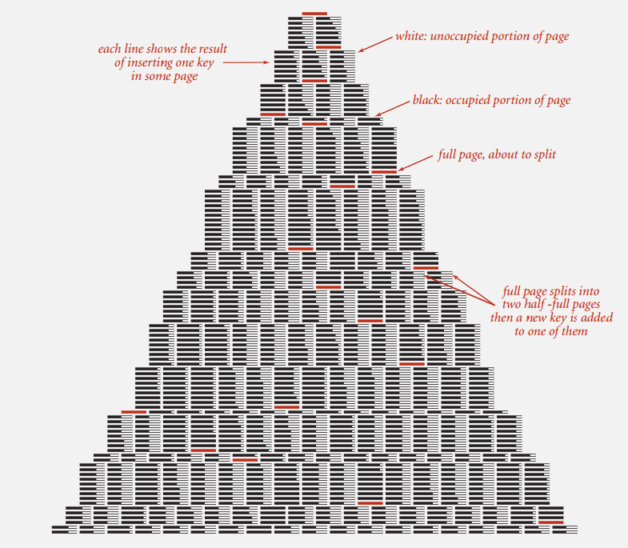

# B-树 学习笔记 #

平衡树算法的扩展。

它支持对保存在磁盘或者网络上的符号表进行**外部查找**。

令人惊讶的是，这算法只需使用4~5个指向一小块数据的引用即可有效支持在含有数百亿或者更多元素的符号表中进行查找。

### 成本模型 ###

**页Page**表示一块连续的数据，如 一个文件 或 4096字节块chunk。

**探查Probe**表示访问一个页， 如 从 硬盘 到 内存。

**目标**实现能够仅用极少次数的探查即可找到任意给定键的查找算法。

**成本模型**使用页的访问次数（无论读写）作为外部查找算法的成本模型。

**B-树**

像2-3树那样，限制了每个结点“键-链接”对的上下数量界限。

选择一个**参数M**（一般都是一个偶数）并构造一棵多向树，

每个结点**最多含有M-1对键和链接**（假设M足够小，使得每个M向结点都能够存放在一个页中，如M=1024），

**最少含有M/2对键和链接**（以提供足够多的分支来保证查找路径），

也就是节点键和链接的对数在**(M/2, M-1)**区间。

根节点是个例外，它含有小于M/2对键和链接，但也不能少于2对。(2, M/2)

**内部结点**：含有与页相关联的键的副本。

**外部结点**：含有指向实际数据的引用

**哨兵键**小于其他所有键

### 查找 ###

### 插入 ###

### 删除 ###

TODO:

### 源码 ###

	public class BTree<Key extends Comparable<Key>, Value> {
		// max children per B-tree node = M-1
		// (must be even and greater than 2)
		private static final int M = 4;
	
		private Node root; // root of the B-tree
		private int height; // height of the B-tree
		private int numOfPair; // number of key-value pairs in the B-tree
	
		// helper B-tree node data type
		private static final class Node {
			private int numOfChild; // number of children
			private Entry[] children = new Entry[M]; // the array of children
	
			// create a node with k children
			private Node(int numOfChild) {
				this.numOfChild = numOfChild;
			}
		}
	
		// internal nodes: only use key and next
		// external nodes: only use key and value
		private static class Entry {
			private Comparable key;
			private final Object val;
			private Node next; // helper field to iterate over array entries
	
			public Entry(Comparable key, Object val, Node next) {
				this.key = key;
				this.val = val;
				this.next = next;
			}
		}
	
		public BTree() {
			root = new Node(0);
		}
	
		public boolean isEmpty() {
			return size() == 0;
		}
	
		public int size() {
			return numOfPair;
		}
	
		public int height() {
			return height;
		}
	
		public Value get(Key key) {
			if (key == null)
				throw new IllegalArgumentException("argument to get() is null");
			return search(root, key, height);
		}
	
		private Value search(Node x, Key key, int height) {
			Entry[] children = x.children;
	
			// external node
			if (height == 0) {
				for (int j = 0; j < x.numOfChild; j++) {
					if (eq(key, children[j].key))
						return (Value) children[j].val;
				}
			}
	
			// internal node
			else {
				for (int j = 0; j < x.numOfChild; j++) {
					if (j + 1 == x.numOfChild || less(key, children[j + 1].key))
						return search(children[j].next, key, height - 1);
				}
			}
			return null;
		}
	
		public void put(Key key, Value val) {
			if (key == null)
				throw new IllegalArgumentException("argument key to put() is null");
			Node u = insert(root, key, val, height);
			numOfPair++;
			if (u == null)
				return;
	
			// need to split root
			Node t = new Node(2);
			t.children[0] = new Entry(root.children[0].key, null, root);
			t.children[1] = new Entry(u.children[0].key, null, u);
			root = t;
			height++;
		}
	
		private Node insert(Node newOne, Key key, Value val, int height) {
			int j;
			Entry t = new Entry(key, val, null);
	
			// external node
			if (height == 0) {
				for (j = 0; j < newOne.numOfChild; j++) {
					if (less(key, newOne.children[j].key))
						break;
				}
			}
	
			// internal node
			else {
				for (j = 0; j < newOne.numOfChild; j++) {
					if ((j + 1 == newOne.numOfChild) || less(key, newOne.children[j + 1].key)) {
						Node u = insert(newOne.children[j++].next, key, val, height - 1);
						if (u == null)
							return null;
						t.key = u.children[0].key;
						t.next = u;
						break;
					}
				}
			}
	
			for (int i = newOne.numOfChild; i > j; i--)
				newOne.children[i] = newOne.children[i - 1];
			newOne.children[j] = t;
			newOne.numOfChild++;
			if (newOne.numOfChild < M)
				return null;
			else
				return split(newOne);
		}
	
		// split node in half
		private Node split(Node oldOne) {
			Node newOne = new Node(M / 2);
			oldOne.numOfChild = M / 2;
			for (int j = 0; j < M / 2; j++)
				newOne.children[j] = oldOne.children[M / 2 + j];
			return newOne;
		}
	
		public String toString() {
			return toString(root, height, "") + "\n";
		}
	
		private String toString(Node h, int height, String indent) {
			StringBuilder s = new StringBuilder();
			Entry[] children = h.children;
	
			if (height == 0) {
				for (int j = 0; j < h.numOfChild; j++) {
					s.append(indent + children[j].key + " " + children[j].val + "\n");
				}
			} else {
				for (int j = 0; j < h.numOfChild; j++) {
					if (j > 0)
						s.append(indent + "(" + children[j].key + ")\n");
					s.append(toString(children[j].next, height - 1, indent + "     "));
				}
			}
			return s.toString();
		}
	
		private boolean less(Comparable k1, Comparable k2) {
			return k1.compareTo(k2) < 0;
		}
	
		private boolean eq(Comparable k1, Comparable k2) {
			return k1.compareTo(k2) == 0;
		}

		public static void main(String[] args) {
			BTree<String, String> st = new BTree<String, String>();
	
			st.put("www.cs.princeton.edu", "128.112.136.12");
			st.put("www.cs.princeton.edu", "128.112.136.11");
			st.put("www.princeton.edu", "128.112.128.15");
			st.put("www.yale.edu", "130.132.143.21");
			st.put("www.simpsons.com", "209.052.165.60");
			st.put("www.apple.com", "17.112.152.32");
			st.put("www.amazon.com", "207.171.182.16");
			st.put("www.ebay.com", "66.135.192.87");
			st.put("www.cnn.com", "64.236.16.20");
			st.put("www.google.com", "216.239.41.99");
			st.put("www.nytimes.com", "199.239.136.200");
			st.put("www.microsoft.com", "207.126.99.140");
			st.put("www.dell.com", "143.166.224.230");
			st.put("www.slashdot.org", "66.35.250.151");
			st.put("www.espn.com", "199.181.135.201");
			st.put("www.weather.com", "63.111.66.11");
			st.put("www.yahoo.com", "216.109.118.65");
	
			System.out.println("cs.princeton.edu:  " + st.get("www.cs.princeton.edu"));
			System.out.println("hardvardsucks.com: " + st.get("www.harvardsucks.com"));
			System.out.println("simpsons.com:      " + st.get("www.simpsons.com"));
			System.out.println("apple.com:         " + st.get("www.apple.com"));
			System.out.println("ebay.com:          " + st.get("www.ebay.com"));
			System.out.println("dell.com:          " + st.get("www.dell.com"));
			System.out.println();
	
			System.out.println("size:    " + st.size());
			System.out.println("height:  " + st.height());
			System.out.println(st);
			System.out.println();
		}
	
	}

### 性能 ###

>含有N个元素的M阶B-树中的一次查找或插入操作需要logN/logM ~ logN/log(M/2)次探查(如：M = 1024; N = 62 billion ，logN/log(M/2) ≤ 4)

---

>优化.总是将根节点保存在内存中。

### 应用 ###

B-树及它的变种(B+树,B*树等)广泛应用于 数据库 和 文件系统。

一棵大B-树。

### 引用 ###

1.《算法4th》Robert Sedgewick & Kevin Wayne 著 ，谢路云 译

[2.BTree.java](https://algs4.cs.princeton.edu/62btree/BTree.java.html) 