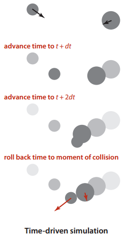
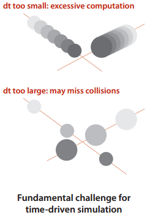
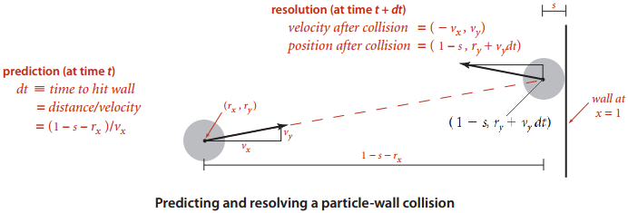
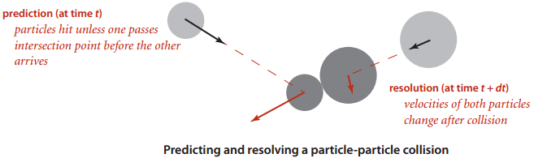
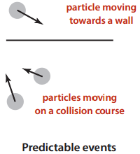
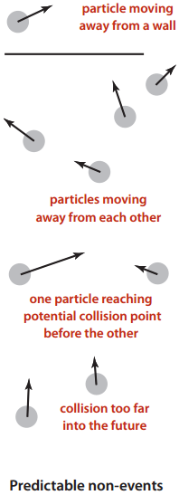
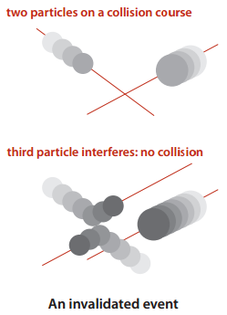
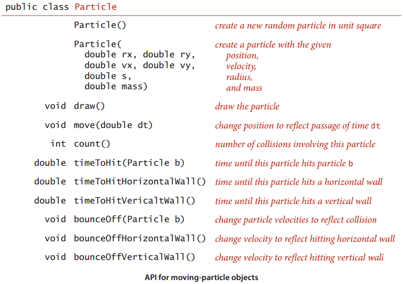

# 背景 #

**商业应用**

- 基础设施（操作系统、数据库、通信）
- 应用程序（电子邮件、文档处理、数码相片）
- 出版（书籍、杂志、网络内容）
- 网络（无线网络、社交网络、互联网）
- 交易处理（金融、零售、网络搜索）

**科学计算**

- 数学计算（多项式、矩阵、微分方程）
- 数据处理（实验结果和观测资料，特别是基因组学）
- 计算模型和模拟

**工程学**
- 数学计算和数据处理
- 计算机辅助设计和生产
- 基于算法的工程设计（网络、控制系统）
- 图像和其他医学系统

**运筹学**

- 任务调度
- 决策
- 资源分配

**计算机科学**

- 计算几何
- 密码学
- 数据库
- 编程语言与系统
- 人工智能

## 事件驱动模拟 ##

科学应用：按照弹性碰撞的原理模拟粒子系统的运动。

科学家通过这个系统可理解和预测物理系统的性质。

这个模型可以模拟气体中分子的运动、化学反应的动态过程等问题。

### 刚性球体模型 ###

一个理想模型，它描述的是原子或分子在含有以下性质的容器中的运动。

- 运动的例子与墙以及互相之间的碰撞是弹性的
- 每个粒子都是一个已知位置、速度、质量和直径的球体
- 不存在其他外力

### 时间驱动模型 ###

主要目标：维持这个模型，即希望能够记录所有粒子在**任意时间内**的**位置**和**速度**。

为此，需要计算：给定了时刻t是的所有粒子位置和速度后，再给出dt时间之后，即未来时间点t+dt时它们的位置和速度。

若粒子互相之间以及和墙的距离都很远，那么计算就很简单：因为粒子的轨迹是一条直线，所以只需用粒子的速度即可更新它的位置。

挑战地方：考虑碰撞情况

解决方法之一：时间驱动模拟。

它基于使用固定长度的dt。

在每次更新时，需检查所有粒子对，判定它们是否可能相遇，然后还原它们的第一次碰撞。然后，将会更新两粒子的速度（反向，速率）以反映出碰撞结果。

局限性：

在粒子数量很多时，计算量就很大

若dt是以秒计，它模拟N个粒子的系统一秒钟的运动所需时间与N^2/dt成正比。

成本昂贵

dt太小，计算量太大。dt太大，可能错过碰撞。

### 事件驱动模拟 ###

另一种是仅关注碰撞发生的时间点，**重点关注下一次碰撞**(因为在此之前有速度计算得到的所有粒子的位置都是有效)

使用一个优先队列记录所有事件。事件是未来的某个时间的一次潜在碰撞（粒子与粒子，墙与粒子）。

**和每个事件相关联的优先级就是它发生的时间**，因此当从优先队列中删去优先级**最低**的元素时，就会得到下一次潜在的碰撞。

### 碰撞预测、计算 ###

向优先队列中插入一个优先级为t+dt的条目（以及一些描述该示例和墙的碰撞事件的信息）

两个粒子之间的碰撞也是类似的，但更加复杂一些。

---

不会碰撞情景

1. 粒子正在向墙体的反方向移动，或者两个粒子的运动方向相反
2. 两粒子运动方向想法
3. 预测到的碰撞距现在的时间太久（可设置限时limit参数，超时的忽略）

这情景无需插入优先队列

---

### 粒子 ###

[Particle](Particle.java)

### 事件 ###

[CollisionSystem#Event](CollisionSystem.java)

Event的实现能够表示这4种类型的事件，允许粒子的值为null

- a和b均不为空，粒子与粒子碰撞
- a非空而b为空，粒子a和垂直墙体的碰撞
- a为空而b非空，粒子b和水平墙体的碰撞
- a和b均为空，重绘事件（画出所有粒子）

### 模拟器代码 ###

[CollisionSystem](CollisionSystem.java)

模拟过程可以作为计算系统中的各种有趣性质的基础，例如一种基本性质是所有粒子向墙体施加的压力。计算这种压力的一种方法是记录墙体和粒子碰撞的次数和动量（根据粒子质量和速度计算这个值简单）。

### 性能 ###

>**命题A** 对N个能够相互碰撞的粒子系统，基于事件的模拟在初始化时最多需要N^2次优先队列操作，在碰撞之时最多需要N次优先队列操作（且对于每个无效的事件都需要一次额外的操作）

事件驱动模拟已被应用于无数需要对运动中的物理对象建模的其他领域，例如分子学、天体物理学和机器人技术。

事件驱动的方式得到的模拟比其他方法更加健壮、准确高效，而基于堆的优先队列的效率使不可能完成的计算称为了可能。

模拟在科学和工程的各个领域都是帮助研究者理解自然事件中各种性质的重要工具。

## B-树 ##

[B-树笔记](BTree.md)

## 后缀数组 ##

